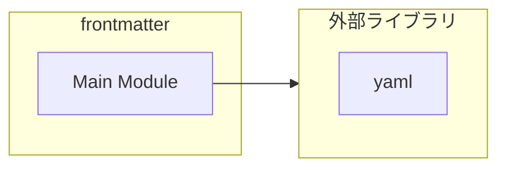

# frontmatter

## 概要

`frontmatter` モジュールのAPIリファレンス。

## インポート

```typescript
// from 'yaml': parseYaml
```

## エクスポート一覧

| 種別 | 名前 | 説明 |
|------|------|------|
| 関数 | `parseFrontmatter` | Parse YAML frontmatter from markdown text. |

## 図解

### 依存関係図



## 関数

### parseFrontmatter

```typescript
parseFrontmatter(content: string): { frontmatter: TFrontmatter; body: string }
```

Parse YAML frontmatter from markdown text.

If frontmatter is missing or invalid, returns an empty frontmatter object
and the original content as body so callers can continue safely.

**パラメータ**

| 名前 | 型 | 必須 |
|------|-----|------|
| content | `string` | はい |

**戻り値**: `{ frontmatter: TFrontmatter; body: string }`

---
*自動生成: 2026-02-22T19:27:00.637Z*
