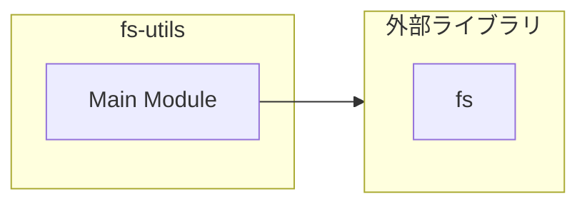

# fs-utils

## 概要

`fs-utils` モジュールのAPIリファレンス。

## インポート

```typescript
// from 'fs': existsSync, mkdirSync
```

## エクスポート一覧

| 種別 | 名前 | 説明 |
|------|------|------|
| 関数 | `ensureDir` | ディレクトリ生成 |

## 図解

### 依存関係図



## 関数

### ensureDir

```typescript
ensureDir(path: string): void
```

ディレクトリ生成

**パラメータ**

| 名前 | 型 | 必須 |
|------|-----|------|
| path | `string` | はい |

**戻り値**: `void`

---
*自動生成: 2026-02-22T19:27:00.637Z*
