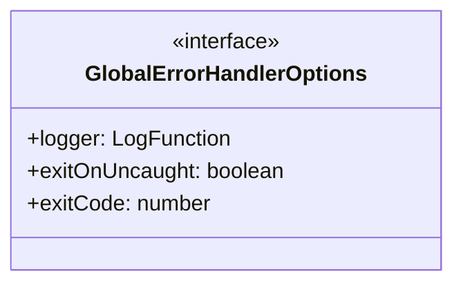
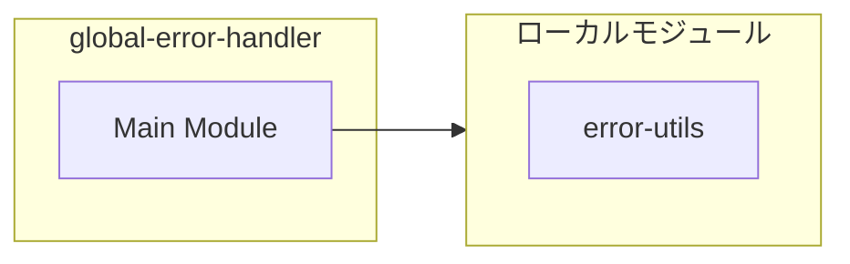
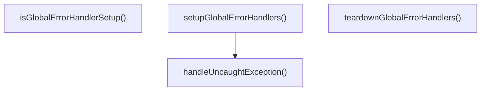
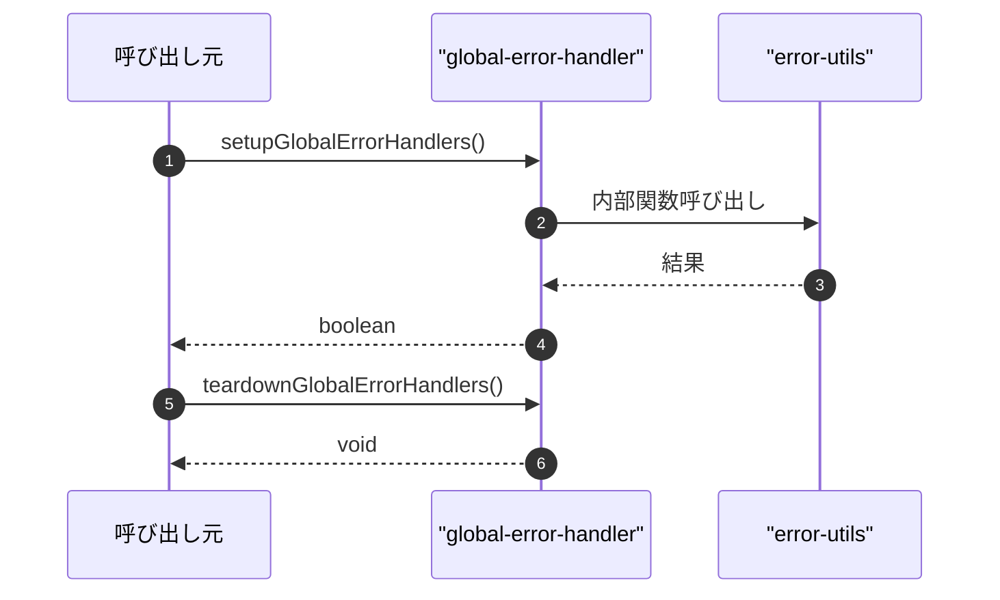

# global-error-handler

## 概要

`global-error-handler` モジュールのAPIリファレンス。

## インポート

```typescript
// from './error-utils.js': isCancelledErrorMessage, toErrorMessage
```

## エクスポート一覧

| 種別 | 名前 | 説明 |
|------|------|------|
| 関数 | `setupGlobalErrorHandlers` | グローバルエラーハンドラを設定する |
| 関数 | `teardownGlobalErrorHandlers` | グローバルエラーハンドラを解除する |
| 関数 | `isGlobalErrorHandlerSetup` | グローバルエラーハンドラが設定されているか確認 |
| インターフェース | `GlobalErrorHandlerOptions` | グローバルエラーハンドラの設定オプション |

## 図解

### クラス図



### 依存関係図



### 関数フロー



### シーケンス図



## 関数

### defaultLog

```typescript
defaultLog(message: any, args: any): void
```

デフォルトのログ出力（コンソール）

**パラメータ**

| 名前 | 型 | 必須 |
|------|-----|------|
| message | `any` | はい |
| args | `any` | はい |

**戻り値**: `void`

### handleUnhandledRejection

```typescript
handleUnhandledRejection(reason: unknown, _promise: Promise<unknown>): void
```

unhandledRejectionハンドラ

**パラメータ**

| 名前 | 型 | 必須 |
|------|-----|------|
| reason | `unknown` | はい |
| _promise | `Promise<unknown>` | はい |

**戻り値**: `void`

### handleUncaughtException

```typescript
handleUncaughtException(error: Error, origin: NodeJS.UncaughtExceptionOrigin): void
```

uncaughtExceptionハンドラ

**パラメータ**

| 名前 | 型 | 必須 |
|------|-----|------|
| error | `Error` | はい |
| origin | `NodeJS.UncaughtExceptionOrigin` | はい |

**戻り値**: `void`

### setupGlobalErrorHandlers

```typescript
setupGlobalErrorHandlers(options: GlobalErrorHandlerOptions): boolean
```

グローバルエラーハンドラを設定する

**パラメータ**

| 名前 | 型 | 必須 |
|------|-----|------|
| options | `GlobalErrorHandlerOptions` | はい |

**戻り値**: `boolean`

### teardownGlobalErrorHandlers

```typescript
teardownGlobalErrorHandlers(): void
```

グローバルエラーハンドラを解除する

**戻り値**: `void`

### isGlobalErrorHandlerSetup

```typescript
isGlobalErrorHandlerSetup(): boolean
```

グローバルエラーハンドラが設定されているか確認

**戻り値**: `boolean`

## インターフェース

### GlobalErrorHandlerOptions

```typescript
interface GlobalErrorHandlerOptions {
  logger?: LogFunction;
  exitOnUncaught?: boolean;
  exitCode?: number;
}
```

グローバルエラーハンドラの設定オプション

## 型定義

### LogFunction

```typescript
type LogFunction = (message: string, ...args: unknown[]) => void
```

ログ出力関数の型

---
*自動生成: 2026-02-23T06:29:42.339Z*
