# hyper-metacognition

## 概要

`hyper-metacognition` モジュールのAPIリファレンス。

## インポート

```typescript
// from './belief-updater.js': Distribution, Evidence
// from './belief-updater.js': createPrior, calculateEntropy
// from './creative-destruction.js': Premise
```

## エクスポート一覧

| 種別 | 名前 | 説明 |
|------|------|------|
| 関数 | `createHyperMetacognitionEngine` | - |
| 関数 | `performHyperMetacognition` | - |
| 関数 | `deepenMetacognition` | - |
| 関数 | `updateMetaBelief` | - |
| 関数 | `getThinkingQualityAssessment` | - |
| 関数 | `generateMetacognitionReport` | - |
| 関数 | `generateEngineReport` | - |
| インターフェース | `MetacognitiveLayer` | メタ認知層 |
| インターフェース | `HyperMetacognitiveState` | 超メタ認知状態 |
| インターフェース | `CognitivePattern` | 認知パターン |
| インターフェース | `ImprovementRecommendation` | 改善推奨 |
| インターフェース | `BayesianMetaBelief` | ベイズ的メタ信念 |
| インターフェース | `HyperMetacognitionEngine` | 超メタ認知エンジン |
| インターフェース | `HyperMetacognitionConfig` | エンジン設定 |

## 図解

### クラス図

```mermaid
classDiagram
  class MetacognitiveLayer {
    <<interface>>
    +level: T0_1_2_3
    +content: string
    +observations: string
    +evaluation: string
    +confidence: number
  }
  class HyperMetacognitiveState {
    <<interface>>
    +sessionId: string
    +layer0: MetacognitiveLayer
    +layer1: MetacognitiveLayer
    +layer2: MetacognitiveLayer
    +layer3: MetacognitiveLayer
  }
  class CognitivePattern {
    <<interface>>
    +name: string
    +type: formalization_aut
    +detectedAt: number
    +description: string
    +impact: number
  }
  class ImprovementRecommendation {
    <<interface>>
    +priority: high_medium_low
    +content: string
    +rationale: string
    +expectedEffect: string
    +difficulty: number
  }
  class BayesianMetaBelief {
    <<interface>>
    +target: string
    +beliefDistribution: Distribution
    +uncertainty: number
    +learningHistory: Array_evidence_Evid
    +stability: number
  }
  class HyperMetacognitionEngine {
    <<interface>>
    +currentState: HyperMetacognitiveSt
    +beliefHistory: BayesianMetaBelief
    +config: HyperMetacognitionCo
    +statistics: totalSessions_numbe
  }
  class HyperMetacognitionConfig {
    <<interface>>
    +maxCognitiveDepth: number
    +formalizationRiskThreshold: number
    +selfReferenceDepth: number
    +autoImprovementRecommendation: boolean
    +patternDetectionSensitivity: number
  }
```



### 依存関係図


### 関数フロー


### シーケンス図


## 関数

### createHyperMetacognitionEngine

```typescript
createHyperMetacognitionEngine(config: Partial<HyperMetacognitionConfig>): HyperMetacognitionEngine
```

**パラメータ**

| 名前 | 型 | 必須 |
|------|-----|------|
| config | `Partial<HyperMetacognitionConfig>` | はい |

**戻り値**: `HyperMetacognitionEngine`

### performHyperMetacognition

```typescript
performHyperMetacognition(engine: HyperMetacognitionEngine, thought: string, context: string): HyperMetacognitiveState
```

**パラメータ**

| 名前 | 型 | 必須 |
|------|-----|------|
| engine | `HyperMetacognitionEngine` | はい |
| thought | `string` | はい |
| context | `string` | はい |

**戻り値**: `HyperMetacognitiveState`

### deepenMetacognition

```typescript
deepenMetacognition(engine: HyperMetacognitionEngine, additionalInsight: string): HyperMetacognitiveState | null
```

**パラメータ**

| 名前 | 型 | 必須 |
|------|-----|------|
| engine | `HyperMetacognitionEngine` | はい |
| additionalInsight | `string` | はい |

**戻り値**: `HyperMetacognitiveState | null`

### updateMetaBelief

```typescript
updateMetaBelief(engine: HyperMetacognitionEngine, target: string, evidence: Evidence): BayesianMetaBelief
```

**パラメータ**

| 名前 | 型 | 必須 |
|------|-----|------|
| engine | `HyperMetacognitionEngine` | はい |
| target | `string` | はい |
| evidence | `Evidence` | はい |

**戻り値**: `BayesianMetaBelief`

### getThinkingQualityAssessment

```typescript
getThinkingQualityAssessment(state: HyperMetacognitiveState): {
  overallScore: number;
  breakdown: {
    depth: number;
    coherence: number;
    selfAwareness: number;
    flexibility: number;
    rigor: number;
  };
  strengths: string[];
  weaknesses: string[];
}
```

**パラメータ**

| 名前 | 型 | 必須 |
|------|-----|------|
| state | `HyperMetacognitiveState` | はい |

**戻り値**: `{
  overallScore: number;
  breakdown: {
    depth: number;
    coherence: number;
    selfAwareness: number;
    flexibility: number;
    rigor: number;
  };
  strengths: string[];
  weaknesses: string[];
}`

### generateMetacognitionReport

```typescript
generateMetacognitionReport(state: HyperMetacognitiveState): string
```

**パラメータ**

| 名前 | 型 | 必須 |
|------|-----|------|
| state | `HyperMetacognitiveState` | はい |

**戻り値**: `string`

### createLayer0

```typescript
createLayer0(thought: string, context: string): MetacognitiveLayer
```

第0層を作成

**パラメータ**

| 名前 | 型 | 必須 |
|------|-----|------|
| thought | `string` | はい |
| context | `string` | はい |

**戻り値**: `MetacognitiveLayer`

### createLayer1

```typescript
createLayer1(layer0: MetacognitiveLayer): MetacognitiveLayer
```

第1層を作成（従来のメタ認知）

**パラメータ**

| 名前 | 型 | 必須 |
|------|-----|------|
| layer0 | `MetacognitiveLayer` | はい |

**戻り値**: `MetacognitiveLayer`

### createLayer2

```typescript
createLayer2(layer1: MetacognitiveLayer): MetacognitiveLayer
```

第2層を作成（超メタ認知）

**パラメータ**

| 名前 | 型 | 必須 |
|------|-----|------|
| layer1 | `MetacognitiveLayer` | はい |

**戻り値**: `MetacognitiveLayer`

### createLayer3

```typescript
createLayer3(layer2: MetacognitiveLayer): MetacognitiveLayer
```

第3層を作成（超メタ認知の限界）

**パラメータ**

| 名前 | 型 | 必須 |
|------|-----|------|
| layer2 | `MetacognitiveLayer` | はい |

**戻り値**: `MetacognitiveLayer`

### createIntegratedEvaluation

```typescript
createIntegratedEvaluation(layer0: MetacognitiveLayer, layer1: MetacognitiveLayer, layer2: MetacognitiveLayer, layer3: MetacognitiveLayer): HyperMetacognitiveState['integratedEvaluation']
```

統合評価を作成

**パラメータ**

| 名前 | 型 | 必須 |
|------|-----|------|
| layer0 | `MetacognitiveLayer` | はい |
| layer1 | `MetacognitiveLayer` | はい |
| layer2 | `MetacognitiveLayer` | はい |
| layer3 | `MetacognitiveLayer` | はい |

**戻り値**: `HyperMetacognitiveState['integratedEvaluation']`

### detectCognitivePatterns

```typescript
detectCognitivePatterns(layers: MetacognitiveLayer[], sensitivity: number): CognitivePattern[]
```

認知パターンを検出

**パラメータ**

| 名前 | 型 | 必須 |
|------|-----|------|
| layers | `MetacognitiveLayer[]` | はい |
| sensitivity | `number` | はい |

**戻り値**: `CognitivePattern[]`

### generateImprovementRecommendations

```typescript
generateImprovementRecommendations(patterns: CognitivePattern[], evaluation: HyperMetacognitiveState['integratedEvaluation']): ImprovementRecommendation[]
```

改善推奨を生成

**パラメータ**

| 名前 | 型 | 必須 |
|------|-----|------|
| patterns | `CognitivePattern[]` | はい |
| evaluation | `HyperMetacognitiveState['integratedEvaluation']` | はい |

**戻り値**: `ImprovementRecommendation[]`

### calculateSelfReferenceConsistency

```typescript
calculateSelfReferenceConsistency(layer0: MetacognitiveLayer, layer1: MetacognitiveLayer, layer2: MetacognitiveLayer, layer3: MetacognitiveLayer): number
```

自己参照の一貫性を計算

**パラメータ**

| 名前 | 型 | 必須 |
|------|-----|------|
| layer0 | `MetacognitiveLayer` | はい |
| layer1 | `MetacognitiveLayer` | はい |
| layer2 | `MetacognitiveLayer` | はい |
| layer3 | `MetacognitiveLayer` | はい |

**戻り値**: `number`

### calculateFlexibility

```typescript
calculateFlexibility(patterns: CognitivePattern[]): number
```

柔軟性を計算

**パラメータ**

| 名前 | 型 | 必須 |
|------|-----|------|
| patterns | `CognitivePattern[]` | はい |

**戻り値**: `number`

### calculateRigor

```typescript
calculateRigor(layer1: MetacognitiveLayer, layer2: MetacognitiveLayer): number
```

厳密性を計算

**パラメータ**

| 名前 | 型 | 必須 |
|------|-----|------|
| layer1 | `MetacognitiveLayer` | はい |
| layer2 | `MetacognitiveLayer` | はい |

**戻り値**: `number`

### generateEngineReport

```typescript
generateEngineReport(engine: HyperMetacognitionEngine): string
```

**パラメータ**

| 名前 | 型 | 必須 |
|------|-----|------|
| engine | `HyperMetacognitionEngine` | はい |

**戻り値**: `string`

## インターフェース

### MetacognitiveLayer

```typescript
interface MetacognitiveLayer {
  level: 0 | 1 | 2 | 3;
  content: string;
  observations: string[];
  evaluation: string;
  confidence: number;
  limitations: string[];
  exclusions: string[];
  timestamp: Date;
}
```

メタ認知層

### HyperMetacognitiveState

```typescript
interface HyperMetacognitiveState {
  sessionId: string;
  layer0: MetacognitiveLayer;
  layer1: MetacognitiveLayer;
  layer2: MetacognitiveLayer;
  layer3: MetacognitiveLayer;
  integratedEvaluation: {
    /** 全体的な思考の質（0-1） */
    thinkingQuality: number;
    /** 形式化リスク（0-1、高いほど危険） */
    formalizationRisk: number;
    /** 自己参照の一貫性（0-1） */
    selfReferenceConsistency: number;
    /** 認知の深さ */
    cognitiveDepth: number;
    /** 停止点の理由 */
    stoppingPointRationale: string;
    /** 停止点の恣意性認識 */
    arbitrarinessAcknowledged: boolean;
  };
  detectedPatterns: CognitivePattern[];
  recommendedImprovements: ImprovementRecommendation[];
  infiniteRegressAwareness: {
    isAware: boolean;
    depth: number;
    practicalLimit: string;
  };
}
```

超メタ認知状態

### CognitivePattern

```typescript
interface CognitivePattern {
  name: string;
  type: 'formalization' | 'autopilot' | 'confirmation-bias' | 'overconfidence' | 'avoidance' | 'creative';
  detectedAt: number[];
  description: string;
  impact: number;
  mitigation: string;
}
```

認知パターン

### ImprovementRecommendation

```typescript
interface ImprovementRecommendation {
  priority: 'high' | 'medium' | 'low';
  content: string;
  rationale: string;
  expectedEffect: string;
  difficulty: number;
  relatedLayers: number[];
}
```

改善推奨

### BayesianMetaBelief

```typescript
interface BayesianMetaBelief {
  target: string;
  beliefDistribution: Distribution;
  uncertainty: number;
  learningHistory: Array<{
    evidence: Evidence;
    previousBelief: number;
    updatedBelief: number;
    timestamp: Date;
  }>;
  stability: number;
}
```

ベイズ的メタ信念

### HyperMetacognitionEngine

```typescript
interface HyperMetacognitionEngine {
  currentState: HyperMetacognitiveState | null;
  beliefHistory: BayesianMetaBelief[];
  config: HyperMetacognitionConfig;
  statistics: {
    totalSessions: number;
    averageThinkingQuality: number;
    averageFormalizationRisk: number;
    patternsDetected: Record<string, number>;
    improvementsImplemented: number;
  };
}
```

超メタ認知エンジン

### HyperMetacognitionConfig

```typescript
interface HyperMetacognitionConfig {
  maxCognitiveDepth: number;
  formalizationRiskThreshold: number;
  selfReferenceDepth: number;
  autoImprovementRecommendation: boolean;
  patternDetectionSensitivity: number;
}
```

エンジン設定

---
*自動生成: 2026-02-22T18:55:28.918Z*
