# inquiry-driven-exploration

## 概要

`inquiry-driven-exploration` モジュールのAPIリファレンス。

## エクスポート一覧

| 種別 | 名前 | 説明 |
|------|------|------|
| クラス | `InquiryDrivenExploration` | 問い駆動型探求クラス |
| インターフェース | `Inquiry` | - |
| インターフェース | `Approach` | - |
| インターフェース | `CounterExample` | - |
| インターフェース | `Integration` | - |
| インターフェース | `Aporia` | - |
| インターフェース | `InquiryCycle` | - |
| インターフェース | `InquiryDrivenExplorationState` | - |
| インターフェース | `ExplorationCompletion` | - |
| 型 | `ExplorationPhase` | - |
| 型 | `InquiryDepth` | - |

## 図解

### クラス図

```mermaid
classDiagram
  class InquiryDrivenExploration {
    -state: InquiryDrivenExplora
    -maxCycles: number
    +advancePhase()
    +addApproach()
    +addCounterExample()
    +discoverAporia()
    +setIntegration()
  }
  class Inquiry {
    <<interface>>
    +question: string
    +kind: descriptive_expla
    +depth: InquiryDepth
    +context: string
    +excludedPossibilities: string
  }
  class Approach {
    <<interface>>
    +description: string
    +perspective: deconstruction
    +findings: string
    +limitations: string
    +confidence: number
  }
  class CounterExample {
    <<interface>>
    +content: string
    +challengedPremise: string
    +strength: number
    +response: accepted_refuted
  }
  class Integration {
    <<interface>>
    +claim: string
    +evidence: string
    +confidence: number
    +residualUncertainty: string
    +contextualBoundary: string
  }
  class Aporia {
    <<interface>>
    +id: string
    +poles: string_string
    +justificationFor: string_string
    +pastDecisions: context_string_chos
    +currentStatus: active_suspended
  }
  class InquiryCycle {
    <<interface>>
    +id: string
    +parentCycleId: string
    +initialInquiry: Inquiry
    +approaches: Approach
    +counterExamples: CounterExample
  }
  class InquiryDrivenExplorationState {
    <<interface>>
    +currentCycle: InquiryCycle
    +cycleHistory: InquiryCycle
    +trackedAporiae: Aporia
    +cumulativeLearnings: string
    +completionCriteria: minCycles_number_in
  }
  class ExplorationCompletion {
    <<interface>>
    +isComplete: boolean
    +completionType: inquiry_deepened
    +reason: string
    +residualInquiries: string
    +nextExplorationRecommendation: string
  }
```



## クラス

### InquiryDrivenExploration

問い駆動型探求クラス

「完了への渇愛」を「探求への好奇心」へ転換するためのコアエンジン。
従来の「タスク完了」概念を、「問いを深めるプロセス」として再定義する。

**プロパティ**

| 名前 | 型 | 可視性 |
|------|-----|--------|
| state | `InquiryDrivenExplorationState` | private |
| maxCycles | `number` | private |

**メソッド**

| 名前 | シグネチャ |
|------|------------|
| advancePhase | `advancePhase(newPhase): void` |
| addApproach | `addApproach(approach): void` |
| addCounterExample | `addCounterExample(counterExample): void` |
| discoverAporia | `discoverAporia(poles, justificationFor): Aporia` |
| setIntegration | `setIntegration(integration): void` |
| addLearning | `addLearning(learning): void` |
| setNextInquiry | `setNextInquiry(question, context): void` |
| completeCycleAndStartNext | `completeCycleAndStartNext(): boolean` |
| evaluateCompletion | `evaluateCompletion(): ExplorationCompletion` |
| getState | `getState(): InquiryDrivenExplorationState` |
| getTrackedAporiae | `getTrackedAporiae(): Aporia[]` |
| getCumulativeLearnings | `getCumulativeLearnings(): string[]` |
| generateCycleId | `generateCycleId(): string` |
| generateAporiaId | `generateAporiaId(): string` |
| classifyInquiry | `classifyInquiry(question): Inquiry["kind"]` |
| advanceDepth | `advanceDepth(currentDepth): InquiryDepth` |
| extractExcludedPossibilities | `extractExcludedPossibilities(): string[]` |
| checkDiminishingReturns | `checkDiminishingReturns(): boolean` |

## インターフェース

### Inquiry

```typescript
interface Inquiry {
  question: string;
  kind: "descriptive" | "explanatory" | "normative" | "aporic";
  depth: InquiryDepth;
  context: string;
  excludedPossibilities: string[];
  timestamp: string;
}
```

### Approach

```typescript
interface Approach {
  description: string;
  perspective: (
		| "deconstruction"
		| "schizoanalysis"
		| "eudaimonia"
		| "utopia_dystopia"
		| "philosophy_of_thought"
		| "taxonomy_of_thought"
		| "logic"
	)[];
  findings: string;
  limitations: string;
  confidence: number;
}
```

### CounterExample

```typescript
interface CounterExample {
  content: string;
  challengedPremise: string;
  strength: number;
  response: "accepted" | "refuted" | "deferred" | "integrated";
}
```

### Integration

```typescript
interface Integration {
  claim: string;
  evidence: string[];
  confidence: number;
  residualUncertainty: string[];
  contextualBoundary: string[];
}
```

### Aporia

```typescript
interface Aporia {
  id: string;
  poles: [string, string];
  justificationFor: [string, string];
  pastDecisions: {
		context: string;
		chosenPole: 0 | 1 | "suspended";
		reason: string;
		timestamp: string;
	}[];
  currentStatus: "active" | "suspended" | "reconciled_on_surface";
}
```

### InquiryCycle

```typescript
interface InquiryCycle {
  id: string;
  parentCycleId?: string;
  initialInquiry: Inquiry;
  approaches: Approach[];
  counterExamples: CounterExample[];
  integration?: Integration;
  aporiae: Aporia[];
  nextInquiry?: Inquiry;
  currentPhase: ExplorationPhase;
  learnings: string[];
  startedAt: string;
  updatedAt: string;
}
```

### InquiryDrivenExplorationState

```typescript
interface InquiryDrivenExplorationState {
  currentCycle: InquiryCycle;
  cycleHistory: InquiryCycle[];
  trackedAporiae: Aporia[];
  cumulativeLearnings: string[];
  completionCriteria: {
		minCycles: number;
		inquiryDepthReached: InquiryDepth;
		aporiaeAcknowledged: boolean;
		counterExamplesSought: boolean;
	};
}
```

### ExplorationCompletion

```typescript
interface ExplorationCompletion {
  isComplete: boolean;
  completionType: | "inquiry_deepened" // 問いが深まった
		| "aporia_acknowledged" // アポリアを認識した
		| "sufficient_understanding" // 十分な理解に達した
		| "resource_limit" // リソースの限界
		| "diminishing_returns";
  reason: string;
  residualInquiries: string[];
  nextExplorationRecommendation?: string;
}
```

## 型定義

### ExplorationPhase

```typescript
type ExplorationPhase = | "initial_inquiry" // 問いを立てる
	| "exploration" // 複数のアプローチを検討
	| "counter_example" // 反例を探す
	| "integration" // 統合と判断
	| "new_inquiry"
```

### InquiryDepth

```typescript
type InquiryDepth = | "surface" // 表面的な問い（「どうすればよいか」）
	| "structural" // 構造的な問い（「なぜそうなっているのか」）
	| "foundational" // 基礎的な問い（「何を前提としているか」）
	| "aporic"
```

---
*自動生成: 2026-02-23T06:29:42.345Z*
