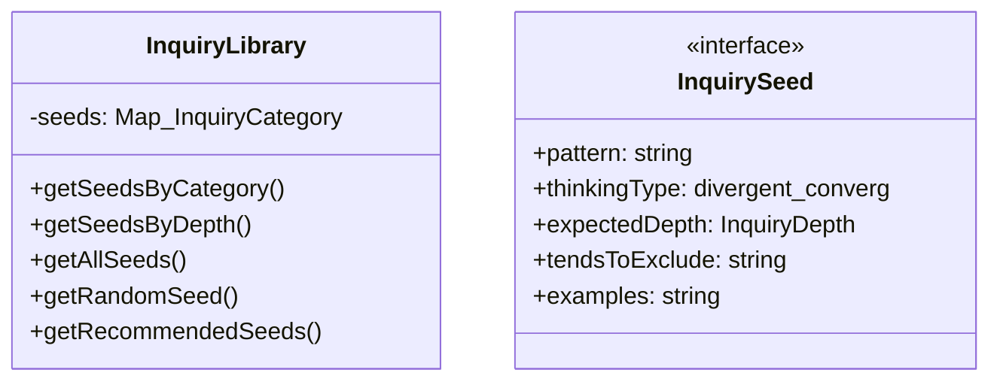
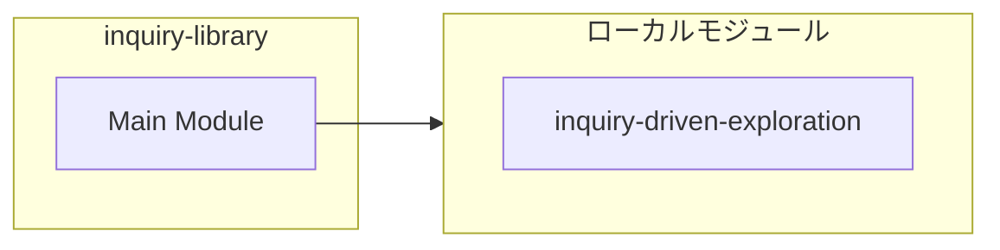

# inquiry-library

## 概要

`inquiry-library` モジュールのAPIリファレンス。

## インポート

```typescript
// from './inquiry-driven-exploration': InquiryDepth
```

## エクスポート一覧

| 種別 | 名前 | 説明 |
|------|------|------|
| 関数 | `getInquiryLibrary` | - |
| クラス | `InquiryLibrary` | 問いのライブラリ |
| インターフェース | `InquirySeed` | - |
| 型 | `InquiryCategory` | - |

## 図解

### クラス図



### 依存関係図



## 関数

### getInquiryLibrary

```typescript
getInquiryLibrary(): InquiryLibrary
```

**戻り値**: `InquiryLibrary`

## クラス

### InquiryLibrary

問いのライブラリ

エージェントが深い問いを立てるための「問いの種」を提供する。
これらの問いは「答え」を見つけるためではなく、「探求」を深めるためのものである。

**プロパティ**

| 名前 | 型 | 可視性 |
|------|-----|--------|
| seeds | `Map<InquiryCategory, InquirySeed[]>` | private |

**メソッド**

| 名前 | シグネチャ |
|------|------------|
| getSeedsByCategory | `getSeedsByCategory(category): InquirySeed[]` |
| getSeedsByDepth | `getSeedsByDepth(depth): InquirySeed[]` |
| getAllSeeds | `getAllSeeds(): InquirySeed[]` |
| getRandomSeed | `getRandomSeed(category): InquirySeed` |
| getRecommendedSeeds | `getRecommendedSeeds(context, maxResults): InquirySeed[]` |
| extractCommonWords | `extractCommonWords(text1, text2): string[]` |
| initializeSeeds | `initializeSeeds(): void` |

## インターフェース

### InquirySeed

```typescript
interface InquirySeed {
  pattern: string;
  thinkingType: "divergent" | "convergent" | "critical" | "creative" | "metacognitive";
  expectedDepth: InquiryDepth;
  tendsToExclude: string[];
  examples: string[];
  relatedPerspectives: (
		| "deconstruction"
		| "schizoanalysis"
		| "eudaimonia"
		| "utopia_dystopia"
		| "philosophy_of_thought"
		| "taxonomy_of_thought"
		| "logic"
	)[];
}
```

## 型定義

### InquiryCategory

```typescript
type InquiryCategory = | "problematization" // 問題化
	| "deconstruction" // 脱構築
	| "genealogy" // 系譜学
	| "aporic" // アポリア
	| "counterfactual" // 反事実
	| "meta_inquiry" // メタ問い
	| "practical" // 実践的
	| "ethical"
```

---
*自動生成: 2026-02-23T06:27:56.773Z*
