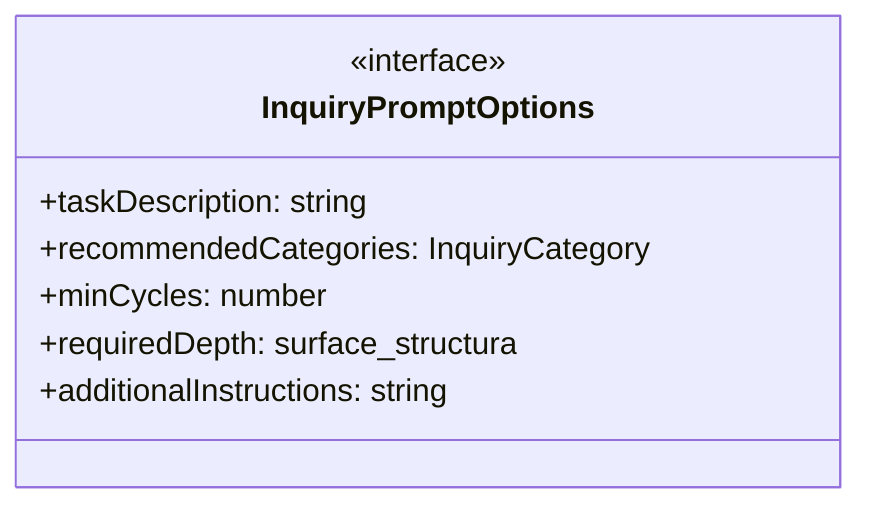
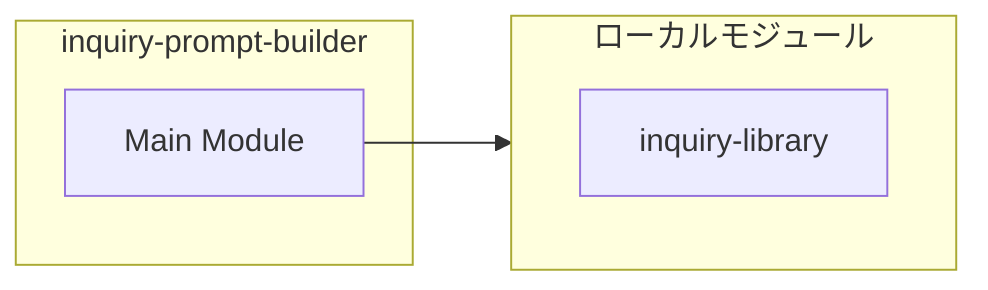
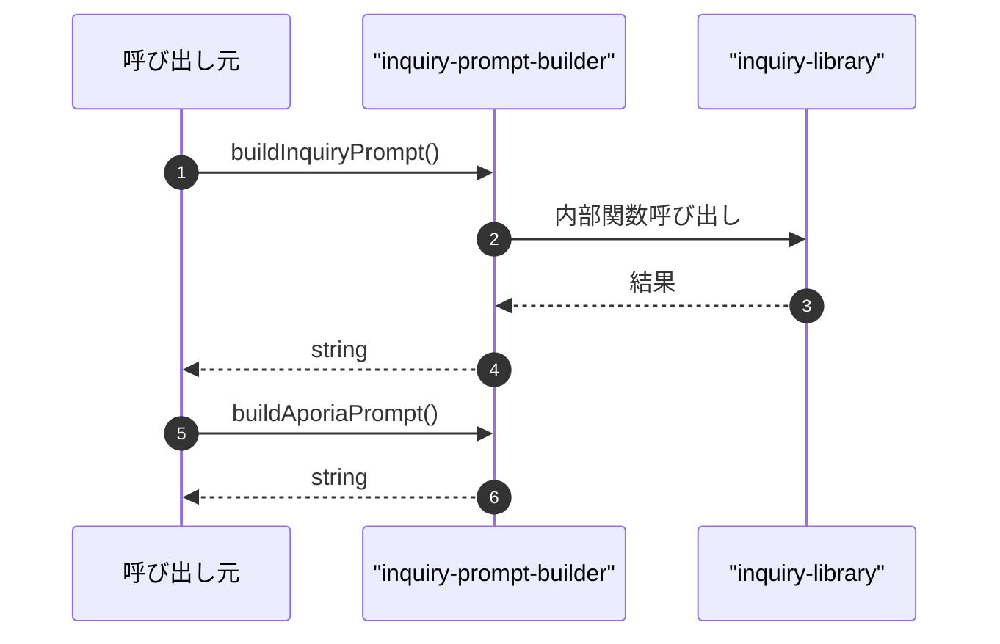

# inquiry-prompt-builder

## 概要

`inquiry-prompt-builder` モジュールのAPIリファレンス。

## インポート

```typescript
// from './inquiry-library.js': getInquiryLibrary, InquiryCategory
```

## エクスポート一覧

| 種別 | 名前 | 説明 |
|------|------|------|
| 関数 | `buildInquiryPrompt` | - |
| 関数 | `buildAporiaPrompt` | - |
| 関数 | `buildPreCompletionCheckPrompt` | - |
| 関数 | `buildDeepeningPrompt` | - |
| インターフェース | `InquiryPromptOptions` | - |

## 図解

### クラス図



### 依存関係図



### シーケンス図



## 関数

### buildInquiryPrompt

```typescript
buildInquiryPrompt(options: InquiryPromptOptions): string
```

**パラメータ**

| 名前 | 型 | 必須 |
|------|-----|------|
| options | `InquiryPromptOptions` | はい |

**戻り値**: `string`

### buildAporiaPrompt

```typescript
buildAporiaPrompt(poles: [string, string]): string
```

**パラメータ**

| 名前 | 型 | 必須 |
|------|-----|------|
| poles | `[string, string]` | はい |

**戻り値**: `string`

### buildPreCompletionCheckPrompt

```typescript
buildPreCompletionCheckPrompt(): string
```

**戻り値**: `string`

### buildDeepeningPrompt

```typescript
buildDeepeningPrompt(currentDepth: "surface" | "structural" | "foundational" | "aporic"): string
```

**パラメータ**

| 名前 | 型 | 必須 |
|------|-----|------|
| currentDepth | `"surface" | "structural" | "foundational" | "ap...` | はい |

**戻り値**: `string`

## インターフェース

### InquiryPromptOptions

```typescript
interface InquiryPromptOptions {
  taskDescription: string;
  recommendedCategories?: InquiryCategory[];
  minCycles?: number;
  requiredDepth?: "surface" | "structural" | "foundational" | "aporic";
  additionalInstructions?: string;
}
```

---
*自動生成: 2026-02-24T17:08:02.701Z*
