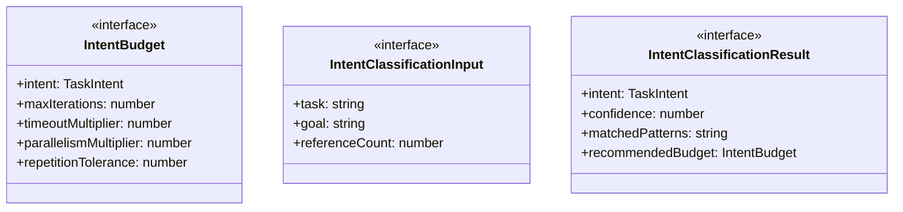
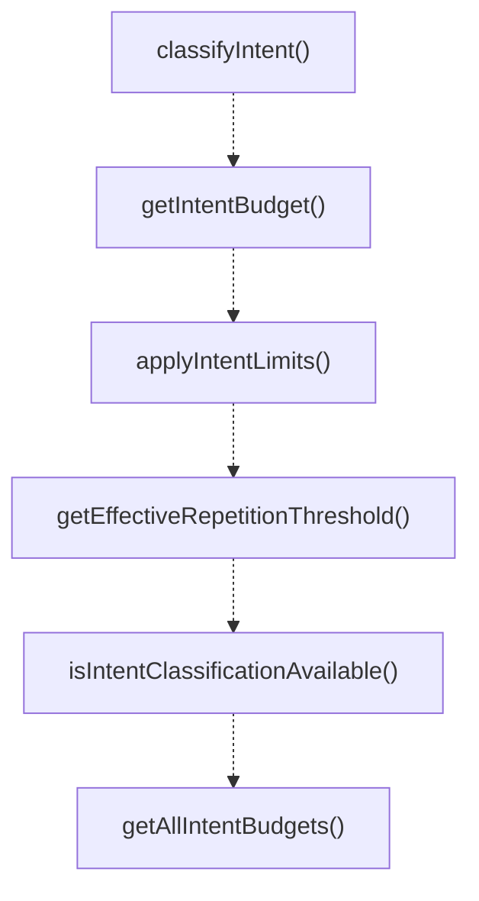

# intent-aware-limits

## 概要

`intent-aware-limits` モジュールのAPIリファレンス。

## エクスポート一覧

| 種別 | 名前 | 説明 |
|------|------|------|
| 関数 | `classifyIntent` | Classify task intent based on content analysis. |
| 関数 | `getIntentBudget` | Get budget for a specific intent. |
| 関数 | `applyIntentLimits` | Apply intent-aware adjustments to base limits. |
| 関数 | `getEffectiveRepetitionThreshold` | Calculate effective repetition threshold based on  |
| 関数 | `isIntentClassificationAvailable` | Check if intent classification is available. |
| 関数 | `getAllIntentBudgets` | Get all intent budgets. |
| 関数 | `summarizeIntentClassification` | Summarize intent classification for logging. |
| インターフェース | `IntentBudget` | Intent-aware budget configuration. |
| インターフェース | `IntentClassificationInput` | Input for intent classification. |
| インターフェース | `IntentClassificationResult` | Result of intent classification. |
| 型 | `TaskIntent` | Task intent types from paper taxonomy. |

## 図解

### クラス図



### 関数フロー



## 関数

### classifyIntent

```typescript
classifyIntent(input: IntentClassificationInput): IntentClassificationResult
```

Classify task intent based on content analysis.

**パラメータ**

| 名前 | 型 | 必須 |
|------|-----|------|
| input | `IntentClassificationInput` | はい |

**戻り値**: `IntentClassificationResult`

### getIntentBudget

```typescript
getIntentBudget(intent: TaskIntent): IntentBudget
```

Get budget for a specific intent.

**パラメータ**

| 名前 | 型 | 必須 |
|------|-----|------|
| intent | `TaskIntent` | はい |

**戻り値**: `IntentBudget`

### applyIntentLimits

```typescript
applyIntentLimits(baseLimits: T, intent: TaskIntent): T
```

Apply intent-aware adjustments to base limits.

**パラメータ**

| 名前 | 型 | 必須 |
|------|-----|------|
| baseLimits | `T` | はい |
| intent | `TaskIntent` | はい |

**戻り値**: `T`

### getEffectiveRepetitionThreshold

```typescript
getEffectiveRepetitionThreshold(baseThreshold: number, intent: TaskIntent): number
```

Calculate effective repetition threshold based on intent.

**パラメータ**

| 名前 | 型 | 必須 |
|------|-----|------|
| baseThreshold | `number` | はい |
| intent | `TaskIntent` | はい |

**戻り値**: `number`

### isIntentClassificationAvailable

```typescript
isIntentClassificationAvailable(): boolean
```

Check if intent classification is available.

**戻り値**: `boolean`

### getAllIntentBudgets

```typescript
getAllIntentBudgets(): Record<TaskIntent, IntentBudget>
```

Get all intent budgets.

**戻り値**: `Record<TaskIntent, IntentBudget>`

### summarizeIntentClassification

```typescript
summarizeIntentClassification(result: IntentClassificationResult): string
```

Summarize intent classification for logging.

**パラメータ**

| 名前 | 型 | 必須 |
|------|-----|------|
| result | `IntentClassificationResult` | はい |

**戻り値**: `string`

## インターフェース

### IntentBudget

```typescript
interface IntentBudget {
  intent: TaskIntent;
  maxIterations: number;
  timeoutMultiplier: number;
  parallelismMultiplier: number;
  repetitionTolerance: number;
  description: string;
}
```

Intent-aware budget configuration.

### IntentClassificationInput

```typescript
interface IntentClassificationInput {
  task: string;
  goal?: string;
  referenceCount?: number;
}
```

Input for intent classification.

### IntentClassificationResult

```typescript
interface IntentClassificationResult {
  intent: TaskIntent;
  confidence: number;
  matchedPatterns: string[];
  recommendedBudget: IntentBudget;
}
```

Result of intent classification.

## 型定義

### TaskIntent

```typescript
type TaskIntent = "declarative" | "procedural" | "reasoning"
```

Task intent types from paper taxonomy.

---
*自動生成: 2026-02-18T00:15:35.727Z*
