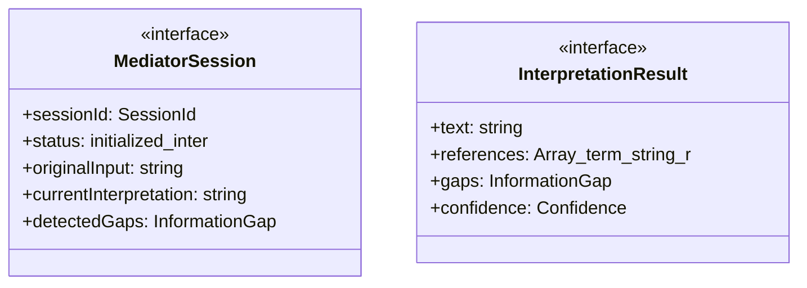
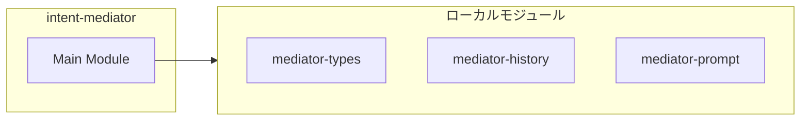
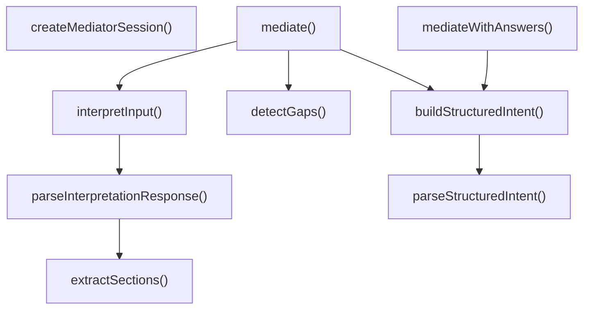
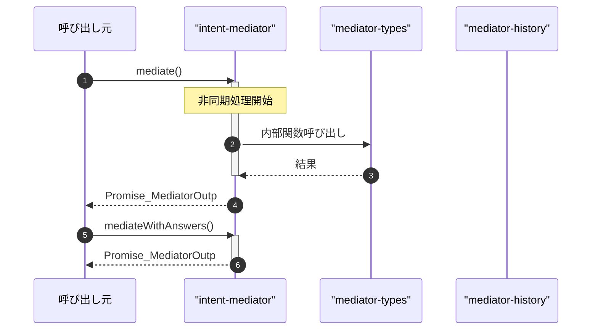

# intent-mediator

## 概要

`intent-mediator` モジュールのAPIリファレンス。

## インポート

```typescript
// from 'node:path': join
// from './mediator-types.js': MediatorInput, MediatorOutput, MediatorConfig, ...
// from './mediator-history.js': loadConfirmedFacts, saveConfirmedFacts, appendFact, ...
// from './mediator-prompt.js': MEDIATOR_SYSTEM_PROMPT, buildInterpretationPrompt, buildClarificationPrompt, ...
```

## エクスポート一覧

| 種別 | 名前 | 説明 |
|------|------|------|
| 関数 | `mediate` | ユーザー入力を仲介 |
| 関数 | `mediateWithAnswers` | 明確化の回答を統合して再仲介 |
| 関数 | `createMediatorSession` | 新しいMediatorセッションを作成 |
| インターフェース | `MediatorSession` | Mediatorセッション |
| 型 | `LlmCallFunction` | LLM呼び出し関数の型 |

## 図解

### クラス図



### 依存関係図



### 関数フロー



### シーケンス図



## 関数

### mediate

```typescript
async mediate(input: MediatorInput, config: Partial<MediatorConfig>, llmCall: LlmCallFunction): Promise<MediatorOutput>
```

ユーザー入力を仲介

**パラメータ**

| 名前 | 型 | 必須 |
|------|-----|------|
| input | `MediatorInput` | はい |
| config | `Partial<MediatorConfig>` | はい |
| llmCall | `LlmCallFunction` | はい |

**戻り値**: `Promise<MediatorOutput>`

### mediateWithAnswers

```typescript
async mediateWithAnswers(input: MediatorInput, interpretation: string, answers: Array<{ question: string; answer: string }>, config: Partial<MediatorConfig>, llmCall: LlmCallFunction): Promise<MediatorOutput>
```

明確化の回答を統合して再仲介

**パラメータ**

| 名前 | 型 | 必須 |
|------|-----|------|
| input | `MediatorInput` | はい |
| interpretation | `string` | はい |
| answers | `Array<{ question: string; answer: string }>` | はい |
| config | `Partial<MediatorConfig>` | はい |
| llmCall | `LlmCallFunction` | はい |

**戻り値**: `Promise<MediatorOutput>`

### createMediatorSession

```typescript
createMediatorSession(userMessage: string, memoryDir: string): MediatorSession
```

新しいMediatorセッションを作成

**パラメータ**

| 名前 | 型 | 必須 |
|------|-----|------|
| userMessage | `string` | はい |
| memoryDir | `string` | はい |

**戻り値**: `MediatorSession`

### interpretInput

```typescript
async interpretInput(input: MediatorInput, llmCall: LlmCallFunction): Promise<InterpretationResult>
```

ユーザー入力を解釈

**パラメータ**

| 名前 | 型 | 必須 |
|------|-----|------|
| input | `MediatorInput` | はい |
| llmCall | `LlmCallFunction` | はい |

**戻り値**: `Promise<InterpretationResult>`

### parseInterpretationResponse

```typescript
parseInterpretationResponse(response: string): InterpretationResult
```

解釈レスポンスをパース

**パラメータ**

| 名前 | 型 | 必須 |
|------|-----|------|
| response | `string` | はい |

**戻り値**: `InterpretationResult`

### extractSections

```typescript
extractSections(text: string): Record<string, string>
```

セクションを抽出

**パラメータ**

| 名前 | 型 | 必須 |
|------|-----|------|
| text | `string` | はい |

**戻り値**: `Record<string, string>`

### detectGaps

```typescript
detectGaps(interpretation: InterpretationResult, input: MediatorInput): InformationGap[]
```

情報ギャップを検出

**パラメータ**

| 名前 | 型 | 必須 |
|------|-----|------|
| interpretation | `InterpretationResult` | はい |
| input | `MediatorInput` | はい |

**戻り値**: `InformationGap[]`

### buildStructuredIntent

```typescript
async buildStructuredIntent(input: MediatorInput, interpretation: string, clarifications: Array<{ question: string; answer: string }>, llmCall: LlmCallFunction): Promise<StructuredIntent>
```

構造化指示を生成

**パラメータ**

| 名前 | 型 | 必須 |
|------|-----|------|
| input | `MediatorInput` | はい |
| interpretation | `string` | はい |
| clarifications | `Array<{ question: string; answer: string }>` | はい |
| llmCall | `LlmCallFunction` | はい |

**戻り値**: `Promise<StructuredIntent>`

### parseStructuredIntent

```typescript
parseStructuredIntent(response: string, originalInput: string): StructuredIntent
```

構造化指示JSONをパース

**パラメータ**

| 名前 | 型 | 必須 |
|------|-----|------|
| response | `string` | はい |
| originalInput | `string` | はい |

**戻り値**: `StructuredIntent`

### defaultLlmCall

```typescript
async defaultLlmCall(_systemPrompt: string, userPrompt: string): Promise<string>
```

デフォルトのLLM呼び出し関数

**パラメータ**

| 名前 | 型 | 必須 |
|------|-----|------|
| _systemPrompt | `string` | はい |
| userPrompt | `string` | はい |

**戻り値**: `Promise<string>`

## インターフェース

### MediatorSession

```typescript
interface MediatorSession {
  sessionId: SessionId;
  status: "initialized" | "interpreting" | "clarifying" | "structuring" | "completed" | "error";
  originalInput: string;
  currentInterpretation: string;
  detectedGaps: InformationGap[];
  clarifications: Array<{ question: string; answer: string }>;
  finalIntent?: StructuredIntent;
  messages: Message[];
  startedAt: string;
  processingTimeMs: number;
}
```

Mediatorセッション

### InterpretationResult

```typescript
interface InterpretationResult {
  text: string;
  references: Array<{ term: string; resolved?: string }>;
  gaps: InformationGap[];
  confidence: Confidence;
}
```

解釈結果

## 型定義

### LlmCallFunction

```typescript
type LlmCallFunction = (
  systemPrompt: string,
  userPrompt: string,
  options?: { timeoutMs?: number }
) => Promise<string>
```

LLM呼び出し関数の型

---
*自動生成: 2026-02-22T19:27:00.645Z*
