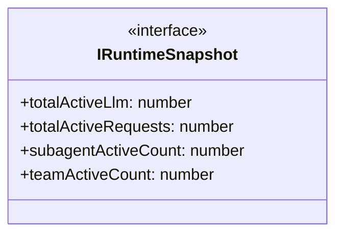

# runtime-snapshot

## 概要

`runtime-snapshot` モジュールのAPIリファレンス。

## エクスポート一覧

| 種別 | 名前 | 説明 |
|------|------|------|
| インターフェース | `IRuntimeSnapshot` | Minimal runtime snapshot interface for limit resol |
| 型 | `RuntimeSnapshotProvider` | Provider function type for runtime snapshot. |

## 図解

### クラス図



## インターフェース

### IRuntimeSnapshot

```typescript
interface IRuntimeSnapshot {
  totalActiveLlm: number;
  totalActiveRequests: number;
  subagentActiveCount: number;
  teamActiveCount: number;
}
```

Minimal runtime snapshot interface for limit resolution.
Captures the essential runtime state needed for capacity calculations.

## 型定義

### RuntimeSnapshotProvider

```typescript
type RuntimeSnapshotProvider = () => IRuntimeSnapshot
```

Provider function type for runtime snapshot.
Used for dependency injection from agent-runtime.ts.

---
*自動生成: 2026-02-18T00:15:35.727Z*
