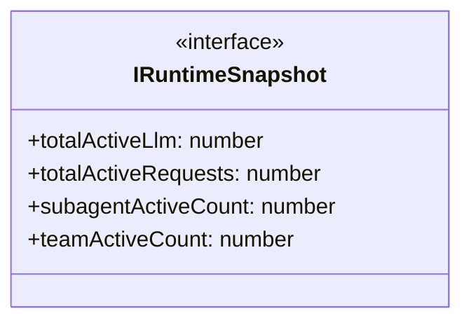

# runtime-snapshot

## 概要

`runtime-snapshot` モジュールのAPIリファレンス。

## エクスポート一覧

| 種別 | 名前 | 説明 |
|------|------|------|
| インターフェース | `IRuntimeSnapshot` | ランタイムスナップショットインターフェース |
| 型 | `RuntimeSnapshotProvider` | ランタイムスナップショットの提供関数 |

## 図解

### クラス図



## インターフェース

### IRuntimeSnapshot

```typescript
interface IRuntimeSnapshot {
  totalActiveLlm: number;
  totalActiveRequests: number;
  subagentActiveCount: number;
  teamActiveCount: number;
}
```

ランタイムスナップショットインターフェース

## 型定義

### RuntimeSnapshotProvider

```typescript
type RuntimeSnapshotProvider = () => IRuntimeSnapshot
```

ランタイムスナップショットの提供関数

---
*自動生成: 2026-02-18T07:48:44.997Z*
