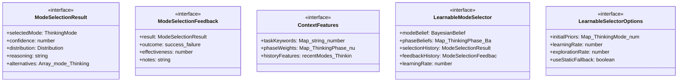
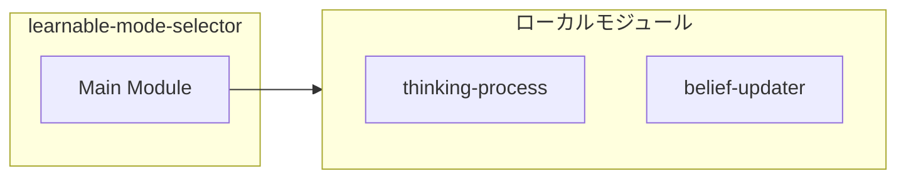
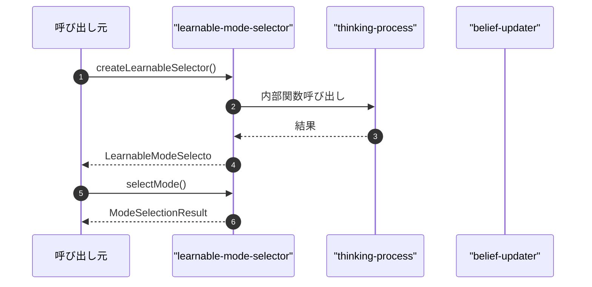

# learnable-mode-selector

## 概要

`learnable-mode-selector` モジュールのAPIリファレンス。

## インポート

```typescript
// from './thinking-process': ThinkingMode, ThinkingPhase, ThinkingContext, ...
// from './belief-updater': Distribution, BayesianBelief, createPrior, ...
```

## エクスポート一覧

| 種別 | 名前 | 説明 |
|------|------|------|
| 関数 | `createLearnableSelector` | - |
| 関数 | `selectMode` | - |
| 関数 | `updatePriors` | - |
| 関数 | `batchUpdatePriors` | - |
| 関数 | `evaluateSelectorPerformance` | - |
| 関数 | `resetSelector` | - |
| 関数 | `adjustSelectorSettings` | - |
| 関数 | `selectorToJSON` | - |
| 関数 | `summarizeSelector` | - |
| インターフェース | `ModeSelectionResult` | 選択結果 |
| インターフェース | `ModeSelectionFeedback` | 選択結果のフィードバック |
| インターフェース | `ContextFeatures` | コンテキスト特徴量 |
| インターフェース | `LearnableModeSelector` | 学習可能モード選択器 |
| インターフェース | `LearnableSelectorOptions` | 選択器作成オプション |

## 図解

### クラス図



### 依存関係図



### 関数フロー

```mermaid
flowchart TD
  adjustDistributionByContext["adjustDistributionByContext()"]
  adjustSelectorSettings["adjustSelectorSettings()"]
  batchUpdatePriors["batchUpdatePriors()"]
  calculateSelectionConfidence["calculateSelectionConfidence()"]
  createLearnableSelector["createLearnableSelector()"]
  evaluateSelectorPerformance["evaluateSelectorPerformance()"]
  extractContextFeatures["extractContextFeatures()"]
  generateSelectionReasoning["generateSelectionReasoning()"]
  getAlternatives["getAlternatives()"]
  resetSelector["resetSelector()"]
  selectExploratoryMode["selectExploratoryMode()"]
  selectMode["selectMode()"]
  selectorToJSON["selectorToJSON()"]
  summarizeSelector["summarizeSelector()"]
  updateBayesianBeliefWithLearning["updateBayesianBeliefWithLearning()"]
  updatePriors["updatePriors()"]
  batchUpdatePriors --> updatePriors
  resetSelector --> createLearnableSelector
  selectExploratoryMode --> getAlternatives
  selectMode --> adjustDistributionByContext
  selectMode --> calculateSelectionConfidence
  selectMode --> extractContextFeatures
  selectMode --> generateSelectionReasoning
  selectMode --> getAlternatives
  selectMode --> selectExploratoryMode
  summarizeSelector --> evaluateSelectorPerformance
  updatePriors --> updateBayesianBeliefWithLearning
```



### シーケンス図



## 関数

### createLearnableSelector

```typescript
createLearnableSelector(options: LearnableSelectorOptions): LearnableModeSelector
```

**パラメータ**

| 名前 | 型 | 必須 |
|------|-----|------|
| options | `LearnableSelectorOptions` | はい |

**戻り値**: `LearnableModeSelector`

### selectMode

```typescript
selectMode(selector: LearnableModeSelector, context: ThinkingContext): ModeSelectionResult
```

**パラメータ**

| 名前 | 型 | 必須 |
|------|-----|------|
| selector | `LearnableModeSelector` | はい |
| context | `ThinkingContext` | はい |

**戻り値**: `ModeSelectionResult`

### updatePriors

```typescript
updatePriors(selector: LearnableModeSelector, feedback: ModeSelectionFeedback): LearnableModeSelector
```

**パラメータ**

| 名前 | 型 | 必須 |
|------|-----|------|
| selector | `LearnableModeSelector` | はい |
| feedback | `ModeSelectionFeedback` | はい |

**戻り値**: `LearnableModeSelector`

### batchUpdatePriors

```typescript
batchUpdatePriors(selector: LearnableModeSelector, feedbacks: ModeSelectionFeedback[]): LearnableModeSelector
```

**パラメータ**

| 名前 | 型 | 必須 |
|------|-----|------|
| selector | `LearnableModeSelector` | はい |
| feedbacks | `ModeSelectionFeedback[]` | はい |

**戻り値**: `LearnableModeSelector`

### evaluateSelectorPerformance

```typescript
evaluateSelectorPerformance(selector: LearnableModeSelector): {
  successRate: number;
  avgEffectiveness: number;
  modeDistribution: Map<ThinkingMode, number>;
  recentTrend: 'improving' | 'declining' | 'stable';
}
```

**パラメータ**

| 名前 | 型 | 必須 |
|------|-----|------|
| selector | `LearnableModeSelector` | はい |

**戻り値**: `{
  successRate: number;
  avgEffectiveness: number;
  modeDistribution: Map<ThinkingMode, number>;
  recentTrend: 'improving' | 'declining' | 'stable';
}`

### resetSelector

```typescript
resetSelector(selector: LearnableModeSelector): LearnableModeSelector
```

**パラメータ**

| 名前 | 型 | 必須 |
|------|-----|------|
| selector | `LearnableModeSelector` | はい |

**戻り値**: `LearnableModeSelector`

### adjustSelectorSettings

```typescript
adjustSelectorSettings(selector: LearnableModeSelector, adjustments: {
    learningRate?: number;
    explorationRate?: number;
  }): LearnableModeSelector
```

**パラメータ**

| 名前 | 型 | 必須 |
|------|-----|------|
| selector | `LearnableModeSelector` | はい |
| adjustments | `object` | はい |
| &nbsp;&nbsp;↳ learningRate | `number` | いいえ |
| &nbsp;&nbsp;↳ explorationRate | `number` | いいえ |

**戻り値**: `LearnableModeSelector`

### extractContextFeatures

```typescript
extractContextFeatures(context: ThinkingContext): ContextFeatures
```

コンテキストから特徴量を抽出

**パラメータ**

| 名前 | 型 | 必須 |
|------|-----|------|
| context | `ThinkingContext` | はい |

**戻り値**: `ContextFeatures`

### adjustDistributionByContext

```typescript
adjustDistributionByContext(distribution: Distribution, features: ContextFeatures, context: ThinkingContext): Distribution
```

コンテキストで分布を調整

**パラメータ**

| 名前 | 型 | 必須 |
|------|-----|------|
| distribution | `Distribution` | はい |
| features | `ContextFeatures` | はい |
| context | `ThinkingContext` | はい |

**戻り値**: `Distribution`

### selectExploratoryMode

```typescript
selectExploratoryMode(selector: LearnableModeSelector, context: ThinkingContext, distribution: Distribution): ModeSelectionResult
```

探索的選択

**パラメータ**

| 名前 | 型 | 必須 |
|------|-----|------|
| selector | `LearnableModeSelector` | はい |
| context | `ThinkingContext` | はい |
| distribution | `Distribution` | はい |

**戻り値**: `ModeSelectionResult`

### calculateSelectionConfidence

```typescript
calculateSelectionConfidence(distribution: Distribution, selectedMode: ThinkingMode): number
```

選択信頼度を計算

**パラメータ**

| 名前 | 型 | 必須 |
|------|-----|------|
| distribution | `Distribution` | はい |
| selectedMode | `ThinkingMode` | はい |

**戻り値**: `number`

### getAlternatives

```typescript
getAlternatives(distribution: Distribution, selectedMode: ThinkingMode): Array<{ mode: ThinkingMode; probability: number }>
```

代替案を取得

**パラメータ**

| 名前 | 型 | 必須 |
|------|-----|------|
| distribution | `Distribution` | はい |
| selectedMode | `ThinkingMode` | はい |

**戻り値**: `Array<{ mode: ThinkingMode; probability: number }>`

### generateSelectionReasoning

```typescript
generateSelectionReasoning(mode: ThinkingMode, context: ThinkingContext, features: ContextFeatures, probability: number): string
```

選択理由を生成

**パラメータ**

| 名前 | 型 | 必須 |
|------|-----|------|
| mode | `ThinkingMode` | はい |
| context | `ThinkingContext` | はい |
| features | `ContextFeatures` | はい |
| probability | `number` | はい |

**戻り値**: `string`

### updateBayesianBeliefWithLearning

```typescript
updateBayesianBeliefWithLearning(belief: BayesianBelief, evidence: Evidence, learningRate: number): BayesianBelief
```

学習率を適用して信念を更新

**パラメータ**

| 名前 | 型 | 必須 |
|------|-----|------|
| belief | `BayesianBelief` | はい |
| evidence | `Evidence` | はい |
| learningRate | `number` | はい |

**戻り値**: `BayesianBelief`

### selectorToJSON

```typescript
selectorToJSON(selector: LearnableModeSelector): Record<string, unknown>
```

**パラメータ**

| 名前 | 型 | 必須 |
|------|-----|------|
| selector | `LearnableModeSelector` | はい |

**戻り値**: `Record<string, unknown>`

### summarizeSelector

```typescript
summarizeSelector(selector: LearnableModeSelector): string
```

**パラメータ**

| 名前 | 型 | 必須 |
|------|-----|------|
| selector | `LearnableModeSelector` | はい |

**戻り値**: `string`

## インターフェース

### ModeSelectionResult

```typescript
interface ModeSelectionResult {
  selectedMode: ThinkingMode;
  confidence: number;
  distribution: Distribution;
  reasoning: string;
  alternatives: Array<{
    mode: ThinkingMode;
    probability: number;
  }>;
  context: ThinkingContext;
  timestamp: Date;
}
```

選択結果

### ModeSelectionFeedback

```typescript
interface ModeSelectionFeedback {
  result: ModeSelectionResult;
  outcome: 'success' | 'failure' | 'partial';
  effectiveness: number;
  notes?: string;
}
```

選択結果のフィードバック

### ContextFeatures

```typescript
interface ContextFeatures {
  taskKeywords: Map<string, number>;
  phaseWeights: Map<ThinkingPhase, number>;
  historyFeatures: {
    recentModes: ThinkingMode[];
    modeDiversity: number;
    avgConfidence: number;
  };
}
```

コンテキスト特徴量

### LearnableModeSelector

```typescript
interface LearnableModeSelector {
  modeBelief: BayesianBelief;
  phaseBeliefs: Map<ThinkingPhase, BayesianBelief>;
  selectionHistory: ModeSelectionResult[];
  feedbackHistory: ModeSelectionFeedback[];
  learningRate: number;
  explorationRate: number;
  createdAt: Date;
  updateCount: number;
}
```

学習可能モード選択器

### LearnableSelectorOptions

```typescript
interface LearnableSelectorOptions {
  initialPriors?: Map<ThinkingMode, number>;
  learningRate?: number;
  explorationRate?: number;
  useStaticFallback?: boolean;
}
```

選択器作成オプション

---
*自動生成: 2026-02-24T17:08:02.706Z*
