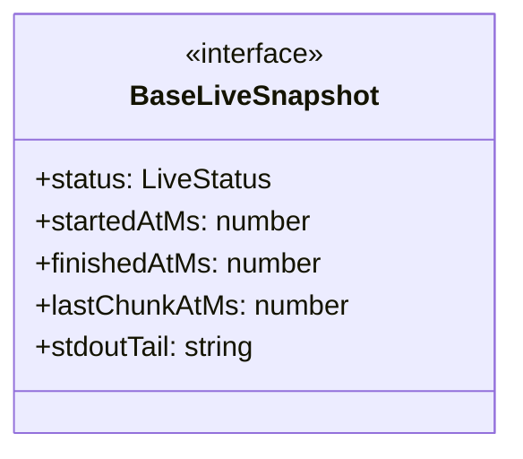
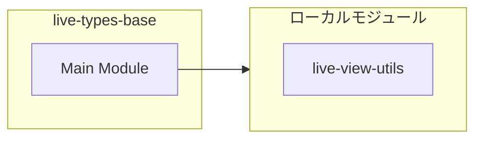

# live-types-base

## 概要

`live-types-base` モジュールのAPIリファレンス。

## インポート

```typescript
// from './live-view-utils.js': LiveStatus
```

## エクスポート一覧

| 種別 | 名前 | 説明 |
|------|------|------|
| インターフェース | `BaseLiveSnapshot` | ライブ監視スナップショットの共通基底型 |

## 図解

### クラス図



### 依存関係図



## インターフェース

### BaseLiveSnapshot

```typescript
interface BaseLiveSnapshot {
  status: LiveStatus;
  startedAtMs?: number;
  finishedAtMs?: number;
  lastChunkAtMs?: number;
  stdoutTail: string;
  stderrTail: string;
  stdoutBytes: number;
  stderrBytes: number;
  stdoutNewlineCount: number;
  stderrNewlineCount: number;
  stdoutEndsWithNewline: boolean;
  stderrEndsWithNewline: boolean;
}
```

ライブ監視スナップショットの共通基底型

---
*自動生成: 2026-02-22T19:27:00.650Z*
