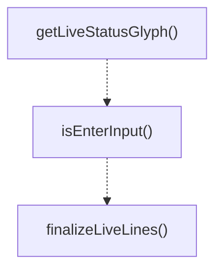

# live-view-utils

## 概要

`live-view-utils` モジュールのAPIリファレンス。

## エクスポート一覧

| 種別 | 名前 | 説明 |
|------|------|------|
| 関数 | `getLiveStatusGlyph` | ステータスに対応するグリフを返す |
| 関数 | `isEnterInput` | 入力がEnterキーか判定する |
| 関数 | `finalizeLiveLines` | 固定高さの表示用に行を整形する |
| 型 | `LiveStatus` | ライブビューのステータスを表す型 |

## 図解

### 関数フロー



## 関数

### getLiveStatusGlyph

```typescript
getLiveStatusGlyph(status: LiveStatus): string
```

ステータスに対応するグリフを返す

**パラメータ**

| 名前 | 型 | 必須 |
|------|-----|------|
| status | `LiveStatus` | はい |

**戻り値**: `string`

### isEnterInput

```typescript
isEnterInput(rawInput: string): boolean
```

入力がEnterキーか判定する

**パラメータ**

| 名前 | 型 | 必須 |
|------|-----|------|
| rawInput | `string` | はい |

**戻り値**: `boolean`

### finalizeLiveLines

```typescript
finalizeLiveLines(lines: string[], height?: number): string[]
```

固定高さの表示用に行を整形する

**パラメータ**

| 名前 | 型 | 必須 |
|------|-----|------|
| lines | `string[]` | はい |
| height | `number` | いいえ |

**戻り値**: `string[]`

## 型定義

### LiveStatus

```typescript
type LiveStatus = "pending" | "running" | "completed" | "failed"
```

ライブビューのステータスを表す型

---
*自動生成: 2026-02-18T07:48:44.998Z*
