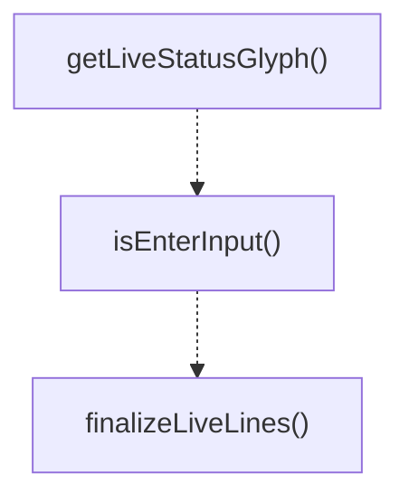

# live-view-utils

## 概要

`live-view-utils` モジュールのAPIリファレンス。

## エクスポート一覧

| 種別 | 名前 | 説明 |
|------|------|------|
| 関数 | `getLiveStatusGlyph` | Get the glyph representation for a live status. |
| 関数 | `isEnterInput` | Check if the raw input represents an Enter key pre |
| 関数 | `finalizeLiveLines` | Finalize lines for display in a fixed-height view. |
| 型 | `LiveStatus` | Common status type for live view items. |

## 図解

### 関数フロー



## 関数

### getLiveStatusGlyph

```typescript
getLiveStatusGlyph(status: LiveStatus): string
```

Get the glyph representation for a live status.

**パラメータ**

| 名前 | 型 | 必須 |
|------|-----|------|
| status | `LiveStatus` | はい |

**戻り値**: `string`

### isEnterInput

```typescript
isEnterInput(rawInput: string): boolean
```

Check if the raw input represents an Enter key press.
Handles multiple representations of Enter across different terminals.

**パラメータ**

| 名前 | 型 | 必須 |
|------|-----|------|
| rawInput | `string` | はい |

**戻り値**: `boolean`

### finalizeLiveLines

```typescript
finalizeLiveLines(lines: string[], height?: number): string[]
```

Finalize lines for display in a fixed-height view.
Pads with empty strings if fewer lines than height, truncates if more.

**パラメータ**

| 名前 | 型 | 必須 |
|------|-----|------|
| lines | `string[]` | はい |
| height | `number` | いいえ |

**戻り値**: `string[]`

## 型定義

### LiveStatus

```typescript
type LiveStatus = "pending" | "running" | "completed" | "failed"
```

Common status type for live view items.
Used by both subagent live items and team member live items.

---
*自動生成: 2026-02-17T22:24:18.945Z*
