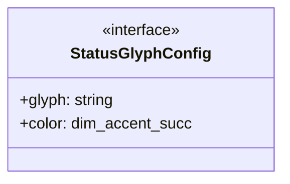

# live-view-utils

## 概要

`live-view-utils` モジュールのAPIリファレンス。

## エクスポート一覧

| 種別 | 名前 | 説明 |
|------|------|------|
| 関数 | `getLiveStatusGlyph` | - |
| 関数 | `getLiveStatusColor` | - |
| 関数 | `getActivityIndicator` | - |
| 関数 | `isEnterInput` | - |
| 関数 | `finalizeLiveLines` | 行データを最終化する |
| 関数 | `toTailLines` | 末尾の行を取得 |
| 関数 | `looksLikeMarkdown` | Markdownらしいテキストか判定する |
| インターフェース | `StatusGlyphConfig` | ステータスグリフの設定 |
| 型 | `LiveStatus` | ライブビューのステータス型 |

## 図解

### クラス図



## 関数

### getLiveStatusGlyph

```typescript
getLiveStatusGlyph(status: LiveStatus): string
```

**パラメータ**

| 名前 | 型 | 必須 |
|------|-----|------|
| status | `LiveStatus` | はい |

**戻り値**: `string`

### getLiveStatusColor

```typescript
getLiveStatusColor(status: LiveStatus): "dim" | "accent" | "success" | "error"
```

**パラメータ**

| 名前 | 型 | 必須 |
|------|-----|------|
| status | `LiveStatus` | はい |

**戻り値**: `"dim" | "accent" | "success" | "error"`

### getActivityIndicator

```typescript
getActivityIndicator(hasOutput: boolean, hasError: boolean, isRecent: boolean): string
```

**パラメータ**

| 名前 | 型 | 必須 |
|------|-----|------|
| hasOutput | `boolean` | はい |
| hasError | `boolean` | はい |
| isRecent | `boolean` | はい |

**戻り値**: `string`

### isEnterInput

```typescript
isEnterInput(rawInput: string): boolean
```

**パラメータ**

| 名前 | 型 | 必須 |
|------|-----|------|
| rawInput | `string` | はい |

**戻り値**: `boolean`

### finalizeLiveLines

```typescript
finalizeLiveLines(lines: string[], height?: number): string[]
```

行データを最終化する

**パラメータ**

| 名前 | 型 | 必須 |
|------|-----|------|
| lines | `string[]` | はい |
| height | `number` | いいえ |

**戻り値**: `string[]`

### toTailLines

```typescript
toTailLines(tail: string, limit: number): string[]
```

末尾の行を取得

**パラメータ**

| 名前 | 型 | 必須 |
|------|-----|------|
| tail | `string` | はい |
| limit | `number` | はい |

**戻り値**: `string[]`

### looksLikeMarkdown

```typescript
looksLikeMarkdown(input: string): boolean
```

Markdownらしいテキストか判定する

**パラメータ**

| 名前 | 型 | 必須 |
|------|-----|------|
| input | `string` | はい |

**戻り値**: `boolean`

## インターフェース

### StatusGlyphConfig

```typescript
interface StatusGlyphConfig {
  glyph: string;
  color: "dim" | "accent" | "success" | "error";
}
```

ステータスグリフの設定

## 型定義

### LiveStatus

```typescript
type LiveStatus = "pending" | "running" | "completed" | "failed"
```

ライブビューのステータス型

---
*自動生成: 2026-02-23T06:29:42.353Z*
