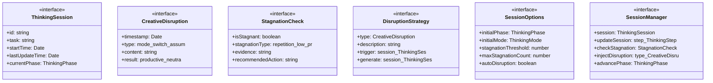
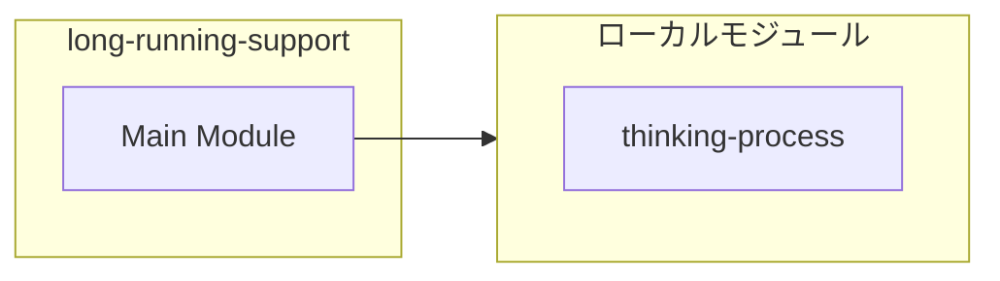
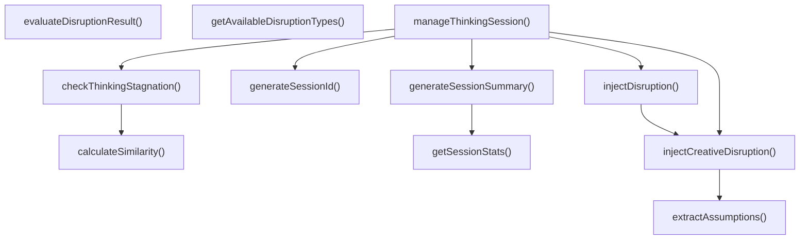
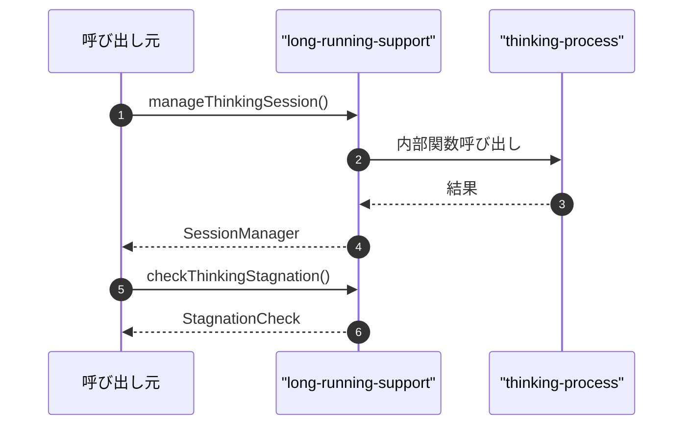

# long-running-support

## 概要

`long-running-support` モジュールのAPIリファレンス。

## インポート

```typescript
// from './thinking-process': ThinkingMode, ThinkingPhase, ThinkingStep, ...
```

## エクスポート一覧

| 種別 | 名前 | 説明 |
|------|------|------|
| 関数 | `manageThinkingSession` | - |
| 関数 | `checkThinkingStagnation` | - |
| 関数 | `injectCreativeDisruption` | - |
| 関数 | `getSessionStats` | - |
| 関数 | `getAvailableDisruptionTypes` | - |
| 関数 | `evaluateDisruptionResult` | - |
| インターフェース | `ThinkingSession` | 思考セッション |
| インターフェース | `CreativeDisruption` | 創造的攪乱 |
| インターフェース | `StagnationCheck` | 停滞検出結果 |
| インターフェース | `DisruptionStrategy` | 攪乱戦略 |
| インターフェース | `SessionOptions` | セッション管理オプション |
| インターフェース | `SessionManager` | セッション管理API |

## 図解

### クラス図



### 依存関係図



### 関数フロー



### シーケンス図



## 関数

### manageThinkingSession

```typescript
manageThinkingSession(task: string, options: SessionOptions): SessionManager
```

**パラメータ**

| 名前 | 型 | 必須 |
|------|-----|------|
| task | `string` | はい |
| options | `SessionOptions` | はい |

**戻り値**: `SessionManager`

### updateSession

```typescript
updateSession(step: ThinkingStep): void
```

**パラメータ**

| 名前 | 型 | 必須 |
|------|-----|------|
| step | `ThinkingStep` | はい |

**戻り値**: `void`

### checkStagnation

```typescript
checkStagnation(): StagnationCheck
```

**戻り値**: `StagnationCheck`

### injectDisruption

```typescript
injectDisruption(type?: CreativeDisruption['type']): CreativeDisruption
```

**パラメータ**

| 名前 | 型 | 必須 |
|------|-----|------|
| type | `CreativeDisruption['type']` | いいえ |

**戻り値**: `CreativeDisruption`

### advancePhaseFn

```typescript
advancePhaseFn(): ThinkingPhase
```

**戻り値**: `ThinkingPhase`

### completeSession

```typescript
completeSession(): ThinkingSession
```

**戻り値**: `ThinkingSession`

### getSessionSummary

```typescript
getSessionSummary(): string
```

**戻り値**: `string`

### checkThinkingStagnation

```typescript
checkThinkingStagnation(session: ThinkingSession, threshold: number): StagnationCheck
```

**パラメータ**

| 名前 | 型 | 必須 |
|------|-----|------|
| session | `ThinkingSession` | はい |
| threshold | `number` | はい |

**戻り値**: `StagnationCheck`

### injectCreativeDisruption

```typescript
injectCreativeDisruption(session: ThinkingSession, forcedType?: CreativeDisruption['type']): CreativeDisruption
```

**パラメータ**

| 名前 | 型 | 必須 |
|------|-----|------|
| session | `ThinkingSession` | はい |
| forcedType | `CreativeDisruption['type']` | いいえ |

**戻り値**: `CreativeDisruption`

### getSessionStats

```typescript
getSessionStats(session: ThinkingSession): {
  duration: number;
  stepCount: number;
  avgConfidence: number;
  modeDistribution: Record<ThinkingMode, number>;
  disruptionCount: number;
  finalStatus: string;
}
```

**パラメータ**

| 名前 | 型 | 必須 |
|------|-----|------|
| session | `ThinkingSession` | はい |

**戻り値**: `{
  duration: number;
  stepCount: number;
  avgConfidence: number;
  modeDistribution: Record<ThinkingMode, number>;
  disruptionCount: number;
  finalStatus: string;
}`

### generateSessionId

```typescript
generateSessionId(): string
```

セッションIDを生成

**戻り値**: `string`

### calculateSimilarity

```typescript
calculateSimilarity(thoughts: string[]): number
```

テキスト間の類似度を計算

**パラメータ**

| 名前 | 型 | 必須 |
|------|-----|------|
| thoughts | `string[]` | はい |

**戻り値**: `number`

### extractAssumptions

```typescript
extractAssumptions(history: ThinkingStep[]): string[]
```

思考履歴から前提を抽出

**パラメータ**

| 名前 | 型 | 必須 |
|------|-----|------|
| history | `ThinkingStep[]` | はい |

**戻り値**: `string[]`

### generateSessionSummary

```typescript
generateSessionSummary(session: ThinkingSession): string
```

セッションサマリーを生成

**パラメータ**

| 名前 | 型 | 必須 |
|------|-----|------|
| session | `ThinkingSession` | はい |

**戻り値**: `string`

### getAvailableDisruptionTypes

```typescript
getAvailableDisruptionTypes(): Array<{
  type: CreativeDisruption['type'];
  description: string;
}>
```

**戻り値**: `Array<{
  type: CreativeDisruption['type'];
  description: string;
}>`

### evaluateDisruptionResult

```typescript
evaluateDisruptionResult(disruption: CreativeDisruption, session: ThinkingSession): CreativeDisruption
```

**パラメータ**

| 名前 | 型 | 必須 |
|------|-----|------|
| disruption | `CreativeDisruption` | はい |
| session | `ThinkingSession` | はい |

**戻り値**: `CreativeDisruption`

## インターフェース

### ThinkingSession

```typescript
interface ThinkingSession {
  id: string;
  task: string;
  startTime: Date;
  lastUpdateTime: Date;
  currentPhase: ThinkingPhase;
  currentMode: ThinkingMode;
  history: ThinkingStep[];
  stagnationCount: number;
  disruptionHistory: CreativeDisruption[];
  status: 'active' | 'stagnant' | 'disrupted' | 'completed';
}
```

思考セッション

### CreativeDisruption

```typescript
interface CreativeDisruption {
  timestamp: Date;
  type: 'mode-switch' | 'assumption-challenge' | 'analogy' | 'random-injection';
  content: string;
  result: 'productive' | 'neutral' | 'counterproductive';
}
```

創造的攪乱

### StagnationCheck

```typescript
interface StagnationCheck {
  isStagnant: boolean;
  stagnationType: 'repetition' | 'low-progress' | 'mode-fixation' | 'confidence-plateau';
  evidence: string;
  recommendedAction: string;
}
```

停滞検出結果

### DisruptionStrategy

```typescript
interface DisruptionStrategy {
  type: CreativeDisruption['type'];
  description: string;
  trigger: (session: ThinkingSession) => boolean;
  generate: (session: ThinkingSession) => string;
}
```

攪乱戦略

### SessionOptions

```typescript
interface SessionOptions {
  initialPhase?: ThinkingPhase;
  initialMode?: ThinkingMode;
  stagnationThreshold?: number;
  maxStagnationCount?: number;
  autoDisruption?: boolean;
}
```

セッション管理オプション

### SessionManager

```typescript
interface SessionManager {
  session: ThinkingSession;
  updateSession: (step: ThinkingStep) => void;
  checkStagnation: () => StagnationCheck;
  injectDisruption: (type?: CreativeDisruption['type']) => CreativeDisruption;
  advancePhase: () => ThinkingPhase;
  completeSession: () => ThinkingSession;
  getSessionSummary: () => string;
}
```

セッション管理API

---
*自動生成: 2026-02-22T18:55:28.932Z*
