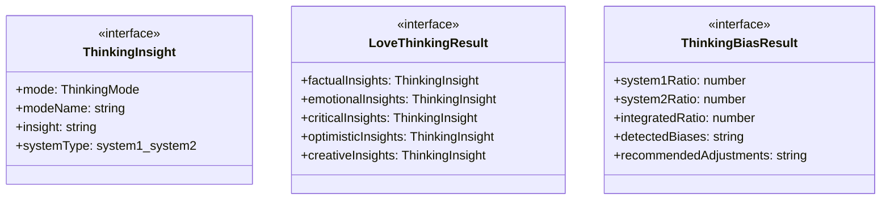
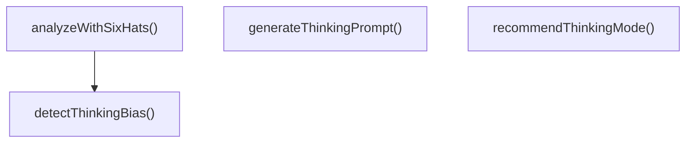

# love-thinking-modes

## 概要

`love-thinking-modes` モジュールのAPIリファレンス。

## エクスポート一覧

| 種別 | 名前 | 説明 |
|------|------|------|
| 関数 | `analyzeWithSixHats` | 「愛」を6つの思考モードで分析 |
| 関数 | `detectThinkingBias` | 思考の偏りを検出 |
| 関数 | `recommendThinkingMode` | 二重過程理論に基づく思考モード切替の推奨 |
| 関数 | `generateThinkingPrompt` | 思考モード切り替えのプロンプト生成 |
| インターフェース | `ThinkingInsight` | 各思考モードからの「愛」についての洞察 |
| インターフェース | `LoveThinkingResult` | 6つの思考帽を用いた「愛」の分析結果 |
| インターフェース | `ThinkingBiasResult` | 思考の偏り検出結果 |
| 型 | `ThinkingMode` | 6つの思考帽（デボノ）に基づく思考モード |

## 図解

### クラス図



### 関数フロー



## 関数

### analyzeWithSixHats

```typescript
analyzeWithSixHats(context: string, knownFacts?: { overallScore?: number; loveType?: string }): LoveThinkingResult
```

「愛」を6つの思考モードで分析

**パラメータ**

| 名前 | 型 | 必須 |
|------|-----|------|
| context | `string` | はい |
| knownFacts | `object` | いいえ |
| &nbsp;&nbsp;↳ overallScore | `number` | いいえ |
| &nbsp;&nbsp;↳ loveType | `string` | いいえ |

**戻り値**: `LoveThinkingResult`

### detectThinkingBias

```typescript
detectThinkingBias(insights: ThinkingInsight[]): ThinkingBiasResult
```

思考の偏りを検出

**パラメータ**

| 名前 | 型 | 必須 |
|------|-----|------|
| insights | `ThinkingInsight[]` | はい |

**戻り値**: `ThinkingBiasResult`

### recommendThinkingMode

```typescript
recommendThinkingMode(currentBias: ThinkingBiasResult): ThinkingMode
```

二重過程理論に基づく思考モード切替の推奨

**パラメータ**

| 名前 | 型 | 必須 |
|------|-----|------|
| currentBias | `ThinkingBiasResult` | はい |

**戻り値**: `ThinkingMode`

### generateThinkingPrompt

```typescript
generateThinkingPrompt(mode: ThinkingMode, context: string): string
```

思考モード切り替えのプロンプト生成

**パラメータ**

| 名前 | 型 | 必須 |
|------|-----|------|
| mode | `ThinkingMode` | はい |
| context | `string` | はい |

**戻り値**: `string`

## インターフェース

### ThinkingInsight

```typescript
interface ThinkingInsight {
  mode: ThinkingMode;
  modeName: string;
  insight: string;
  systemType: "system1" | "system2" | "integrated";
}
```

各思考モードからの「愛」についての洞察

### LoveThinkingResult

```typescript
interface LoveThinkingResult {
  factualInsights: ThinkingInsight[];
  emotionalInsights: ThinkingInsight[];
  criticalInsights: ThinkingInsight[];
  optimisticInsights: ThinkingInsight[];
  creativeInsights: ThinkingInsight[];
  integrativeInsights: ThinkingInsight[];
  biasDetection: ThinkingBiasResult;
  synthesis: string;
}
```

6つの思考帽を用いた「愛」の分析結果

### ThinkingBiasResult

```typescript
interface ThinkingBiasResult {
  system1Ratio: number;
  system2Ratio: number;
  integratedRatio: number;
  detectedBiases: string[];
  recommendedAdjustments: string[];
}
```

思考の偏り検出結果

## 型定義

### ThinkingMode

```typescript
type ThinkingMode = | "white" // 事実・情報重視
	| "red" // 感情・直感
	| "black" // 批判・リスク
	| "yellow" // 楽観・価値
	| "green" // 創造・代替案
	| "blue"
```

6つの思考帽（デボノ）に基づく思考モード

思考分類学の視点から：思考には多様な形態があり、
状況に応じて適切な思考モードを選択・切り替える能力が重要。

---
*自動生成: 2026-02-22T19:27:00.656Z*
