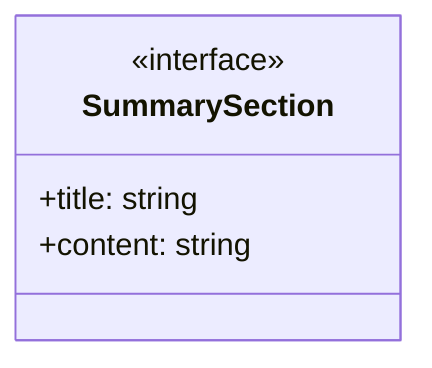
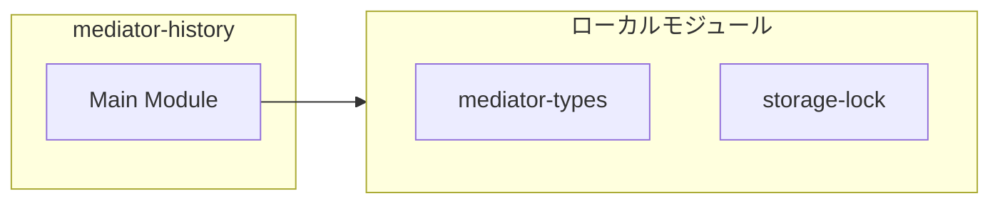
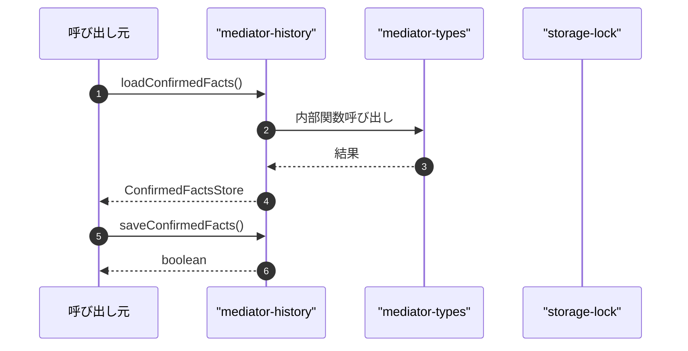

# mediator-history

## 概要

`mediator-history` モジュールのAPIリファレンス。

## インポート

```typescript
// from 'node:fs': existsSync, mkdirSync, readFileSync, ...
// from 'node:path': join
// from './mediator-types.js': SessionId, Timestamp, ConfirmedFact, ...
// from './storage-lock.js': withFileLock, atomicWriteTextFile
```

## エクスポート一覧

| 種別 | 名前 | 説明 |
|------|------|------|
| 関数 | `loadConfirmedFacts` | 確認済み事実をロード |
| 関数 | `saveConfirmedFacts` | 確認済み事実を保存 |
| 関数 | `appendFact` | 確認済み事実を追加 |
| 関数 | `findFactByKey` | キーで確認済み事実を検索 |
| 関数 | `getRecentFacts` | 最近の確認済み事実を取得 |
| 関数 | `getFactsBySession` | セッションIDで事実をフィルタ |
| 関数 | `loadConversationSummary` | 会話要約をロード |
| 関数 | `saveConversationSummary` | 会話要約を保存 |
| 関数 | `appendSummarySection` | 会話要約に追記 |
| 関数 | `createSessionSummary` | セッションの会話要約を生成 |
| 関数 | `getUserPreferences` | ユーザー設定を取得 |
| 関数 | `updateUserPreferences` | ユーザー設定を更新 |
| 関数 | `pruneOldFacts` | 古い確認済み事実を削除 |
| 関数 | `exportHistory` | 履歴をエクスポート |
| 関数 | `getHistoryStats` | 履歴の統計情報を取得 |

## 図解

### クラス図



### 依存関係図



### 関数フロー

```mermaid
flowchart TD
  appendFact["appendFact()"]
  appendSummarySection["appendSummarySection()"]
  createSessionSummary["createSessionSummary()"]
  exportHistory["exportHistory()"]
  findFactByKey["findFactByKey()"]
  formatSummarySection["formatSummarySection()"]
  generateFactId["generateFactId()"]
  getFactsBySession["getFactsBySession()"]
  getHistoryStats["getHistoryStats()"]
  getRecentFacts["getRecentFacts()"]
  getUserPreferences["getUserPreferences()"]
  isValidFactsStore["isValidFactsStore()"]
  loadConfirmedFacts["loadConfirmedFacts()"]
  loadConversationSummary["loadConversationSummary()"]
  pruneOldFacts["pruneOldFacts()"]
  saveConfirmedFacts["saveConfirmedFacts()"]
  saveConversationSummary["saveConversationSummary()"]
  updateUserPreferences["updateUserPreferences()"]
  appendFact --> generateFactId
  appendFact --> loadConfirmedFacts
  appendFact --> saveConfirmedFacts
  appendSummarySection --> formatSummarySection
  appendSummarySection --> loadConversationSummary
  appendSummarySection --> saveConversationSummary
  exportHistory --> loadConfirmedFacts
  exportHistory --> loadConversationSummary
  findFactByKey --> loadConfirmedFacts
  getFactsBySession --> loadConfirmedFacts
  getHistoryStats --> loadConfirmedFacts
  getHistoryStats --> loadConversationSummary
  getRecentFacts --> loadConfirmedFacts
  getUserPreferences --> loadConfirmedFacts
  loadConfirmedFacts --> isValidFactsStore
  pruneOldFacts --> loadConfirmedFacts
  pruneOldFacts --> saveConfirmedFacts
  updateUserPreferences --> loadConfirmedFacts
  updateUserPreferences --> saveConfirmedFacts
```



### シーケンス図



## 関数

### loadConfirmedFacts

```typescript
loadConfirmedFacts(memoryDir: string): ConfirmedFactsStore
```

確認済み事実をロード

**パラメータ**

| 名前 | 型 | 必須 |
|------|-----|------|
| memoryDir | `string` | はい |

**戻り値**: `ConfirmedFactsStore`

### saveConfirmedFacts

```typescript
saveConfirmedFacts(memoryDir: string, store: ConfirmedFactsStore): boolean
```

確認済み事実を保存

**パラメータ**

| 名前 | 型 | 必須 |
|------|-----|------|
| memoryDir | `string` | はい |
| store | `ConfirmedFactsStore` | はい |

**戻り値**: `boolean`

### appendFact

```typescript
appendFact(memoryDir: string, fact: Omit<ConfirmedFact, "id" | "confirmedAt">): boolean
```

確認済み事実を追加

**パラメータ**

| 名前 | 型 | 必須 |
|------|-----|------|
| memoryDir | `string` | はい |
| fact | `Omit<ConfirmedFact, "id" | "confirmedAt">` | はい |

**戻り値**: `boolean`

### findFactByKey

```typescript
findFactByKey(memoryDir: string, key: string): ConfirmedFact | undefined
```

キーで確認済み事実を検索

**パラメータ**

| 名前 | 型 | 必須 |
|------|-----|------|
| memoryDir | `string` | はい |
| key | `string` | はい |

**戻り値**: `ConfirmedFact | undefined`

### getRecentFacts

```typescript
getRecentFacts(memoryDir: string, limit: number): ConfirmedFact[]
```

最近の確認済み事実を取得

**パラメータ**

| 名前 | 型 | 必須 |
|------|-----|------|
| memoryDir | `string` | はい |
| limit | `number` | はい |

**戻り値**: `ConfirmedFact[]`

### getFactsBySession

```typescript
getFactsBySession(memoryDir: string, sessionId: SessionId): ConfirmedFact[]
```

セッションIDで事実をフィルタ

**パラメータ**

| 名前 | 型 | 必須 |
|------|-----|------|
| memoryDir | `string` | はい |
| sessionId | `SessionId` | はい |

**戻り値**: `ConfirmedFact[]`

### loadConversationSummary

```typescript
loadConversationSummary(memoryDir: string): string
```

会話要約をロード

**パラメータ**

| 名前 | 型 | 必須 |
|------|-----|------|
| memoryDir | `string` | はい |

**戻り値**: `string`

### saveConversationSummary

```typescript
saveConversationSummary(memoryDir: string, summary: string): boolean
```

会話要約を保存

**パラメータ**

| 名前 | 型 | 必須 |
|------|-----|------|
| memoryDir | `string` | はい |
| summary | `string` | はい |

**戻り値**: `boolean`

### appendSummarySection

```typescript
appendSummarySection(memoryDir: string, section: SummarySection): boolean
```

会話要約に追記

**パラメータ**

| 名前 | 型 | 必須 |
|------|-----|------|
| memoryDir | `string` | はい |
| section | `SummarySection` | はい |

**戻り値**: `boolean`

### createSessionSummary

```typescript
createSessionSummary(sessionId: SessionId, topic: string, decisions: string[], pending: string[]): string
```

セッションの会話要約を生成

**パラメータ**

| 名前 | 型 | 必須 |
|------|-----|------|
| sessionId | `SessionId` | はい |
| topic | `string` | はい |
| decisions | `string[]` | はい |
| pending | `string[]` | はい |

**戻り値**: `string`

### getUserPreferences

```typescript
getUserPreferences(memoryDir: string): UserPreferences
```

ユーザー設定を取得

**パラメータ**

| 名前 | 型 | 必須 |
|------|-----|------|
| memoryDir | `string` | はい |

**戻り値**: `UserPreferences`

### updateUserPreferences

```typescript
updateUserPreferences(memoryDir: string, preferences: Partial<UserPreferences>): boolean
```

ユーザー設定を更新

**パラメータ**

| 名前 | 型 | 必須 |
|------|-----|------|
| memoryDir | `string` | はい |
| preferences | `Partial<UserPreferences>` | はい |

**戻り値**: `boolean`

### pruneOldFacts

```typescript
pruneOldFacts(memoryDir: string, daysToKeep: number): number
```

古い確認済み事実を削除

**パラメータ**

| 名前 | 型 | 必須 |
|------|-----|------|
| memoryDir | `string` | はい |
| daysToKeep | `number` | はい |

**戻り値**: `number`

### exportHistory

```typescript
exportHistory(memoryDir: string): {
  confirmedFacts: ConfirmedFactsStore;
  conversationSummary: string;
  exportedAt: Timestamp;
}
```

履歴をエクスポート

**パラメータ**

| 名前 | 型 | 必須 |
|------|-----|------|
| memoryDir | `string` | はい |

**戻り値**: `{
  confirmedFacts: ConfirmedFactsStore;
  conversationSummary: string;
  exportedAt: Timestamp;
}`

### generateFactId

```typescript
generateFactId(): string
```

事実IDを生成

**戻り値**: `string`

### isValidFactsStore

```typescript
isValidFactsStore(data: unknown): data is ConfirmedFactsStore
```

確認済み事実ストアのバリデーション

**パラメータ**

| 名前 | 型 | 必須 |
|------|-----|------|
| data | `unknown` | はい |

**戻り値**: `data is ConfirmedFactsStore`

### formatSummarySection

```typescript
formatSummarySection(section: SummarySection): string
```

要約セクションをフォーマット

**パラメータ**

| 名前 | 型 | 必須 |
|------|-----|------|
| section | `SummarySection` | はい |

**戻り値**: `string`

### getHistoryStats

```typescript
getHistoryStats(memoryDir: string): {
  totalFacts: number;
  oldestFact: Timestamp | null;
  newestFact: Timestamp | null;
  hasConversationSummary: boolean;
}
```

履歴の統計情報を取得

**パラメータ**

| 名前 | 型 | 必須 |
|------|-----|------|
| memoryDir | `string` | はい |

**戻り値**: `{
  totalFacts: number;
  oldestFact: Timestamp | null;
  newestFact: Timestamp | null;
  hasConversationSummary: boolean;
}`

## インターフェース

### SummarySection

```typescript
interface SummarySection {
  title: string;
  content: string[];
}
```

会話要約セクション

---
*自動生成: 2026-02-22T19:27:00.657Z*
