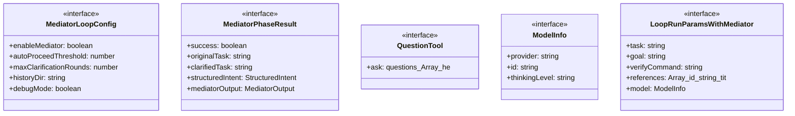
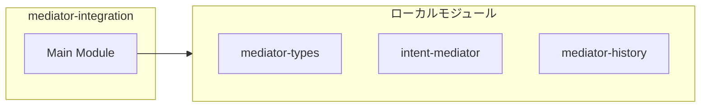
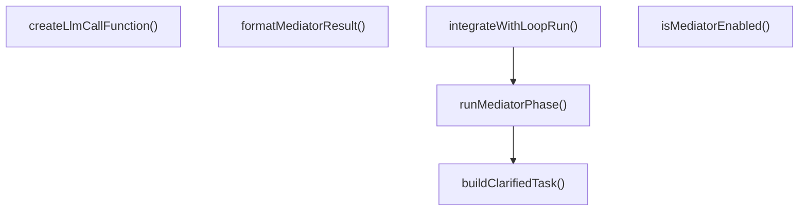
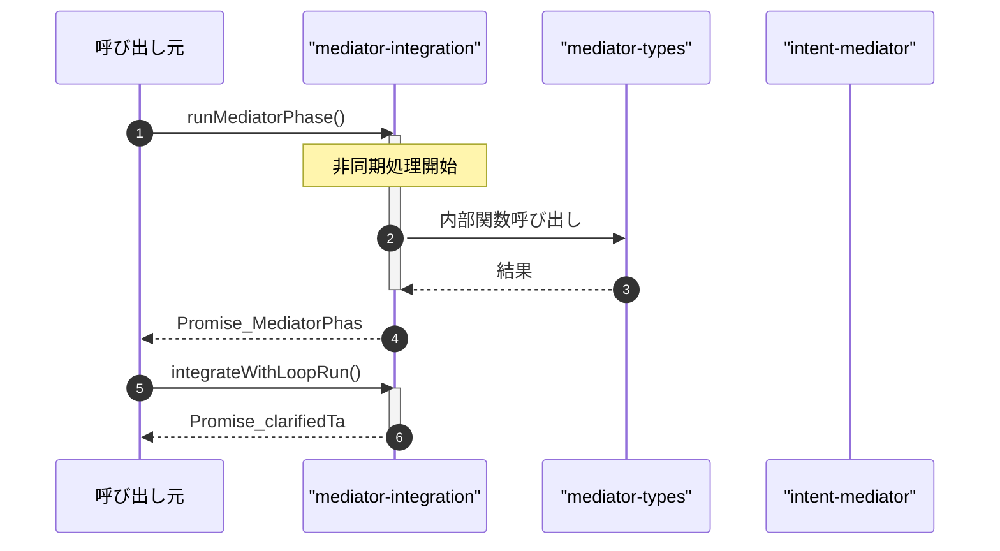

# mediator-integration

## 概要

`mediator-integration` モジュールのAPIリファレンス。

## インポート

```typescript
// from './mediator-types.js': MediatorInput, MediatorOutput, MediatorConfig, ...
// from './intent-mediator.js': mediate, mediateWithAnswers, LlmCallFunction
// from './mediator-history.js': loadConfirmedFacts, appendFact, appendSummarySection
```

## エクスポート一覧

| 種別 | 名前 | 説明 |
|------|------|------|
| 関数 | `runMediatorPhase` | Mediatorフェーズを実行 |
| 関数 | `integrateWithLoopRun` | loop_runにMediatorを統合 |
| 関数 | `createLlmCallFunction` | LLM呼び出し関数を作成 |
| 関数 | `formatMediatorResult` | Mediatorの結果をログ用にフォーマット |
| 関数 | `isMediatorEnabled` | Mediator統合が有効かどうかを判定 |
| インターフェース | `MediatorLoopConfig` | MediatorとLoopの統合設定 |
| インターフェース | `MediatorPhaseResult` | Mediatorフェーズの結果 |
| インターフェース | `QuestionTool` | Question ツールの型定義 |
| インターフェース | `ModelInfo` | モデル情報 |
| インターフェース | `LoopRunParamsWithMediator` | loop_run用のパラメータ拡張 |

## 図解

### クラス図



### 依存関係図



### 関数フロー



### シーケンス図



## 関数

### runMediatorPhase

```typescript
async runMediatorPhase(task: string, config: MediatorLoopConfig, llmCall: LlmCallFunction, questionTool?: QuestionTool): Promise<MediatorPhaseResult>
```

Mediatorフェーズを実行

**パラメータ**

| 名前 | 型 | 必須 |
|------|-----|------|
| task | `string` | はい |
| config | `MediatorLoopConfig` | はい |
| llmCall | `LlmCallFunction` | はい |
| questionTool | `QuestionTool` | いいえ |

**戻り値**: `Promise<MediatorPhaseResult>`

### buildClarifiedTask

```typescript
buildClarifiedTask(originalTask: string, output: MediatorOutput): string
```

明確化後のタスクを構築

**パラメータ**

| 名前 | 型 | 必須 |
|------|-----|------|
| originalTask | `string` | はい |
| output | `MediatorOutput` | はい |

**戻り値**: `string`

### integrateWithLoopRun

```typescript
async integrateWithLoopRun(params: LoopRunParamsWithMediator, llmCall: LlmCallFunction, questionTool?: QuestionTool): Promise<{
  clarifiedTask: string;
  mediatorResult?: MediatorPhaseResult;
  shouldProceed: boolean;
}>
```

loop_runにMediatorを統合

**パラメータ**

| 名前 | 型 | 必須 |
|------|-----|------|
| params | `LoopRunParamsWithMediator` | はい |
| llmCall | `LlmCallFunction` | はい |
| questionTool | `QuestionTool` | いいえ |

**戻り値**: `Promise<{
  clarifiedTask: string;
  mediatorResult?: MediatorPhaseResult;
  shouldProceed: boolean;
}>`

### createLlmCallFunction

```typescript
createLlmCallFunction(callModel: (prompt: string, timeoutMs: number) => Promise<string>): LlmCallFunction
```

LLM呼び出し関数を作成

**パラメータ**

| 名前 | 型 | 必須 |
|------|-----|------|
| callModel | `(prompt: string, timeoutMs: number) => Promise<...` | はい |

**戻り値**: `LlmCallFunction`

### formatMediatorResult

```typescript
formatMediatorResult(result: MediatorPhaseResult): string
```

Mediatorの結果をログ用にフォーマット

**パラメータ**

| 名前 | 型 | 必須 |
|------|-----|------|
| result | `MediatorPhaseResult` | はい |

**戻り値**: `string`

### isMediatorEnabled

```typescript
isMediatorEnabled(explicitConfig?: {
  enableMediator?: boolean;
}): boolean
```

Mediator統合が有効かどうかを判定

**パラメータ**

| 名前 | 型 | 必須 |
|------|-----|------|
| explicitConfig | `object` | いいえ |
| &nbsp;&nbsp;↳ enableMediator | `boolean` | いいえ |

**戻り値**: `boolean`

## インターフェース

### MediatorLoopConfig

```typescript
interface MediatorLoopConfig {
  enableMediator: boolean;
  autoProceedThreshold: number;
  maxClarificationRounds: number;
  historyDir: string;
  debugMode: boolean;
}
```

MediatorとLoopの統合設定

### MediatorPhaseResult

```typescript
interface MediatorPhaseResult {
  success: boolean;
  originalTask: string;
  clarifiedTask: string;
  structuredIntent?: StructuredIntent;
  mediatorOutput?: MediatorOutput;
  needsClarification: boolean;
  error?: string;
  processingTimeMs: number;
  clarificationHistory: Array<{
    round: number;
    questions: MediatorQuestion[];
    answers: Array<{ question: string; answer: string }>;
  }>;
}
```

Mediatorフェーズの結果

### QuestionTool

```typescript
interface QuestionTool {
  ask: (questions: Array<{
    header: string;
    question: string;
    options: Array<{ label: string; description: string }>;
    multiple?: boolean;
    custom?: boolean;
  }>) => Promise<Array<{ question: string; answer: string }>>;
}
```

Question ツールの型定義

### ModelInfo

```typescript
interface ModelInfo {
  provider: string;
  id: string;
  thinkingLevel: string;
}
```

モデル情報

### LoopRunParamsWithMediator

```typescript
interface LoopRunParamsWithMediator {
  task: string;
  goal?: string;
  verifyCommand?: string;
  references?: Array<{ id: string; title?: string; source: string }>;
  model: ModelInfo;
  cwd: string;
  enableMediator?: boolean;
  mediatorAutoProceedThreshold?: number;
}
```

loop_run用のパラメータ拡張

---
*自動生成: 2026-02-23T06:29:42.361Z*
