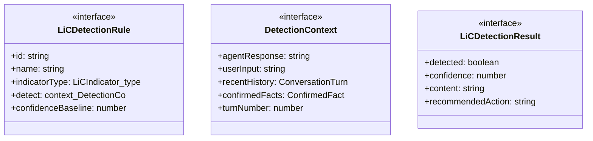
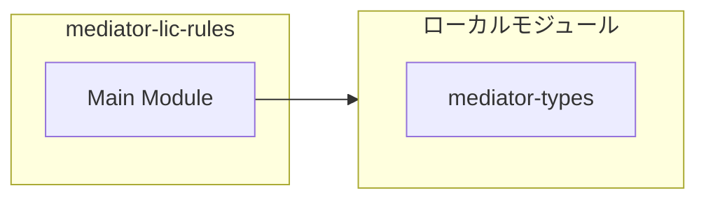
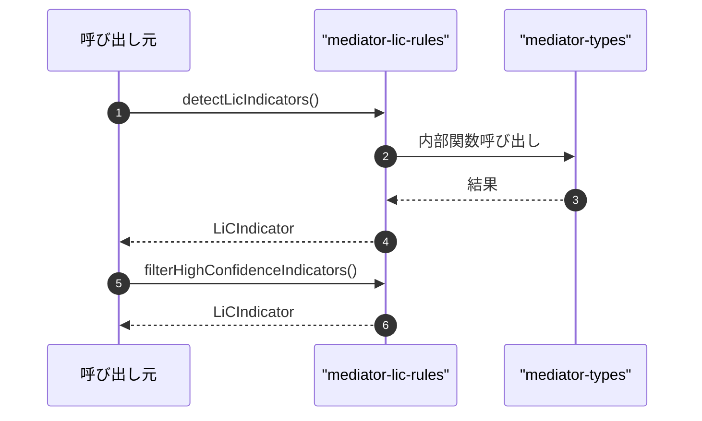

# mediator-lic-rules

## 概要

`mediator-lic-rules` モジュールのAPIリファレンス。

## インポート

```typescript
// from './mediator-types.js': LiCIndicator, ConfirmedFact, ConversationTurn, ...
```

## エクスポート一覧

| 種別 | 名前 | 説明 |
|------|------|------|
| 関数 | `detectLicIndicators` | ルールベースでLiC兆候を検出する |
| 関数 | `filterHighConfidenceIndicators` | 高信頼度の兆候のみを抽出 |
| 関数 | `generateDetectionSummary` | 検出結果のサマリーを生成 |
| インターフェース | `LiCDetectionRule` | LiC検出ルール |
| インターフェース | `DetectionContext` | 検出コンテキスト |
| インターフェース | `LiCDetectionResult` | 検出結果 |

## 図解

### クラス図



### 依存関係図



### シーケンス図



## 関数

### detectLicIndicators

```typescript
detectLicIndicators(context: DetectionContext, rules: LiCDetectionRule[]): LiCIndicator[]
```

ルールベースでLiC兆候を検出する

**パラメータ**

| 名前 | 型 | 必須 |
|------|-----|------|
| context | `DetectionContext` | はい |
| rules | `LiCDetectionRule[]` | はい |

**戻り値**: `LiCIndicator[]`

### filterHighConfidenceIndicators

```typescript
filterHighConfidenceIndicators(indicators: LiCIndicator[], threshold: any): LiCIndicator[]
```

高信頼度の兆候のみを抽出

**パラメータ**

| 名前 | 型 | 必須 |
|------|-----|------|
| indicators | `LiCIndicator[]` | はい |
| threshold | `any` | はい |

**戻り値**: `LiCIndicator[]`

### extractImportantKeywords

```typescript
extractImportantKeywords(text: string): string[]
```

重要なキーワードを抽出する

**パラメータ**

| 名前 | 型 | 必須 |
|------|-----|------|
| text | `string` | はい |

**戻り値**: `string[]`

### generateDetectionSummary

```typescript
generateDetectionSummary(indicators: LiCIndicator[]): string
```

検出結果のサマリーを生成

**パラメータ**

| 名前 | 型 | 必須 |
|------|-----|------|
| indicators | `LiCIndicator[]` | はい |

**戻り値**: `string`

## インターフェース

### LiCDetectionRule

```typescript
interface LiCDetectionRule {
  id: string;
  name: string;
  indicatorType: LiCIndicator["type"];
  detect: (context: DetectionContext) => LiCDetectionResult | null;
  confidenceBaseline: number;
  description: string;
}
```

LiC検出ルール

### DetectionContext

```typescript
interface DetectionContext {
  agentResponse: string;
  userInput: string;
  recentHistory: ConversationTurn[];
  confirmedFacts: ConfirmedFact[];
  turnNumber: number;
}
```

検出コンテキスト

### LiCDetectionResult

```typescript
interface LiCDetectionResult {
  detected: boolean;
  confidence: number;
  content: string;
  recommendedAction?: string;
}
```

検出結果

---
*自動生成: 2026-02-24T17:08:02.716Z*
