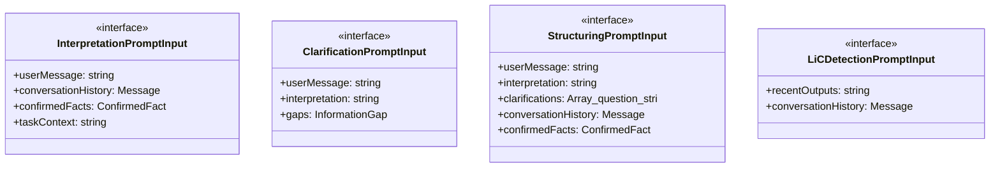
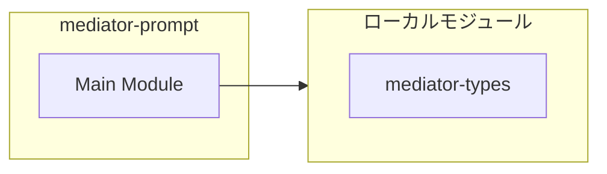
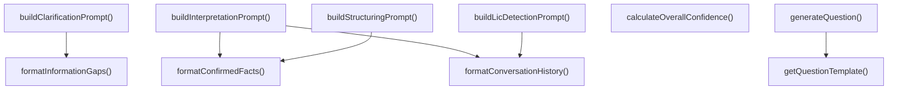
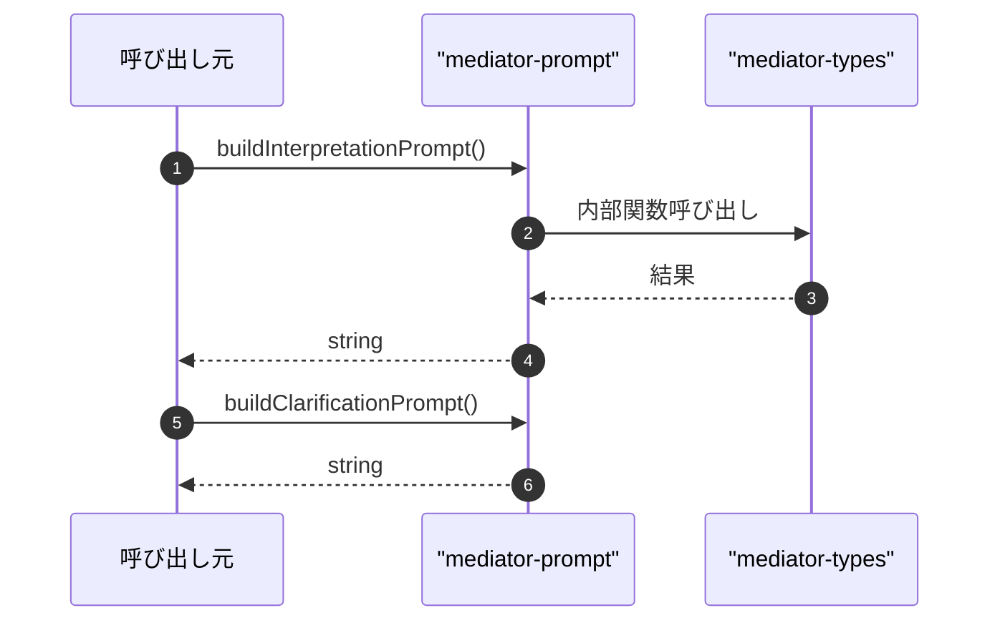

# mediator-prompt

## 概要

`mediator-prompt` モジュールのAPIリファレンス。

## インポート

```typescript
// from './mediator-types.js': Message, ConfirmedFact, InformationGap, ...
```

## エクスポート一覧

| 種別 | 名前 | 説明 |
|------|------|------|
| 関数 | `buildInterpretationPrompt` | 意図解釈プロンプトを構築 |
| 関数 | `buildClarificationPrompt` | 明確化質問生成プロンプトを構築 |
| 関数 | `buildStructuringPrompt` | 構造化指示生成プロンプトを構築 |
| 関数 | `buildLicDetectionPrompt` | LiC検出プロンプトを構築 |
| 関数 | `getQuestionTemplate` | 質問候補を生成 |
| 関数 | `generateQuestion` | 質問を生成 |
| 関数 | `calculateOverallConfidence` | 全体の信頼度を計算 |
| インターフェース | `InterpretationPromptInput` | 意図解釈プロンプトの入力 |
| インターフェース | `ClarificationPromptInput` | 明確化質問生成プロンプトの入力 |
| インターフェース | `StructuringPromptInput` | 構造化指示生成プロンプトの入力 |
| インターフェース | `LiCDetectionPromptInput` | LiC検出プロンプトの入力 |

## 図解

### クラス図



### 依存関係図



### 関数フロー



### シーケンス図



## 関数

### buildInterpretationPrompt

```typescript
buildInterpretationPrompt(input: InterpretationPromptInput): string
```

意図解釈プロンプトを構築

**パラメータ**

| 名前 | 型 | 必須 |
|------|-----|------|
| input | `InterpretationPromptInput` | はい |

**戻り値**: `string`

### buildClarificationPrompt

```typescript
buildClarificationPrompt(input: ClarificationPromptInput): string
```

明確化質問生成プロンプトを構築

**パラメータ**

| 名前 | 型 | 必須 |
|------|-----|------|
| input | `ClarificationPromptInput` | はい |

**戻り値**: `string`

### buildStructuringPrompt

```typescript
buildStructuringPrompt(input: StructuringPromptInput): string
```

構造化指示生成プロンプトを構築

**パラメータ**

| 名前 | 型 | 必須 |
|------|-----|------|
| input | `StructuringPromptInput` | はい |

**戻り値**: `string`

### buildLicDetectionPrompt

```typescript
buildLicDetectionPrompt(input: LiCDetectionPromptInput): string
```

LiC検出プロンプトを構築

**パラメータ**

| 名前 | 型 | 必須 |
|------|-----|------|
| input | `LiCDetectionPromptInput` | はい |

**戻り値**: `string`

### formatConversationHistory

```typescript
formatConversationHistory(messages: Message[]): string
```

会話履歴をフォーマット

**パラメータ**

| 名前 | 型 | 必須 |
|------|-----|------|
| messages | `Message[]` | はい |

**戻り値**: `string`

### formatConfirmedFacts

```typescript
formatConfirmedFacts(facts: ConfirmedFact[]): string
```

確認済み事実をフォーマット

**パラメータ**

| 名前 | 型 | 必須 |
|------|-----|------|
| facts | `ConfirmedFact[]` | はい |

**戻り値**: `string`

### formatInformationGaps

```typescript
formatInformationGaps(gaps: InformationGap[]): string
```

情報ギャップをフォーマット

**パラメータ**

| 名前 | 型 | 必須 |
|------|-----|------|
| gaps | `InformationGap[]` | はい |

**戻り値**: `string`

### getQuestionTemplate

```typescript
getQuestionTemplate(gapType: InformationGapType): {
  headerTemplate: string;
  questionTemplate: string;
  optionTemplates: Array<{ label: string; description: string }>;
}
```

質問候補を生成

**パラメータ**

| 名前 | 型 | 必須 |
|------|-----|------|
| gapType | `InformationGapType` | はい |

**戻り値**: `{
  headerTemplate: string;
  questionTemplate: string;
  optionTemplates: Array<{ label: string; description: string }>;
}`

### generateQuestion

```typescript
generateQuestion(gap: InformationGap): MediatorQuestion
```

質問を生成

**パラメータ**

| 名前 | 型 | 必須 |
|------|-----|------|
| gap | `InformationGap` | はい |

**戻り値**: `MediatorQuestion`

### calculateOverallConfidence

```typescript
calculateOverallConfidence(interpretation: string, gapsRemaining: number, factsUsed: number): number
```

全体の信頼度を計算

**パラメータ**

| 名前 | 型 | 必須 |
|------|-----|------|
| interpretation | `string` | はい |
| gapsRemaining | `number` | はい |
| factsUsed | `number` | はい |

**戻り値**: `number`

## インターフェース

### InterpretationPromptInput

```typescript
interface InterpretationPromptInput {
  userMessage: string;
  conversationHistory: Message[];
  confirmedFacts: ConfirmedFact[];
  taskContext?: string;
}
```

意図解釈プロンプトの入力

### ClarificationPromptInput

```typescript
interface ClarificationPromptInput {
  userMessage: string;
  interpretation: string;
  gaps: InformationGap[];
}
```

明確化質問生成プロンプトの入力

### StructuringPromptInput

```typescript
interface StructuringPromptInput {
  userMessage: string;
  interpretation: string;
  clarifications?: Array<{ question: string; answer: string }>;
  conversationHistory: Message[];
  confirmedFacts: ConfirmedFact[];
}
```

構造化指示生成プロンプトの入力

### LiCDetectionPromptInput

```typescript
interface LiCDetectionPromptInput {
  recentOutputs: string[];
  conversationHistory: Message[];
}
```

LiC検出プロンプトの入力

---
*自動生成: 2026-02-22T18:55:28.941Z*
