# mediator-types

## 概要

`mediator-types` モジュールのAPIリファレンス。

## エクスポート一覧

| 種別 | 名前 | 説明 |
|------|------|------|
| 関数 | `generateSessionId` | 新しいセッションIDを生成 |
| 関数 | `getCurrentTimestamp` | 現在のタイムスタンプを取得 |
| 関数 | `isConfidenceAboveThreshold` | 信頼度が閾値を超えているか判定 |
| 関数 | `createEmptyStructuredIntent` | 空の構造化意図を作成 |
| 関数 | `structuredIntentToPrompt` | 構造化意図を実行可能なプロンプトに変換 |
| インターフェース | `InformationGap` | 情報ギャップ |
| インターフェース | `GapCandidate` | ギャップ候補 |
| インターフェース | `Message` | メッセージ |
| インターフェース | `ConversationHistory` | 会話履歴 |
| インターフェース | `ConfirmedFact` | 確認済み事実 |
| インターフェース | `ConfirmedFactsStore` | 確認済み事実ストア |
| インターフェース | `UserPreferences` | ユーザー設定 |
| インターフェース | `TargetInfo` | ターゲット情報 |
| インターフェース | `ActionInfo` | アクション情報 |
| インターフェース | `Constraints` | 制約条件 |
| インターフェース | `SuccessCriteria` | 成功基準 |
| インターフェース | `StructuredIntent` | 構造化された意図 |
| インターフェース | `MediatorInput` | Mediatorへの入力 |
| インターフェース | `MediatorOutput` | Mediatorの出力 |
| インターフェース | `MediatorQuestion` | Mediatorからの質問 |
| インターフェース | `QuestionOption` | 質問の選択肢 |
| インターフェース | `LiCDetectionResult` | LiC（Lost in Conversation）検出結果 |
| インターフェース | `MediatorConfig` | Mediator設定 |
| インターフェース | `QuestionOptionExtended` | 明確化質問オプション |
| インターフェース | `ClarificationQuestion` | 明確化質問 |
| インターフェース | `StructuredInstruction` | 構造化指示（簡易版） |
| インターフェース | `InterpretedIntent` | 解釈された意図 |
| インターフェース | `InformationGapExtended` | 情報ギャップ（拡張版） |
| インターフェース | `IntentInterpretation` | 意図解釈結果 |
| インターフェース | `LiCIndicator` | LiC兆候オブジェクト |
| インターフェース | `ConversationTurn` | 会話ターン |
| インターフェース | `ConfirmedFactExtended` | 確認済み事実（拡張版 - mediator-prompt.ts用） |
| インターフェース | `ConversationFocus` | 会話要約フォーカス |
| インターフェース | `ConversationSummaryExtended` | 会話要約（拡張版） |
| インターフェース | `MediatorContext` | Mediatorコンテキスト |
| インターフェース | `MediatorResult` | Mediator処理結果 |
| インターフェース | `ExperiencePair` | Experience Pair |
| インターフェース | `ExtractedGuideline` | 抽出ガイドライン |
| 型 | `SessionId` | セッションID型 |
| 型 | `Confidence` | 信頼度型 |
| 型 | `Timestamp` | タイムスタンプ型 |
| 型 | `InformationGapType` | 情報ギャップの種類 |
| 型 | `MessageRole` | メッセージの役割 |
| 型 | `ActionType` | アクション種別 |
| 型 | `MediatorStatus` | Mediatorの処理状態 |
| 型 | `InformationGapTypeExtended` | 拡張情報ギャップ種別（mediator-prompt.ts用） |
| 型 | `IntentCategory` | 意図カテゴリ |
| 型 | `QuestionType` | 明確化質問タイプ |
| 型 | `LiCIndicatorType` | LiC兆候タイプ |
| 型 | `MediatorAction` | Mediator推奨アクション |

## 図解

### クラス図

```mermaid
classDiagram
  class InformationGap {
    <<interface>>
    +type: InformationGapType
    +term: string
    +description: string
    +candidates: GapCandidate
    +severity: low_medium_high
  }
  class GapCandidate {
    <<interface>>
    +value: string
    +description: string
    +confidence: Confidence
  }
  class Message {
    <<interface>>
    +role: MessageRole
    +content: string
    +timestamp: Timestamp
    +metadata: Record_string_unknow
  }
  class ConversationHistory {
    <<interface>>
    +sessionId: SessionId
    +messages: Message
    +startedAt: Timestamp
    +lastUpdatedAt: Timestamp
  }
  class ConfirmedFact {
    <<interface>>
    +id: string
    +key: string
    +value: string
    +context: string
    +confirmedAt: Timestamp
  }
  class ConfirmedFactsStore {
    <<interface>>
    +facts: ConfirmedFact
    +userPreferences: UserPreferences
    +lastUpdatedAt: Timestamp
  }
  class UserPreferences {
    <<interface>>
    +preferredDetailLevel: brief_normal_de
    +preferredLanguage: ja_en
    +codingStyle: minimal_comprehen
    +custom: Record_string_unknow
  }
  class TargetInfo {
    <<interface>>
    +files: string
    +modules: string
    +functions: string
    +scope: string
    +other: string
  }
  class ActionInfo {
    <<interface>>
    +type: ActionType
    +description: string
    +steps: string
    +priority: low_medium_high
  }
  class Constraints {
    <<interface>>
    +mustPreserve: string
    +mustSatisfy: string
    +avoid: string
    +assumptions: string
  }
  class SuccessCriteria {
    <<interface>>
    +criteria: string
    +verificationMethod: string
    +acceptanceTests: string
  }
  class StructuredIntent {
    <<interface>>
    +target: TargetInfo
    +action: ActionInfo
    +constraints: Constraints
    +successCriteria: SuccessCriteria
    +confidence: Confidence
  }
  class MediatorInput {
    <<interface>>
    +userMessage: string
    +conversationHistory: Message
    +confirmedFacts: ConfirmedFact
    +taskContext: string
    +sessionId: SessionId
  }
  class MediatorOutput {
    <<interface>>
    +status: MediatorStatus
    +interpretation: string
    +gaps: InformationGap
    +questions: MediatorQuestion
    +structuredIntent: StructuredIntent
  }
  class MediatorQuestion {
    <<interface>>
    +header: string
    +question: string
    +options: QuestionOption
    +multiple: boolean
    +custom: boolean
  }
  class QuestionOption {
    <<interface>>
    +label: string
    +description: string
  }
  class LiCDetectionResult {
    <<interface>>
    +detected: boolean
    +severity: low_medium_high
    +evidence: string
    +recommendedAction: continue_mediate
    +driftScore: number
  }
  class MediatorConfig {
    <<interface>>
    +enableQuestioning: boolean
    +maxQuestionsPerTurn: number
    +confidenceThreshold: number
    +historyDir: string
    +enableLicDetection: boolean
  }
  class QuestionOptionExtended {
    <<interface>>
    +label: string
    +description: string
  }
  class ClarificationQuestion {
    <<interface>>
    +id: string
    +question: string
    +type: QuestionType
    +options: QuestionOptionExtend
    +priority: critical_high_m
  }
  class StructuredInstruction {
    <<interface>>
    +action: string
    +target: string
    +expectedOutcome: string
    +constraints: string
    +prerequisites: string
  }
  class InterpretedIntent {
    <<interface>>
    +description: string
    +structuredInstruction: StructuredInstructio
    +confidence: number
    +category: IntentCategory
  }
  class InformationGapExtended {
    <<interface>>
    +id: string
    +description: string
    +type: InformationGapTypeEx
    +importance: number
    +suggestedQuestions: string
  }
  class IntentInterpretation {
    <<interface>>
    +rawInput: string
    +possibleIntents: InterpretedIntent
    +primaryIntentIndex: number
    +confidence: number
    +hasInformationGap: boolean
  }
  class LiCIndicator {
    <<interface>>
    +id: string
    +type: LiCIndicatorType
    +detectedContent: string
    +confidence: number
    +detectedAt: string
  }
  class ConversationTurn {
    <<interface>>
    +turnNumber: number
    +userInput: string
    +agentResponse: string
    +timestamp: string
    +confirmedFactIds: string
  }
  class ConfirmedFactExtended {
    <<interface>>
    +id: string
    +category: string
    +content: string
    +confidence: number
    +confirmedAt: string
  }
  class ConversationFocus {
    <<interface>>
    +description: string
    +activeTask: string
  }
  class ConversationSummaryExtended {
    <<interface>>
    +currentFocus: ConversationFocus
    +openIssues: Array_priority_stri
  }
  class MediatorContext {
    <<interface>>
    +currentTurn: number
    +currentInput: string
    +recentHistory: ConversationTurn
    +confirmedFacts: ConfirmedFactExtende
    +conversationSummary: ConversationSummaryE
  }
  class MediatorResult {
    <<interface>>
    +interpretation: IntentInterpretation
    +clarificationQuestions: ClarificationQuestio
    +informationGaps: InformationGapExtend
    +newConfirmedFacts: ConfirmedFactExtende
    +licIndicators: LiCIndicator
  }
  class ExperiencePair {
    <<interface>>
    +id: string
    +failureCase: userInput_string_ag
    +successCase: userInput_string_ag
  }
  class ExtractedGuideline {
    <<interface>>
    +id: string
    +content: string
    +applicabilityCondition: string
    +sourcePairId: string
    +usageCount: number
  }
```



## 関数

### generateSessionId

```typescript
generateSessionId(): SessionId
```

新しいセッションIDを生成

**戻り値**: `SessionId`

### getCurrentTimestamp

```typescript
getCurrentTimestamp(): Timestamp
```

現在のタイムスタンプを取得

**戻り値**: `Timestamp`

### isConfidenceAboveThreshold

```typescript
isConfidenceAboveThreshold(confidence: Confidence, threshold: number): boolean
```

信頼度が閾値を超えているか判定

**パラメータ**

| 名前 | 型 | 必須 |
|------|-----|------|
| confidence | `Confidence` | はい |
| threshold | `number` | はい |

**戻り値**: `boolean`

### createEmptyStructuredIntent

```typescript
createEmptyStructuredIntent(originalInput: string): StructuredIntent
```

空の構造化意図を作成

**パラメータ**

| 名前 | 型 | 必須 |
|------|-----|------|
| originalInput | `string` | はい |

**戻り値**: `StructuredIntent`

### structuredIntentToPrompt

```typescript
structuredIntentToPrompt(intent: StructuredIntent): string
```

構造化意図を実行可能なプロンプトに変換

**パラメータ**

| 名前 | 型 | 必須 |
|------|-----|------|
| intent | `StructuredIntent` | はい |

**戻り値**: `string`

## インターフェース

### InformationGap

```typescript
interface InformationGap {
  type: InformationGapType;
  term: string;
  description: string;
  candidates?: GapCandidate[];
  severity: "low" | "medium" | "high";
  context?: string;
}
```

情報ギャップ

### GapCandidate

```typescript
interface GapCandidate {
  value: string;
  description: string;
  confidence: Confidence;
}
```

ギャップ候補

### Message

```typescript
interface Message {
  role: MessageRole;
  content: string;
  timestamp: Timestamp;
  metadata?: Record<string, unknown>;
}
```

メッセージ

### ConversationHistory

```typescript
interface ConversationHistory {
  sessionId: SessionId;
  messages: Message[];
  startedAt: Timestamp;
  lastUpdatedAt: Timestamp;
}
```

会話履歴

### ConfirmedFact

```typescript
interface ConfirmedFact {
  id: string;
  key: string;
  value: string;
  context: string;
  confirmedAt: Timestamp;
  sessionId: SessionId;
}
```

確認済み事実

### ConfirmedFactsStore

```typescript
interface ConfirmedFactsStore {
  facts: ConfirmedFact[];
  userPreferences: UserPreferences;
  lastUpdatedAt: Timestamp;
}
```

確認済み事実ストア

### UserPreferences

```typescript
interface UserPreferences {
  preferredDetailLevel?: "brief" | "normal" | "detailed";
  preferredLanguage?: "ja" | "en";
  codingStyle?: "minimal" | "comprehensive" | "refactor";
  custom?: Record<string, unknown>;
}
```

ユーザー設定

### TargetInfo

```typescript
interface TargetInfo {
  files?: string[];
  modules?: string[];
  functions?: string[];
  scope: string;
  other?: string[];
}
```

ターゲット情報

### ActionInfo

```typescript
interface ActionInfo {
  type: ActionType;
  description: string;
  steps?: string[];
  priority?: "low" | "medium" | "high" | "critical";
}
```

アクション情報

### Constraints

```typescript
interface Constraints {
  mustPreserve: string[];
  mustSatisfy: string[];
  avoid: string[];
  assumptions: string[];
}
```

制約条件

### SuccessCriteria

```typescript
interface SuccessCriteria {
  criteria: string[];
  verificationMethod?: string;
  acceptanceTests?: string[];
}
```

成功基準

### StructuredIntent

```typescript
interface StructuredIntent {
  target: TargetInfo;
  action: ActionInfo;
  constraints: Constraints;
  successCriteria: SuccessCriteria;
  confidence: Confidence;
  clarificationNeeded: boolean;
  originalInput: string;
  interpretationBasis: string[];
}
```

構造化された意図

### MediatorInput

```typescript
interface MediatorInput {
  userMessage: string;
  conversationHistory: Message[];
  confirmedFacts: ConfirmedFact[];
  taskContext?: string;
  sessionId: SessionId;
}
```

Mediatorへの入力

### MediatorOutput

```typescript
interface MediatorOutput {
  status: MediatorStatus;
  interpretation: string;
  gaps: InformationGap[];
  questions: MediatorQuestion[];
  structuredIntent?: StructuredIntent;
  confidence: Confidence;
  processingTimeMs: number;
}
```

Mediatorの出力

### MediatorQuestion

```typescript
interface MediatorQuestion {
  header: string;
  question: string;
  options: QuestionOption[];
  multiple: boolean;
  custom: boolean;
  relatedGap: InformationGapType;
}
```

Mediatorからの質問

### QuestionOption

```typescript
interface QuestionOption {
  label: string;
  description: string;
}
```

質問の選択肢

### LiCDetectionResult

```typescript
interface LiCDetectionResult {
  detected: boolean;
  severity: "low" | "medium" | "high";
  evidence: string[];
  recommendedAction: "continue" | "mediate" | "abort";
  driftScore: number;
}
```

LiC（Lost in Conversation）検出結果

### MediatorConfig

```typescript
interface MediatorConfig {
  enableQuestioning: boolean;
  maxQuestionsPerTurn: number;
  confidenceThreshold: number;
  historyDir: string;
  enableLicDetection: boolean;
  debugMode?: boolean;
}
```

Mediator設定

### QuestionOptionExtended

```typescript
interface QuestionOptionExtended {
  label: string;
  description?: string;
}
```

明確化質問オプション

### ClarificationQuestion

```typescript
interface ClarificationQuestion {
  id: string;
  question: string;
  type: QuestionType;
  options?: QuestionOptionExtended[];
  priority: "critical" | "high" | "medium" | "low";
  relatedGapId?: string;
}
```

明確化質問

### StructuredInstruction

```typescript
interface StructuredInstruction {
  action: string;
  target?: string;
  expectedOutcome?: string;
  constraints: string[];
  prerequisites?: string[];
}
```

構造化指示（簡易版）

### InterpretedIntent

```typescript
interface InterpretedIntent {
  description: string;
  structuredInstruction: StructuredInstruction;
  confidence: number;
  category: IntentCategory;
}
```

解釈された意図

### InformationGapExtended

```typescript
interface InformationGapExtended {
  id: string;
  description: string;
  type: InformationGapTypeExtended;
  importance: number;
  suggestedQuestions: string[];
}
```

情報ギャップ（拡張版）

### IntentInterpretation

```typescript
interface IntentInterpretation {
  rawInput: string;
  possibleIntents: InterpretedIntent[];
  primaryIntentIndex: number;
  confidence: number;
  hasInformationGap: boolean;
  informationGaps: InformationGapExtended[];
}
```

意図解釈結果

### LiCIndicator

```typescript
interface LiCIndicator {
  id: string;
  type: LiCIndicatorType;
  detectedContent: string;
  confidence: number;
  detectedAt: string;
  recommendedAction: string;
}
```

LiC兆候オブジェクト

### ConversationTurn

```typescript
interface ConversationTurn {
  turnNumber: number;
  userInput: string;
  agentResponse: string;
  timestamp?: string;
  confirmedFactIds?: string[];
}
```

会話ターン

### ConfirmedFactExtended

```typescript
interface ConfirmedFactExtended {
  id: string;
  category: string;
  content: string;
  confidence: number;
  confirmedAt: string;
  tags?: string[];
}
```

確認済み事実（拡張版 - mediator-prompt.ts用）

### ConversationFocus

```typescript
interface ConversationFocus {
  description: string;
  activeTask?: string;
}
```

会話要約フォーカス

### ConversationSummaryExtended

```typescript
interface ConversationSummaryExtended {
  currentFocus?: ConversationFocus;
  openIssues: Array<{
    priority: string;
    description: string;
  }>;
}
```

会話要約（拡張版）

### MediatorContext

```typescript
interface MediatorContext {
  currentTurn: number;
  currentInput: string;
  recentHistory: ConversationTurn[];
  confirmedFacts: ConfirmedFactExtended[];
  conversationSummary: ConversationSummaryExtended;
  licIndicators: LiCIndicator[];
  intentState?: IntentInterpretation;
}
```

Mediatorコンテキスト

### MediatorResult

```typescript
interface MediatorResult {
  interpretation: IntentInterpretation;
  clarificationQuestions: ClarificationQuestion[];
  informationGaps: InformationGapExtended[];
  newConfirmedFacts: ConfirmedFactExtended[];
  licIndicators: LiCIndicator[];
  recommendedAction: MediatorAction;
  confidence: number;
}
```

Mediator処理結果

### ExperiencePair

```typescript
interface ExperiencePair {
  id: string;
  failureCase: {
    userInput: string;
    agentInterpretation: string;
    actualIntent: string;
    userFeedback?: string;
  };
  successCase: {
    userInput: string;
    agentInterpretation: string;
    actualIntent: string;
  };
}
```

Experience Pair

### ExtractedGuideline

```typescript
interface ExtractedGuideline {
  id: string;
  content: string;
  applicabilityCondition: string;
  sourcePairId?: string;
  usageCount: number;
  successRate: number;
}
```

抽出ガイドライン

## 型定義

### SessionId

```typescript
type SessionId = string
```

セッションID型

### Confidence

```typescript
type Confidence = number
```

信頼度型

### Timestamp

```typescript
type Timestamp = string
```

タイムスタンプ型

### InformationGapType

```typescript
type InformationGapType = | "ambiguous_reference"      // 「あれ」「それ」など参照先が不明
  | "missing_target"           // 対象ファイル/モジュールが不明
  | "unclear_action"           // 「修正」の内容が不明
  | "missing_constraints"      // 制約条件が不明
  | "unclear_success_criteria" // 成功基準が不明
  | "context_mismatch"         // 文脈との不整合
  | "implicit_assumption"
```

情報ギャップの種類

### MessageRole

```typescript
type MessageRole = "user" | "assistant" | "mediator" | "system"
```

メッセージの役割

### ActionType

```typescript
type ActionType = | "create"      // 新規作成
  | "modify"      // 変更
  | "delete"      // 削除
  | "query"       // 検索・参照
  | "analyze"     // 分析
  | "execute"     // 実行
  | "debug"       // デバッグ
  | "document"    // ドキュメント作成
  | "test"        // テスト関連
  | "refactor"    // リファクタリング
  | "review"      // レビュー
  | "unknown"
```

アクション種別

### MediatorStatus

```typescript
type MediatorStatus = | "ready"                 // 実行可能な状態
  | "needs_clarification"   // 明確化が必要
  | "needs_confirmation"    // 確認が必要
  | "ambiguous"             // 解釈が曖昧
  | "error"
```

Mediatorの処理状態

### InformationGapTypeExtended

```typescript
type InformationGapTypeExtended = | InformationGapType
  | "missing_parameter"
  | "preference_unknown"
```

拡張情報ギャップ種別（mediator-prompt.ts用）

### IntentCategory

```typescript
type IntentCategory = | "task_execution"
  | "information_request"
  | "clarification"
  | "correction"
  | "continuation"
  | "context_switch"
  | "termination"
  | "ambiguous"
```

意図カテゴリ

### QuestionType

```typescript
type QuestionType = | "single_choice"
  | "multiple_choice"
  | "text_input"
  | "confirmation"
  | "ranking"
```

明確化質問タイプ

### LiCIndicatorType

```typescript
type LiCIndicatorType = | "generic_response"
  | "context_ignore"
  | "premise_mismatch"
  | "repetition"
  | "topic_drift"
  | "confirmation_overload"
  | "assumption_conflict"
```

LiC兆候タイプ

### MediatorAction

```typescript
type MediatorAction = | "proceed"
  | "clarify_first"
  | "confirm_interpretation"
  | "request_context"
  | "flag_lic"
  | "abort"
```

Mediator推奨アクション

---
*自動生成: 2026-02-22T19:27:00.663Z*
