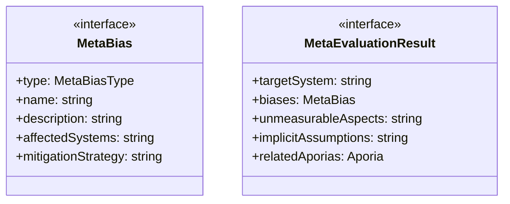
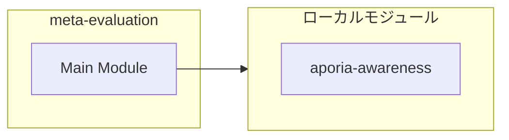
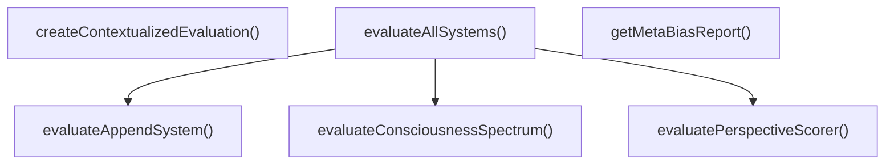
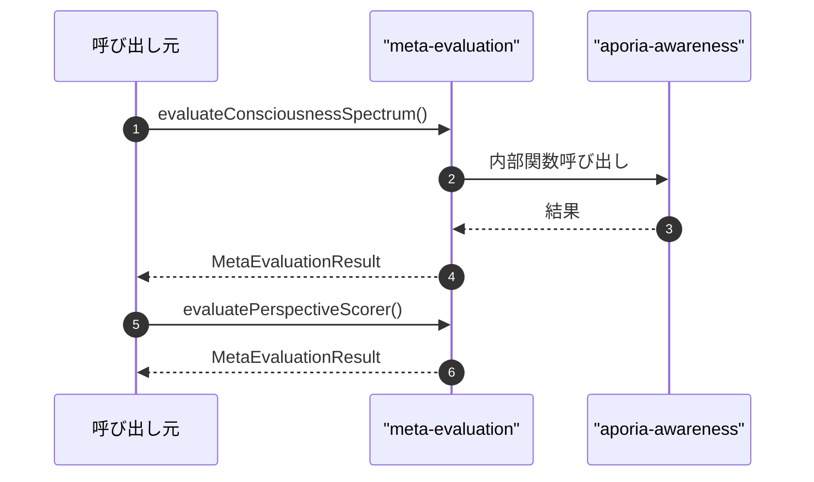

# meta-evaluation

## 概要

`meta-evaluation` モジュールのAPIリファレンス。

## インポート

```typescript
// from './aporia-awareness.js': Aporia, detectAporia, createInitialAporiaState, ...
```

## エクスポート一覧

| 種別 | 名前 | 説明 |
|------|------|------|
| 関数 | `evaluateConsciousnessSpectrum` | consciousness-spectrum.tsのメタ評価 |
| 関数 | `evaluatePerspectiveScorer` | perspective-scorer.tsのメタ評価 |
| 関数 | `evaluateAppendSystem` | APPEND_SYSTEM.mdのメタ評価 |
| 関数 | `evaluateAllSystems` | 全評価システムの統合メタ評価 |
| 関数 | `getMetaBiasReport` | メタバイアスレポートを生成 |
| 関数 | `createContextualizedEvaluation` | アポリア状態と統合した包括的評価を生成 |
| インターフェース | `MetaBias` | メタバイアス |
| インターフェース | `MetaEvaluationResult` | メタ評価結果 |
| 型 | `MetaBiasType` | 評価システムのバイアス種類 |

## 図解

### クラス図



### 依存関係図



### 関数フロー



### シーケンス図



## 関数

### evaluateConsciousnessSpectrum

```typescript
evaluateConsciousnessSpectrum(): MetaEvaluationResult
```

consciousness-spectrum.tsのメタ評価

**戻り値**: `MetaEvaluationResult`

### evaluatePerspectiveScorer

```typescript
evaluatePerspectiveScorer(): MetaEvaluationResult
```

perspective-scorer.tsのメタ評価

**戻り値**: `MetaEvaluationResult`

### evaluateAppendSystem

```typescript
evaluateAppendSystem(): MetaEvaluationResult
```

APPEND_SYSTEM.mdのメタ評価

**戻り値**: `MetaEvaluationResult`

### evaluateAllSystems

```typescript
evaluateAllSystems(): MetaEvaluationResult[]
```

全評価システムの統合メタ評価

**戻り値**: `MetaEvaluationResult[]`

### getMetaBiasReport

```typescript
getMetaBiasReport(results: MetaEvaluationResult[]): string
```

メタバイアスレポートを生成

**パラメータ**

| 名前 | 型 | 必須 |
|------|-----|------|
| results | `MetaEvaluationResult[]` | はい |

**戻り値**: `string`

### createContextualizedEvaluation

```typescript
createContextualizedEvaluation(aporiaState: AporiaState, perspectiveScores?: Record<string, number>): {
  evaluation: string;
  aporiasHeld: string[];
  caveats: string[];
}
```

アポリア状態と統合した包括的評価を生成

**パラメータ**

| 名前 | 型 | 必須 |
|------|-----|------|
| aporiaState | `AporiaState` | はい |
| perspectiveScores | `Record<string, number>` | いいえ |

**戻り値**: `{
  evaluation: string;
  aporiasHeld: string[];
  caveats: string[];
}`

## インターフェース

### MetaBias

```typescript
interface MetaBias {
  type: MetaBiasType;
  name: string;
  description: string;
  affectedSystems: string[];
  mitigationStrategy: string;
  severity: 'low' | 'medium' | 'high';
}
```

メタバイアス

### MetaEvaluationResult

```typescript
interface MetaEvaluationResult {
  targetSystem: string;
  biases: MetaBias[];
  unmeasurableAspects: string[];
  implicitAssumptions: string[];
  relatedAporias: Aporia[];
  confidenceContext: {
    rawValue: number;
    contextualized: string;
    caveats: string[];
  };
  recommendedUsage: string[];
  discouragedUsage: string[];
}
```

メタ評価結果

## 型定義

### MetaBiasType

```typescript
type MetaBiasType = | 'quantification_reduction'   // 量への還元：複雑な質を数値に還元
  | 'measurement_paradox'        // 測定パラドックス：測定が対象を変える
  | 'normative_assumption'       // 規範的仮定：「良い」の暗黙の定義
  | 'western_philosophy_bias'    // 西洋哲学バイアス
  | 'exclusion_of_qualia'        // クオリアの排除：主観的体験の無視
  | 'self_referential_paradox'
```

評価システムのバイアス種類

---
*自動生成: 2026-02-22T19:27:00.665Z*
