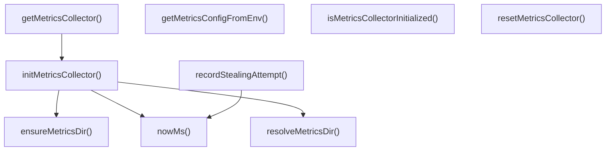

# metrics-collector

## 概要

`metrics-collector` モジュールのAPIリファレンス。

## インポート

```typescript
// from 'node:fs': existsSync, mkdirSync, appendFileSync, ...
// from 'node:os': homedir
// from 'node:path': join
```

## エクスポート一覧

| 種別 | 名前 | 説明 |
|------|------|------|
| 関数 | `initMetricsCollector` | 初期化設定 |
| 関数 | `getMetricsCollector` | メトリクス取得API |
| 関数 | `resetMetricsCollector` | コレクタリセット |
| 関数 | `isMetricsCollectorInitialized` | 初期化確認 |
| 関数 | `recordStealingAttempt` | - |
| 関数 | `getMetricsConfigFromEnv` | 環境変数から設定取得 |
| インターフェース | `SchedulerMetrics` | スケジューラの指標 |
| インターフェース | `TaskCompletionEvent` | メトリクス用タスク完了イベント |
| インターフェース | `PreemptionEvent` | プリエンプションイベント |
| インターフェース | `WorkStealEvent` | ワークスチールイベント |
| インターフェース | `MetricsSummary` | メトリクスサマリー情報 |
| インターフェース | `MetricsCollectorConfig` | メトリクス収集設定 |
| インターフェース | `StealingStats` | ワークスチール統計 |

## 図解

### クラス図

```mermaid
classDiagram
  class SchedulerMetrics {
    <<interface>>
    +timestamp: number
    +queueDepth: number
    +activeTasks: number
    +avgWaitMs: number
    +p50WaitMs: number
  }
  class TaskCompletionEvent {
    <<interface>>
    +taskId: string
    +source: string
    +provider: string
    +model: string
    +priority: string
  }
  class PreemptionEvent {
    <<interface>>
    +taskId: string
    +reason: string
    +timestamp: number
  }
  class WorkStealEvent {
    <<interface>>
    +sourceInstance: string
    +taskId: string
    +timestamp: number
  }
  class MetricsSummary {
    <<interface>>
    +periodStartMs: number
    +periodEndMs: number
    +totalTasksCompleted: number
    +successRate: number
    +avgWaitMs: number
  }
  class MetricsCollectorConfig {
    <<interface>>
    +metricsDir: string
    +collectionIntervalMs: number
    +maxLogFileSizeBytes: number
    +maxLogFiles: number
    +enableLogging: boolean
  }
  class StealingStats {
    <<interface>>
    +totalAttempts: number
    +successfulSteals: number
    +failedAttempts: number
    +successRate: number
    +avgLatencyMs: number
  }
  class MetricsWindowState {
    <<interface>>
    +waitTimes: number
    +executionTimes: number
    +taskCompletions: number
    +preemptions: number
    +steals: number
  }
  class CollectorState {
    <<interface>>
    +config: MetricsCollectorConf
    +metricsDir: string
    +collectionTimer: ReturnType_typeofset
    +initialized: boolean
    +window: MetricsWindowState
  }
```



### 関数フロー



### シーケンス図


## 関数

### resolveMetricsDir

```typescript
resolveMetricsDir(baseDir: string): string
```

Resolve metrics directory path.

**パラメータ**

| 名前 | 型 | 必須 |
|------|-----|------|
| baseDir | `string` | はい |

**戻り値**: `string`

### ensureMetricsDir

```typescript
ensureMetricsDir(dir: string): void
```

Ensure metrics directory exists.

**パラメータ**

| 名前 | 型 | 必須 |
|------|-----|------|
| dir | `string` | はい |

**戻り値**: `void`

### nowMs

```typescript
nowMs(): number
```

Get current timestamp in milliseconds.

**戻り値**: `number`

### percentile

```typescript
percentile(sortedValues: number[], p: number): number
```

Calculate percentile of a sorted array.

**パラメータ**

| 名前 | 型 | 必須 |
|------|-----|------|
| sortedValues | `number[]` | はい |
| p | `number` | はい |

**戻り値**: `number`

### getCurrentLogFilePath

```typescript
getCurrentLogFilePath(dir: string): string
```

Get current metrics log file path.

**パラメータ**

| 名前 | 型 | 必須 |
|------|-----|------|
| dir | `string` | はい |

**戻り値**: `string`

### appendJsonlEntry

```typescript
appendJsonlEntry(filePath: string, entry: Record<string, unknown>): void
```

Append JSONL entry to log file.

**パラメータ**

| 名前 | 型 | 必須 |
|------|-----|------|
| filePath | `string` | はい |
| entry | `Record<string, unknown>` | はい |

**戻り値**: `void`

### rotateLogFilesIfNeeded

```typescript
rotateLogFilesIfNeeded(dir: string, config: MetricsCollectorConfig): void
```

Rotate log files if needed.

**パラメータ**

| 名前 | 型 | 必須 |
|------|-----|------|
| dir | `string` | はい |
| config | `MetricsCollectorConfig` | はい |

**戻り値**: `void`

### initMetricsCollector

```typescript
initMetricsCollector(configOverrides?: Partial<MetricsCollectorConfig>): void
```

初期化設定

**パラメータ**

| 名前 | 型 | 必須 |
|------|-----|------|
| configOverrides | `Partial<MetricsCollectorConfig>` | いいえ |

**戻り値**: `void`

### getMetricsCollector

```typescript
getMetricsCollector(): {
  recordTaskCompletion: (task: { id: string; source: string; provider: string; model: string; priority: string }, result: { waitedMs: number; executionMs: number; success: boolean }) => void;
  recordPreemption: (taskId: string, reason: string) => void;
  recordWorkSteal: (sourceInstance: string, taskId: string) => void;
  recordRateLimitHit: () => void;
  updateQueueStats: (queueDepth: number, activeTasks: number) => void;
  getMetrics: () => SchedulerMetrics;
  getSummary: (periodMs: number) => MetricsSummary;
  getStealingStats: () => StealingStats;
  startCollection: (intervalMs?: number) => void;
  stopCollection: () => void;
}
```

メトリクス取得API

**戻り値**: `{
  recordTaskCompletion: (task: { id: string; source: string; provider: string; model: string; priority: string }, result: { waitedMs: number; executionMs: number; success: boolean }) => void;
  recordPreemption: (taskId: string, reason: string) => void;
  recordWorkSteal: (sourceInstance: string, taskId: string) => void;
  recordRateLimitHit: () => void;
  updateQueueStats: (queueDepth: number, activeTasks: number) => void;
  getMetrics: () => SchedulerMetrics;
  getSummary: (periodMs: number) => MetricsSummary;
  getStealingStats: () => StealingStats;
  startCollection: (intervalMs?: number) => void;
  stopCollection: () => void;
}`

### recordTaskCompletion

```typescript
recordTaskCompletion(task: { id: string; source: string; provider: string; model: string; priority: string }, result: { waitedMs: number; executionMs: number; success: boolean }): void
```

Record a task completion event.

**パラメータ**

| 名前 | 型 | 必須 |
|------|-----|------|
| task | `object` | はい |
| &nbsp;&nbsp;↳ id | `string` | はい |
| &nbsp;&nbsp;↳ source | `string` | はい |
| &nbsp;&nbsp;↳ provider | `string` | はい |
| &nbsp;&nbsp;↳ model | `string` | はい |
| &nbsp;&nbsp;↳ priority | `string` | はい |
| result | `object` | はい |
| &nbsp;&nbsp;↳ waitedMs | `number` | はい |
| &nbsp;&nbsp;↳ executionMs | `number` | はい |
| &nbsp;&nbsp;↳ success | `boolean` | はい |

**戻り値**: `void`

### recordPreemption

```typescript
recordPreemption(taskId: string, reason: string): void
```

Record a preemption event.

**パラメータ**

| 名前 | 型 | 必須 |
|------|-----|------|
| taskId | `string` | はい |
| reason | `string` | はい |

**戻り値**: `void`

### recordWorkSteal

```typescript
recordWorkSteal(sourceInstance: string, taskId: string): void
```

Record a work steal event.

**パラメータ**

| 名前 | 型 | 必須 |
|------|-----|------|
| sourceInstance | `string` | はい |
| taskId | `string` | はい |

**戻り値**: `void`

### recordRateLimitHit

```typescript
recordRateLimitHit(): void
```

Record a rate limit hit.

**戻り値**: `void`

### updateQueueStats

```typescript
updateQueueStats(queueDepth: number, activeTasks: number): void
```

Update queue statistics (called by scheduler).

**パラメータ**

| 名前 | 型 | 必須 |
|------|-----|------|
| queueDepth | `number` | はい |
| activeTasks | `number` | はい |

**戻り値**: `void`

### getMetrics

```typescript
getMetrics(): SchedulerMetrics
```

Get current metrics snapshot.

**戻り値**: `SchedulerMetrics`

### getSummary

```typescript
getSummary(periodMs: number): MetricsSummary
```

Get metrics summary for a time period.

**パラメータ**

| 名前 | 型 | 必須 |
|------|-----|------|
| periodMs | `number` | はい |

**戻り値**: `MetricsSummary`

### getStealingStats

```typescript
getStealingStats(): StealingStats
```

Get work stealing statistics.

**戻り値**: `StealingStats`

### startCollection

```typescript
startCollection(intervalMs?: number): void
```

Start periodic metrics collection.

**パラメータ**

| 名前 | 型 | 必須 |
|------|-----|------|
| intervalMs | `number` | いいえ |

**戻り値**: `void`

### stopCollection

```typescript
stopCollection(): void
```

Stop periodic metrics collection.

**戻り値**: `void`

### collectAndLogMetrics

```typescript
collectAndLogMetrics(): void
```

Collect and log current metrics.

**戻り値**: `void`

### resetMetricsCollector

```typescript
resetMetricsCollector(): void
```

コレクタリセット

**戻り値**: `void`

### isMetricsCollectorInitialized

```typescript
isMetricsCollectorInitialized(): boolean
```

初期化確認

**戻り値**: `boolean`

### recordStealingAttempt

```typescript
recordStealingAttempt(success: boolean, latencyMs?: number): void
```

**パラメータ**

| 名前 | 型 | 必須 |
|------|-----|------|
| success | `boolean` | はい |
| latencyMs | `number` | いいえ |

**戻り値**: `void`

### getMetricsConfigFromEnv

```typescript
getMetricsConfigFromEnv(): Partial<MetricsCollectorConfig>
```

環境変数から設定取得

**戻り値**: `Partial<MetricsCollectorConfig>`

## インターフェース

### SchedulerMetrics

```typescript
interface SchedulerMetrics {
  timestamp: number;
  queueDepth: number;
  activeTasks: number;
  avgWaitMs: number;
  p50WaitMs: number;
  p99WaitMs: number;
  tasksCompletedPerMin: number;
  rateLimitHits: number;
  preemptCount: number;
  stealCount: number;
}
```

スケジューラの指標

### TaskCompletionEvent

```typescript
interface TaskCompletionEvent {
  taskId: string;
  source: string;
  provider: string;
  model: string;
  priority: string;
  waitedMs: number;
  executionMs: number;
  success: boolean;
  timestamp: number;
}
```

メトリクス用タスク完了イベント

### PreemptionEvent

```typescript
interface PreemptionEvent {
  taskId: string;
  reason: string;
  timestamp: number;
}
```

プリエンプションイベント

### WorkStealEvent

```typescript
interface WorkStealEvent {
  sourceInstance: string;
  taskId: string;
  timestamp: number;
}
```

ワークスチールイベント

### MetricsSummary

```typescript
interface MetricsSummary {
  periodStartMs: number;
  periodEndMs: number;
  totalTasksCompleted: number;
  successRate: number;
  avgWaitMs: number;
  avgExecutionMs: number;
  p50WaitMs: number;
  p99WaitMs: number;
  p99ExecutionMs: number;
  totalPreemptions: number;
  totalSteals: number;
  totalRateLimitHits: number;
  throughputPerMin: number;
  byProvider: Record<string, { count: number; avgWaitMs: number; avgExecutionMs: number }>;
  byPriority: Record<string, { count: number; avgWaitMs: number; avgExecutionMs: number }>;
}
```

メトリクスサマリー情報

### MetricsCollectorConfig

```typescript
interface MetricsCollectorConfig {
  metricsDir: string;
  collectionIntervalMs: number;
  maxLogFileSizeBytes: number;
  maxLogFiles: number;
  enableLogging: boolean;
}
```

メトリクス収集設定

### StealingStats

```typescript
interface StealingStats {
  totalAttempts: number;
  successfulSteals: number;
  failedAttempts: number;
  successRate: number;
  avgLatencyMs: number;
  lastStealAt: number | null;
}
```

ワークスチール統計

### MetricsWindowState

```typescript
interface MetricsWindowState {
  waitTimes: number[];
  executionTimes: number[];
  taskCompletions: number;
  preemptions: number;
  steals: number;
  rateLimitHits: number;
  windowStartMs: number;
}
```

### CollectorState

```typescript
interface CollectorState {
  config: MetricsCollectorConfig;
  metricsDir: string;
  collectionTimer?: ReturnType<typeof setInterval>;
  initialized: boolean;
  window: MetricsWindowState;
  completionEvents: TaskCompletionEvent[];
  preemptionEvents: PreemptionEvent[];
  stealEvents: WorkStealEvent[];
  totalCompletions: number;
  totalPreemptions: number;
  totalSteals: number;
  totalRateLimitHits: number;
  stealingAttempts: number;
  successfulSteals: number;
  stealLatencies: number[];
  lastStealAt: number | null;
  currentQueueDepth: number;
  currentActiveTasks: number;
}
```

---
*自動生成: 2026-02-18T18:06:17.536Z*
