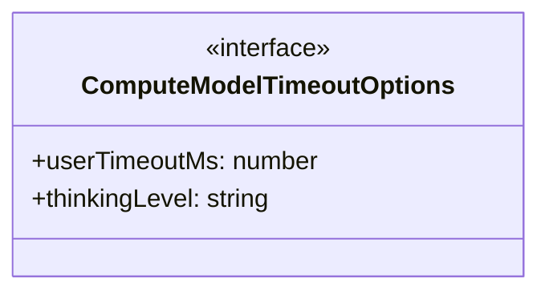
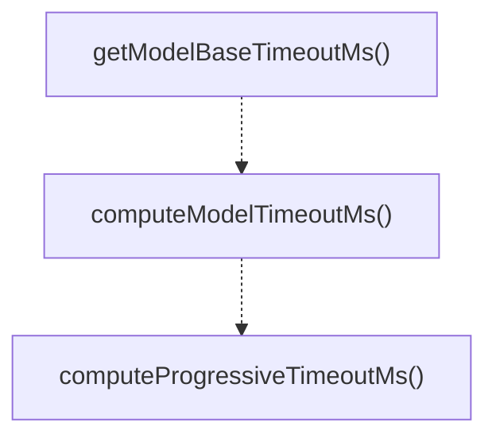

# model-timeouts

## 概要

`model-timeouts` モジュールのAPIリファレンス。

## エクスポート一覧

| 種別 | 名前 | 説明 |
|------|------|------|
| 関数 | `getModelBaseTimeoutMs` | Get the base timeout for a model without thinking  |
| 関数 | `computeModelTimeoutMs` | Compute the appropriate timeout for a model with a |
| 関数 | `computeProgressiveTimeoutMs` | Compute a progressive timeout that increases with  |
| インターフェース | `ComputeModelTimeoutOptions` | Options for computing model timeout. |

## 図解

### クラス図



### 関数フロー



## 関数

### getModelBaseTimeoutMs

```typescript
getModelBaseTimeoutMs(modelId: string): number
```

Get the base timeout for a model without thinking level adjustment.

**パラメータ**

| 名前 | 型 | 必須 |
|------|-----|------|
| modelId | `string` | はい |

**戻り値**: `number`

### computeModelTimeoutMs

```typescript
computeModelTimeoutMs(modelId: string, options?: ComputeModelTimeoutOptions): number
```

Compute the appropriate timeout for a model with all adjustments.
Priority: user-specified > model-specific + thinking adjustment > default

**パラメータ**

| 名前 | 型 | 必須 |
|------|-----|------|
| modelId | `string` | はい |
| options | `ComputeModelTimeoutOptions` | いいえ |

**戻り値**: `number`

### computeProgressiveTimeoutMs

```typescript
computeProgressiveTimeoutMs(baseTimeoutMs: number, attempt: number): number
```

Compute a progressive timeout that increases with retry attempts.

**パラメータ**

| 名前 | 型 | 必須 |
|------|-----|------|
| baseTimeoutMs | `number` | はい |
| attempt | `number` | はい |

**戻り値**: `number`

## インターフェース

### ComputeModelTimeoutOptions

```typescript
interface ComputeModelTimeoutOptions {
  userTimeoutMs?: number;
  thinkingLevel?: string;
}
```

Options for computing model timeout.

---
*自動生成: 2026-02-17T21:54:59.808Z*
