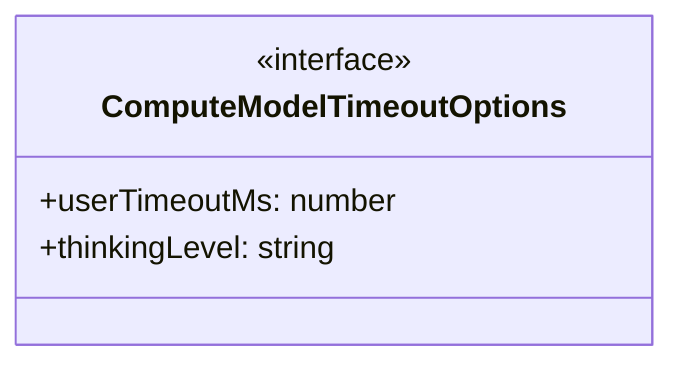
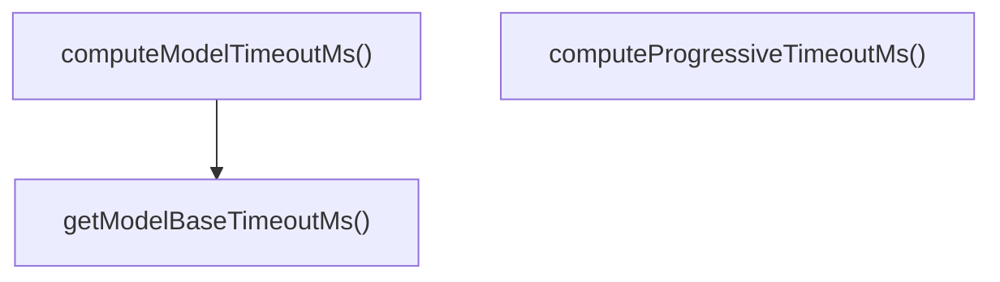

# model-timeouts

## 概要

`model-timeouts` モジュールのAPIリファレンス。

## エクスポート一覧

| 種別 | 名前 | 説明 |
|------|------|------|
| 関数 | `getModelBaseTimeoutMs` | モデル基本タイムアウト取得 |
| 関数 | `computeModelTimeoutMs` | モデルごとのタイムアウト計算 |
| 関数 | `computeProgressiveTimeoutMs` | 漸進的タイムアウト計算 |
| インターフェース | `ComputeModelTimeoutOptions` | 計算オプション |

## 図解

### クラス図



### 関数フロー



## 関数

### getModelBaseTimeoutMs

```typescript
getModelBaseTimeoutMs(modelId: string): number
```

モデル基本タイムアウト取得

**パラメータ**

| 名前 | 型 | 必須 |
|------|-----|------|
| modelId | `string` | はい |

**戻り値**: `number`

### computeModelTimeoutMs

```typescript
computeModelTimeoutMs(modelId: string, options?: ComputeModelTimeoutOptions): number
```

モデルごとのタイムアウト計算

**パラメータ**

| 名前 | 型 | 必須 |
|------|-----|------|
| modelId | `string` | はい |
| options | `ComputeModelTimeoutOptions` | いいえ |

**戻り値**: `number`

### computeProgressiveTimeoutMs

```typescript
computeProgressiveTimeoutMs(baseTimeoutMs: number, attempt: number): number
```

漸進的タイムアウト計算

**パラメータ**

| 名前 | 型 | 必須 |
|------|-----|------|
| baseTimeoutMs | `number` | はい |
| attempt | `number` | はい |

**戻り値**: `number`

## インターフェース

### ComputeModelTimeoutOptions

```typescript
interface ComputeModelTimeoutOptions {
  userTimeoutMs?: number;
  thinkingLevel?: string;
}
```

計算オプション

---
*自動生成: 2026-02-18T15:54:41.492Z*
