# nonlinear-thought

## 概要

`nonlinear-thought` モジュールのAPIリファレンス。

## インポート

```typescript
// from './belief-updater.js': Distribution
// from './belief-updater.js': createPrior, normalizeDistribution
```

## エクスポート一覧

| 種別 | 名前 | 説明 |
|------|------|------|
| 関数 | `createNonLinearThoughtEngine` | - |
| 関数 | `registerSeed` | - |
| 関数 | `generateNonLinearThoughts` | - |
| 関数 | `generateParallelThoughts` | - |
| 関数 | `optimizeAssociation` | - |
| 関数 | `getParetoOptimalInsights` | - |
| 関数 | `generateNonLinearThoughtReport` | - |
| 関数 | `resetEngine` | - |
| 関数 | `extractSeedsFromText` | - |
| インターフェース | `ThoughtSeed` | 思考の種（シード） |
| インターフェース | `Association` | 連想 |
| インターフェース | `AssociationChain` | 連想チェーン |
| インターフェース | `ConvergencePoint` | 収束点 |
| インターフェース | `EmergentInsight` | 創発的洞察 |
| インターフェース | `InsightEvaluation` | 洞察の評価 |
| インターフェース | `NonLinearThoughtParameters` | 非線形思考パラメータ |
| インターフェース | `NonLinearThoughtEngine` | 非線形思考エンジン |
| インターフェース | `NonLinearThoughtConfig` | エンジン設定 |
| 型 | `SeedType` | シードタイプ |
| 型 | `AssociationType` | 連想タイプ |
| 型 | `InsightKind` | 洞察の種類 |

## 図解

### クラス図

```mermaid
classDiagram
  class ThoughtSeed {
    <<interface>>
    +id: string
    +content: string
    +type: SeedType
    +emotionalValence: number
    +abstractionLevel: number
  }
  class Association {
    <<interface>>
    +id: string
    +content: string
    +type: AssociationType
    +strength: number
    +rationale: string
  }
  class AssociationChain {
    <<interface>>
    +id: string
    +seed: ThoughtSeed
    +associations: Association
    +depth: number
    +diversity: number
  }
  class ConvergencePoint {
    <<interface>>
    +content: string
    +convergenceStrength: number
    +chainCount: number
    +insightPotential: number
    +rationale: string
  }
  class EmergentInsight {
    <<interface>>
    +id: string
    +content: string
    +kind: InsightKind
    +novelty: number
    +utility: number
  }
  class InsightEvaluation {
    <<interface>>
    +creativityScore: number
    +feasibilityScore: number
    +impactScore: number
    +verifiabilityScore: number
    +overallScore: number
  }
  class NonLinearThoughtParameters {
    <<interface>>
    +maxDepth: number
    +breadth: number
    +randomnessWeight: number
    +surprisePreference: number
    +allowConvergence: boolean
  }
  class NonLinearThoughtEngine {
    <<interface>>
    +seeds: Map_string_ThoughtSe
    +chains: AssociationChain
    +convergencePoints: ConvergencePoint
    +insights: EmergentInsight
    +config: NonLinearThoughtConf
  }
  class NonLinearThoughtConfig {
    <<interface>>
    +defaultParameters: NonLinearThoughtPara
    +minInsightQuality: number
    +minChainsForConvergence: number
    +parallelChains: number
    +autoInsightExtraction: boolean
  }
```



### 依存関係図


### 関数フロー


### シーケンス図


## 関数

### createNonLinearThoughtEngine

```typescript
createNonLinearThoughtEngine(config: Partial<NonLinearThoughtConfig>): NonLinearThoughtEngine
```

**パラメータ**

| 名前 | 型 | 必須 |
|------|-----|------|
| config | `Partial<NonLinearThoughtConfig>` | はい |

**戻り値**: `NonLinearThoughtEngine`

### registerSeed

```typescript
registerSeed(engine: NonLinearThoughtEngine, content: string, type: SeedType): ThoughtSeed
```

**パラメータ**

| 名前 | 型 | 必須 |
|------|-----|------|
| engine | `NonLinearThoughtEngine` | はい |
| content | `string` | はい |
| type | `SeedType` | はい |

**戻り値**: `ThoughtSeed`

### generateNonLinearThoughts

```typescript
generateNonLinearThoughts(engine: NonLinearThoughtEngine, seedId?: string, parameters: Partial<NonLinearThoughtParameters>): AssociationChain
```

**パラメータ**

| 名前 | 型 | 必須 |
|------|-----|------|
| engine | `NonLinearThoughtEngine` | はい |
| seedId | `string` | いいえ |
| parameters | `Partial<NonLinearThoughtParameters>` | はい |

**戻り値**: `AssociationChain`

### generateParallelThoughts

```typescript
generateParallelThoughts(engine: NonLinearThoughtEngine, seeds: string[], parameters: Partial<NonLinearThoughtParameters>): AssociationChain[]
```

**パラメータ**

| 名前 | 型 | 必須 |
|------|-----|------|
| engine | `NonLinearThoughtEngine` | はい |
| seeds | `string[]` | はい |
| parameters | `Partial<NonLinearThoughtParameters>` | はい |

**戻り値**: `AssociationChain[]`

### optimizeAssociation

```typescript
optimizeAssociation(engine: NonLinearThoughtEngine, targetInsightType: InsightKind): NonLinearThoughtParameters
```

**パラメータ**

| 名前 | 型 | 必須 |
|------|-----|------|
| engine | `NonLinearThoughtEngine` | はい |
| targetInsightType | `InsightKind` | はい |

**戻り値**: `NonLinearThoughtParameters`

### getParetoOptimalInsights

```typescript
getParetoOptimalInsights(engine: NonLinearThoughtEngine): EmergentInsight[]
```

**パラメータ**

| 名前 | 型 | 必須 |
|------|-----|------|
| engine | `NonLinearThoughtEngine` | はい |

**戻り値**: `EmergentInsight[]`

### generateNonLinearThoughtReport

```typescript
generateNonLinearThoughtReport(engine: NonLinearThoughtEngine): string
```

**パラメータ**

| 名前 | 型 | 必須 |
|------|-----|------|
| engine | `NonLinearThoughtEngine` | はい |

**戻り値**: `string`

### resetEngine

```typescript
resetEngine(engine: NonLinearThoughtEngine): NonLinearThoughtEngine
```

**パラメータ**

| 名前 | 型 | 必須 |
|------|-----|------|
| engine | `NonLinearThoughtEngine` | はい |

**戻り値**: `NonLinearThoughtEngine`

### extractRelatedConcepts

```typescript
extractRelatedConcepts(content: string): string[]
```

関連概念を抽出

**パラメータ**

| 名前 | 型 | 必須 |
|------|-----|------|
| content | `string` | はい |

**戻り値**: `string[]`

### generateAssociationChain

```typescript
generateAssociationChain(seed: ThoughtSeed, params: NonLinearThoughtParameters): AssociationChain
```

連想チェーンを生成

**パラメータ**

| 名前 | 型 | 必須 |
|------|-----|------|
| seed | `ThoughtSeed` | はい |
| params | `NonLinearThoughtParameters` | はい |

**戻り値**: `AssociationChain`

### generateAssociations

```typescript
generateAssociations(content: string, count: number, randomnessWeight: number, surprisePreference: number, minStrength: number): Association[]
```

連想を生成

**パラメータ**

| 名前 | 型 | 必須 |
|------|-----|------|
| content | `string` | はい |
| count | `number` | はい |
| randomnessWeight | `number` | はい |
| surprisePreference | `number` | はい |
| minStrength | `number` | はい |

**戻り値**: `Association[]`

### generateSemanticAssociations

```typescript
generateSemanticAssociations(content: string): Association[]
```

意味的連想を生成

**パラメータ**

| 名前 | 型 | 必須 |
|------|-----|------|
| content | `string` | はい |

**戻り値**: `Association[]`

### generatePhoneticAssociations

```typescript
generatePhoneticAssociations(content: string): Association[]
```

音韻的連想を生成

**パラメータ**

| 名前 | 型 | 必須 |
|------|-----|------|
| content | `string` | はい |

**戻り値**: `Association[]`

### generateMetaphoricalAssociations

```typescript
generateMetaphoricalAssociations(content: string): Association[]
```

隠喩的連想を生成

**パラメータ**

| 名前 | 型 | 必須 |
|------|-----|------|
| content | `string` | はい |

**戻り値**: `Association[]`

### generateRandomAssociations

```typescript
generateRandomAssociations(_content: string, count: number): Association[]
```

ランダム連想を生成

**パラメータ**

| 名前 | 型 | 必須 |
|------|-----|------|
| _content | `string` | はい |
| count | `number` | はい |

**戻り値**: `Association[]`

### selectAssociation

```typescript
selectAssociation(associations: Association[], params: NonLinearThoughtParameters): Association
```

連想を選択

**パラメータ**

| 名前 | 型 | 必須 |
|------|-----|------|
| associations | `Association[]` | はい |
| params | `NonLinearThoughtParameters` | はい |

**戻り値**: `Association`

### detectConvergence

```typescript
detectConvergence(engine: NonLinearThoughtEngine, newChain: AssociationChain): void
```

収束点を検出

**パラメータ**

| 名前 | 型 | 必須 |
|------|-----|------|
| engine | `NonLinearThoughtEngine` | はい |
| newChain | `AssociationChain` | はい |

**戻り値**: `void`

### recalculateConvergence

```typescript
recalculateConvergence(engine: NonLinearThoughtEngine): void
```

収束点を再計算

**パラメータ**

| 名前 | 型 | 必須 |
|------|-----|------|
| engine | `NonLinearThoughtEngine` | はい |

**戻り値**: `void`

### extractInsights

```typescript
extractInsights(engine: NonLinearThoughtEngine, chain: AssociationChain): void
```

洞察を抽出

**パラメータ**

| 名前 | 型 | 必須 |
|------|-----|------|
| engine | `NonLinearThoughtEngine` | はい |
| chain | `AssociationChain` | はい |

**戻り値**: `void`

### createConnectionInsight

```typescript
createConnectionInsight(chain: AssociationChain): EmergentInsight
```

接続洞察を作成

**パラメータ**

| 名前 | 型 | 必須 |
|------|-----|------|
| chain | `AssociationChain` | はい |

**戻り値**: `EmergentInsight`

### createPatternInsight

```typescript
createPatternInsight(chain: AssociationChain): EmergentInsight
```

パターン洞察を作成

**パラメータ**

| 名前 | 型 | 必須 |
|------|-----|------|
| chain | `AssociationChain` | はい |

**戻り値**: `EmergentInsight`

### createConvergenceInsight

```typescript
createConvergenceInsight(point: ConvergencePoint, chain: AssociationChain): EmergentInsight
```

収束洞察を作成

**パラメータ**

| 名前 | 型 | 必須 |
|------|-----|------|
| point | `ConvergencePoint` | はい |
| chain | `AssociationChain` | はい |

**戻り値**: `EmergentInsight`

### extractSeedsFromText

```typescript
extractSeedsFromText(engine: NonLinearThoughtEngine, text: string): ThoughtSeed[]
```

**パラメータ**

| 名前 | 型 | 必須 |
|------|-----|------|
| engine | `NonLinearThoughtEngine` | はい |
| text | `string` | はい |

**戻り値**: `ThoughtSeed[]`

## インターフェース

### ThoughtSeed

```typescript
interface ThoughtSeed {
  id: string;
  content: string;
  type: SeedType;
  emotionalValence: number;
  abstractionLevel: number;
  relatedConcepts: string[];
  activationStrength: number;
}
```

思考の種（シード）

### Association

```typescript
interface Association {
  id: string;
  content: string;
  type: AssociationType;
  strength: number;
  rationale?: string;
  semanticDistance: number;
  surpriseLevel: number;
  activatedAt: Date;
}
```

連想

### AssociationChain

```typescript
interface AssociationChain {
  id: string;
  seed: ThoughtSeed;
  associations: Association[];
  depth: number;
  diversity: number;
  convergencePoints: ConvergencePoint[];
  statistics: {
    totalLength: number;
    averageStrength: number;
    averageSurprise: number;
    typeDistribution: Record<AssociationType, number>;
  };
}
```

連想チェーン

### ConvergencePoint

```typescript
interface ConvergencePoint {
  content: string;
  convergenceStrength: number;
  chainCount: number;
  insightPotential: number;
  rationale: string;
}
```

収束点

### EmergentInsight

```typescript
interface EmergentInsight {
  id: string;
  content: string;
  kind: InsightKind;
  novelty: number;
  utility: number;
  plausibility: number;
  sourceChains: string[];
  relatedConvergencePoints: string[];
  evaluation: InsightEvaluation;
}
```

創発的洞察

### InsightEvaluation

```typescript
interface InsightEvaluation {
  creativityScore: number;
  feasibilityScore: number;
  impactScore: number;
  verifiabilityScore: number;
  overallScore: number;
}
```

洞察の評価

### NonLinearThoughtParameters

```typescript
interface NonLinearThoughtParameters {
  maxDepth: number;
  breadth: number;
  randomnessWeight: number;
  surprisePreference: number;
  allowConvergence: boolean;
  minAssociationStrength: number;
}
```

非線形思考パラメータ

### NonLinearThoughtEngine

```typescript
interface NonLinearThoughtEngine {
  seeds: Map<string, ThoughtSeed>;
  chains: AssociationChain[];
  convergencePoints: ConvergencePoint[];
  insights: EmergentInsight[];
  config: NonLinearThoughtConfig;
  statistics: {
    totalChains: number;
    totalInsights: number;
    averageChainDepth: number;
    highNoveltyInsights: number;
    convergenceRate: number;
  };
}
```

非線形思考エンジン

### NonLinearThoughtConfig

```typescript
interface NonLinearThoughtConfig {
  defaultParameters: NonLinearThoughtParameters;
  minInsightQuality: number;
  minChainsForConvergence: number;
  parallelChains: number;
  autoInsightExtraction: boolean;
}
```

エンジン設定

## 型定義

### SeedType

```typescript
type SeedType = | 'concept'      // 概念
  | 'image'        // 画像
  | 'emotion'      // 感情
  | 'question'     // 問い
  | 'paradox'      // パラドックス
  | 'metaphor'     // 隠喩
  | 'memory'       // 記憶
  | 'random'
```

シードタイプ

### AssociationType

```typescript
type AssociationType = | 'semantic'     // 意味的（関連する意味）
  | 'phonetic'     // 音韻的（似た音）
  | 'visual'       // 視覚的（似た形）
  | 'emotional'    // 感情的（似た感情）
  | 'temporal'     // 時間的（同時期の記憶）
  | 'spatial'      // 空間的（似た場所）
  | 'metaphorical' // 隠喩的（比喩的接続）
  | 'random'
```

連想タイプ

### InsightKind

```typescript
type InsightKind = | 'connection'     // 新しい接続
  | 'pattern'        // パターンの発見
  | 'analogy'        // 類推
  | 'reframe'        // 再フレーミング
  | 'synthesis'      // 総合
  | 'question'       // 新しい問い
  | 'contradiction'
```

洞察の種類

---
*自動生成: 2026-02-23T06:29:42.376Z*
