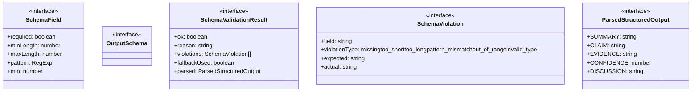
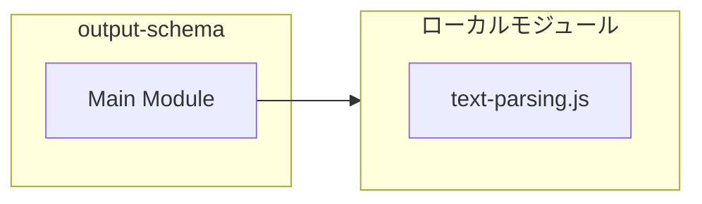
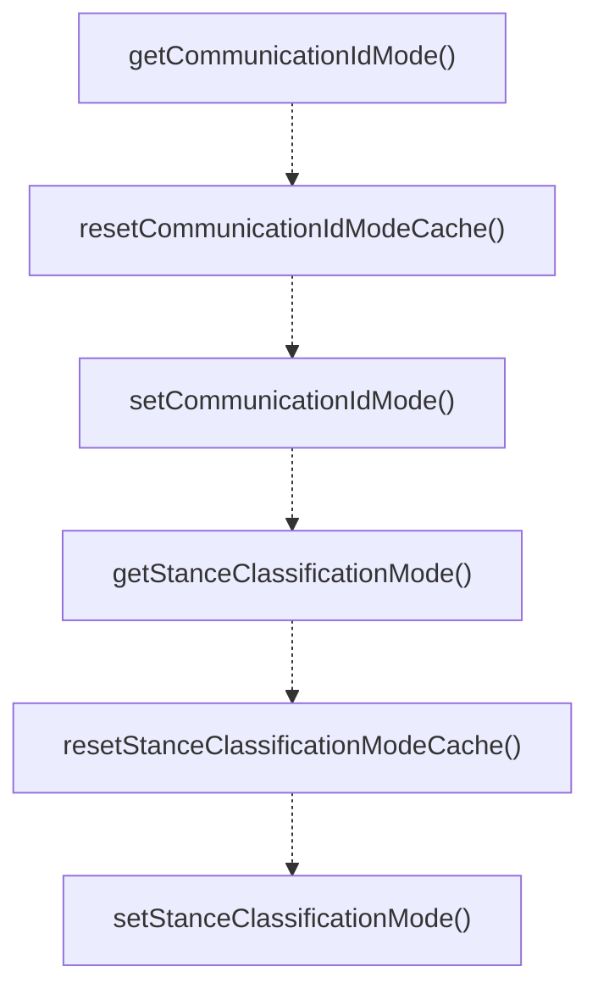

# output-schema

## 概要

`output-schema` モジュールのAPIリファレンス。

## インポート

```typescript
import { extractField, parseUnitInterval, clampConfidence } from './text-parsing.js';
```

## エクスポート一覧

| 種別 | 名前 | 説明 |
|------|------|------|
| 関数 | `getCommunicationIdMode` | Get the current communication ID mode. |
| 関数 | `resetCommunicationIdModeCache` | Reset the cached communication ID mode (primarily  |
| 関数 | `setCommunicationIdMode` | Set communication ID mode at runtime (primarily fo |
| 関数 | `getStanceClassificationMode` | Get the current stance classification mode. |
| 関数 | `resetStanceClassificationModeCache` | Reset the cached stance classification mode (prima |
| 関数 | `setStanceClassificationMode` | Set stance classification mode at runtime (primari |
| 関数 | `getSchemaValidationMode` | Get the current schema validation mode. |
| 関数 | `resetSchemaValidationModeCache` | Reset the cached schema validation mode (primarily |
| 関数 | `setSchemaValidationMode` | Set schema validation mode at runtime (primarily f |
| 関数 | `parseStructuredOutput` | Parse structured output text into a structured obj |
| 関数 | `validateSubagentOutputWithSchema` | Validate subagent output with schema. |
| 関数 | `validateTeamMemberOutputWithSchema` | Validate team member output with schema. |
| 関数 | `recordSchemaViolation` | Record a schema violation for analytics. |
| 関数 | `getSchemaViolationStats` | Get schema violation statistics. |
| 関数 | `resetSchemaViolationStats` | Reset schema violation statistics. |
| インターフェース | `SchemaValidationResult` | Schema validation result. |
| インターフェース | `SchemaViolation` | Individual schema violation. |
| インターフェース | `ParsedStructuredOutput` | Parsed structured output. |
| 型 | `SchemaValidationMode` | Validation mode for output schema checking. |
| 型 | `CommunicationIdMode` | Communication ID mode for structured output proces |
| 型 | `StanceClassificationMode` | Stance classification mode for discussion analysis |

## 図解

### クラス図



### 依存関係図



### 関数フロー



## 関数

### getCommunicationIdMode

```typescript
getCommunicationIdMode(): CommunicationIdMode
```

Get the current communication ID mode.
Reads from PI_COMMUNICATION_ID_MODE environment variable.

**戻り値**: `CommunicationIdMode`

### resetCommunicationIdModeCache

```typescript
resetCommunicationIdModeCache(): void
```

Reset the cached communication ID mode (primarily for testing).

**戻り値**: `void`

### setCommunicationIdMode

```typescript
setCommunicationIdMode(mode: CommunicationIdMode): void
```

Set communication ID mode at runtime (primarily for testing).

**パラメータ**

| 名前 | 型 | 必須 |
|------|-----|------|
| mode | `CommunicationIdMode` | はい |

**戻り値**: `void`

### getStanceClassificationMode

```typescript
getStanceClassificationMode(): StanceClassificationMode
```

Get the current stance classification mode.
Reads from PI_STANCE_CLASSIFICATION_MODE environment variable.

**戻り値**: `StanceClassificationMode`

### resetStanceClassificationModeCache

```typescript
resetStanceClassificationModeCache(): void
```

Reset the cached stance classification mode (primarily for testing).

**戻り値**: `void`

### setStanceClassificationMode

```typescript
setStanceClassificationMode(mode: StanceClassificationMode): void
```

Set stance classification mode at runtime (primarily for testing).

**パラメータ**

| 名前 | 型 | 必須 |
|------|-----|------|
| mode | `StanceClassificationMode` | はい |

**戻り値**: `void`

### getSchemaValidationMode

```typescript
getSchemaValidationMode(): SchemaValidationMode
```

Get the current schema validation mode.
Reads from PI_OUTPUT_SCHEMA_MODE environment variable.

MIGRATION COMPLETE: Default is now "strict" (v2.0.0+)
- "legacy": Use regex-based validation only (deprecated)
- "dual": Run both regex and schema validation, log differences
- "strict": Use schema validation only (default)

**戻り値**: `SchemaValidationMode`

### resetSchemaValidationModeCache

```typescript
resetSchemaValidationModeCache(): void
```

Reset the cached schema validation mode (primarily for testing).

**戻り値**: `void`

### setSchemaValidationMode

```typescript
setSchemaValidationMode(mode: SchemaValidationMode): void
```

Set schema validation mode at runtime (primarily for testing).

**パラメータ**

| 名前 | 型 | 必須 |
|------|-----|------|
| mode | `SchemaValidationMode` | はい |

**戻り値**: `void`

### parseStructuredOutput

```typescript
parseStructuredOutput(output: string): ParsedStructuredOutput
```

Parse structured output text into a structured object.

**パラメータ**

| 名前 | 型 | 必須 |
|------|-----|------|
| output | `string` | はい |

**戻り値**: `ParsedStructuredOutput`

### validateField

```typescript
validateField(fieldName: string, value: unknown, schema: SchemaField): SchemaViolation[]
```

Validate a single field against its schema definition.

**パラメータ**

| 名前 | 型 | 必須 |
|------|-----|------|
| fieldName | `string` | はい |
| value | `unknown` | はい |
| schema | `SchemaField` | はい |

**戻り値**: `SchemaViolation[]`

### validateAgainstSchema

```typescript
validateAgainstSchema(parsed: ParsedStructuredOutput, schema: OutputSchema): SchemaViolation[]
```

Validate parsed output against a schema.

**パラメータ**

| 名前 | 型 | 必須 |
|------|-----|------|
| parsed | `ParsedStructuredOutput` | はい |
| schema | `OutputSchema` | はい |

**戻り値**: `SchemaViolation[]`

### validateSubagentOutputWithSchema

```typescript
validateSubagentOutputWithSchema(output: string, mode: SchemaValidationMode): SchemaValidationResult
```

Validate subagent output with schema.

**パラメータ**

| 名前 | 型 | 必須 |
|------|-----|------|
| output | `string` | はい |
| mode | `SchemaValidationMode` | はい |

**戻り値**: `SchemaValidationResult`

### validateTeamMemberOutputWithSchema

```typescript
validateTeamMemberOutputWithSchema(output: string, mode: SchemaValidationMode): SchemaValidationResult
```

Validate team member output with schema.

**パラメータ**

| 名前 | 型 | 必須 |
|------|-----|------|
| output | `string` | はい |
| mode | `SchemaValidationMode` | はい |

**戻り値**: `SchemaValidationResult`

### recordSchemaViolation

```typescript
recordSchemaViolation(violation: SchemaViolation): void
```

Record a schema violation for analytics.

**パラメータ**

| 名前 | 型 | 必須 |
|------|-----|------|
| violation | `SchemaViolation` | はい |

**戻り値**: `void`

### getSchemaViolationStats

```typescript
getSchemaViolationStats(): Map<string, number>
```

Get schema violation statistics.

**戻り値**: `Map<string, number>`

### resetSchemaViolationStats

```typescript
resetSchemaViolationStats(): void
```

Reset schema violation statistics.

**戻り値**: `void`

## インターフェース

### SchemaField

```typescript
interface SchemaField {
  required: boolean;
  minLength?: number;
  maxLength?: number;
  pattern?: RegExp;
  min?: number;
  max?: number;
  type: "string" | "number" | "string[]";
}
```

Schema field definition.

### OutputSchema

```typescript
interface OutputSchema {
}
```

Schema definition for structured output.

### SchemaValidationResult

```typescript
interface SchemaValidationResult {
  ok: boolean;
  reason?: string;
  violations: SchemaViolation[];
  fallbackUsed: boolean;
  parsed?: ParsedStructuredOutput;
}
```

Schema validation result.

### SchemaViolation

```typescript
interface SchemaViolation {
  field: string;
  violationType: "missing" | "too_short" | "too_long" | "pattern_mismatch" | "out_of_range" | "invalid_type";
  expected: string;
  actual?: string;
}
```

Individual schema violation.

### ParsedStructuredOutput

```typescript
interface ParsedStructuredOutput {
  SUMMARY: string;
  CLAIM?: string;
  EVIDENCE?: string;
  CONFIDENCE?: number;
  DISCUSSION?: string;
  RESULT: string;
  NEXT_STEP?: string;
}
```

Parsed structured output.

## 型定義

### SchemaValidationMode

```typescript
type SchemaValidationMode = "legacy" | "dual" | "strict"
```

Validation mode for output schema checking.

### CommunicationIdMode

```typescript
type CommunicationIdMode = "legacy" | "structured"
```

Communication ID mode for structured output processing.
- "legacy" (default): No structured claim/evidence IDs
- "structured": Enable claim and evidence ID tracking

### StanceClassificationMode

```typescript
type StanceClassificationMode = "disabled" | "heuristic" | "structured"
```

Stance classification mode for discussion analysis.
- "disabled" (default): No stance classification, backward compatible
- "heuristic": Use regex-based pattern matching for stance detection
- "structured": Full structured analysis with confidence scores

---
*自動生成: 2026-02-17T21:48:27.733Z*
