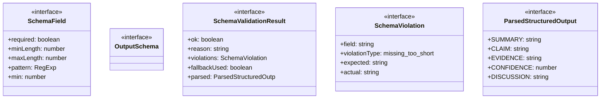
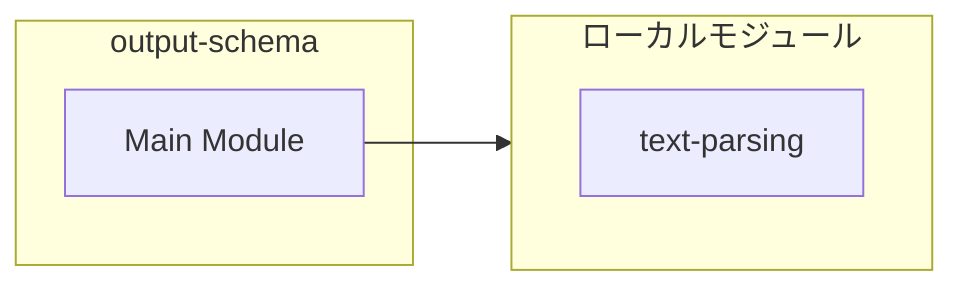
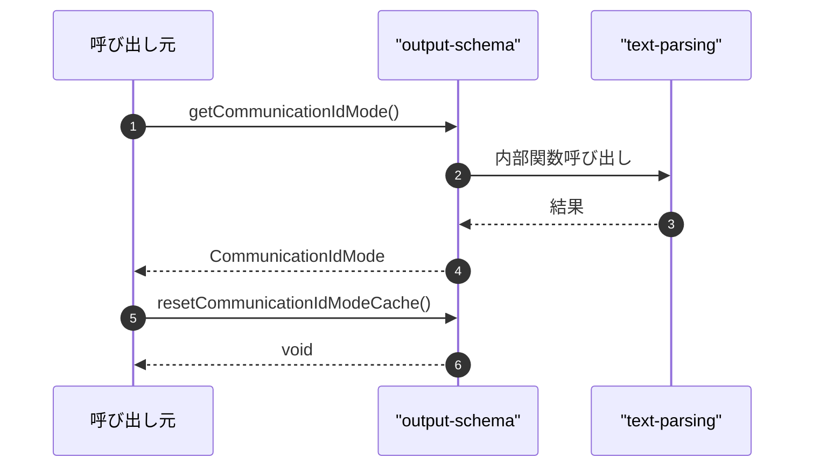

# output-schema

## 概要

`output-schema` モジュールのAPIリファレンス。

## インポート

```typescript
// from './text-parsing.js': extractField, parseUnitInterval, clampConfidence
```

## エクスポート一覧

| 種別 | 名前 | 説明 |
|------|------|------|
| 関数 | `getCommunicationIdMode` | 通信IDモードを取得する |
| 関数 | `resetCommunicationIdModeCache` | キャッシュをリセットする |
| 関数 | `setCommunicationIdMode` | モードを設定する |
| 関数 | `getStanceClassificationMode` | 分類モードを取得する |
| 関数 | `resetStanceClassificationModeCache` | キャッシュをリセットする |
| 関数 | `setStanceClassificationMode` | スタンス分類モードを設定する |
| 関数 | `getSchemaValidationMode` | 現在の検証モードを取得 |
| 関数 | `resetSchemaValidationModeCache` | キャッシュをリセット |
| 関数 | `setSchemaValidationMode` | - |
| 関数 | `parseStructuredOutput` | 構造化出力を解析 |
| 関数 | `validateSubagentOutputWithSchema` | サブエージェント出力を検証 |
| 関数 | `validateTeamMemberOutputWithSchema` | チームメンバー出力を検証 |
| 関数 | `recordSchemaViolation` | スキーマ違反を記録 |
| 関数 | `getSchemaViolationStats` | 違反統計を取得 |
| 関数 | `resetSchemaViolationStats` | 違反統計をリセット |
| インターフェース | `SchemaValidationResult` | スキーマ検証の実行結果 |
| インターフェース | `SchemaViolation` | スキーマ違反の詳細情報 |
| インターフェース | `ParsedStructuredOutput` | 構造化出力の解析結果 |
| 型 | `SchemaValidationMode` | スキーマ検証モード定義 |
| 型 | `CommunicationIdMode` | 通信IDモードの型定義 |
| 型 | `StanceClassificationMode` | 分類モードの型定義 |

## 図解

### クラス図



### 依存関係図



### 関数フロー

```mermaid
flowchart TD
  getCommunicationIdMode["getCommunicationIdMode()"]
  getSchemaValidationMode["getSchemaValidationMode()"]
  getSchemaViolationStats["getSchemaViolationStats()"]
  getStanceClassificationMode["getStanceClassificationMode()"]
  parseStructuredOutput["parseStructuredOutput()"]
  recordSchemaViolation["recordSchemaViolation()"]
  resetCommunicationIdModeCache["resetCommunicationIdModeCache()"]
  resetSchemaValidationModeCache["resetSchemaValidationModeCache()"]
  resetSchemaViolationStats["resetSchemaViolationStats()"]
  resetStanceClassificationModeCache["resetStanceClassificationModeCache()"]
  setCommunicationIdMode["setCommunicationIdMode()"]
  setSchemaValidationMode["setSchemaValidationMode()"]
  setStanceClassificationMode["setStanceClassificationMode()"]
  validateAgainstSchema["validateAgainstSchema()"]
  validateField["validateField()"]
  validateSubagentOutputWithSchema["validateSubagentOutputWithSchema()"]
  validateTeamMemberOutputWithSchema["validateTeamMemberOutputWithSchema()"]
  validateAgainstSchema --> validateField
  validateSubagentOutputWithSchema --> getSchemaValidationMode
  validateSubagentOutputWithSchema --> parseStructuredOutput
  validateSubagentOutputWithSchema --> validateAgainstSchema
  validateTeamMemberOutputWithSchema --> getSchemaValidationMode
  validateTeamMemberOutputWithSchema --> parseStructuredOutput
  validateTeamMemberOutputWithSchema --> validateAgainstSchema
```



### シーケンス図



## 関数

### getCommunicationIdMode

```typescript
getCommunicationIdMode(): CommunicationIdMode
```

通信IDモードを取得する

**戻り値**: `CommunicationIdMode`

### resetCommunicationIdModeCache

```typescript
resetCommunicationIdModeCache(): void
```

キャッシュをリセットする

**戻り値**: `void`

### setCommunicationIdMode

```typescript
setCommunicationIdMode(mode: CommunicationIdMode): void
```

モードを設定する

**パラメータ**

| 名前 | 型 | 必須 |
|------|-----|------|
| mode | `CommunicationIdMode` | はい |

**戻り値**: `void`

### getStanceClassificationMode

```typescript
getStanceClassificationMode(): StanceClassificationMode
```

分類モードを取得する

**戻り値**: `StanceClassificationMode`

### resetStanceClassificationModeCache

```typescript
resetStanceClassificationModeCache(): void
```

キャッシュをリセットする

**戻り値**: `void`

### setStanceClassificationMode

```typescript
setStanceClassificationMode(mode: StanceClassificationMode): void
```

スタンス分類モードを設定する

**パラメータ**

| 名前 | 型 | 必須 |
|------|-----|------|
| mode | `StanceClassificationMode` | はい |

**戻り値**: `void`

### getSchemaValidationMode

```typescript
getSchemaValidationMode(): SchemaValidationMode
```

現在の検証モードを取得

**戻り値**: `SchemaValidationMode`

### resetSchemaValidationModeCache

```typescript
resetSchemaValidationModeCache(): void
```

キャッシュをリセット

**戻り値**: `void`

### setSchemaValidationMode

```typescript
setSchemaValidationMode(mode: SchemaValidationMode): void
```

**パラメータ**

| 名前 | 型 | 必須 |
|------|-----|------|
| mode | `SchemaValidationMode` | はい |

**戻り値**: `void`

### parseStructuredOutput

```typescript
parseStructuredOutput(output: string): ParsedStructuredOutput
```

構造化出力を解析

**パラメータ**

| 名前 | 型 | 必須 |
|------|-----|------|
| output | `string` | はい |

**戻り値**: `ParsedStructuredOutput`

### validateField

```typescript
validateField(fieldName: string, value: unknown, schema: SchemaField): SchemaViolation[]
```

Validate a single field against its schema definition.

**パラメータ**

| 名前 | 型 | 必須 |
|------|-----|------|
| fieldName | `string` | はい |
| value | `unknown` | はい |
| schema | `SchemaField` | はい |

**戻り値**: `SchemaViolation[]`

### validateAgainstSchema

```typescript
validateAgainstSchema(parsed: ParsedStructuredOutput, schema: OutputSchema): SchemaViolation[]
```

Validate parsed output against a schema.

**パラメータ**

| 名前 | 型 | 必須 |
|------|-----|------|
| parsed | `ParsedStructuredOutput` | はい |
| schema | `OutputSchema` | はい |

**戻り値**: `SchemaViolation[]`

### validateSubagentOutputWithSchema

```typescript
validateSubagentOutputWithSchema(output: string, mode: SchemaValidationMode): SchemaValidationResult
```

サブエージェント出力を検証

**パラメータ**

| 名前 | 型 | 必須 |
|------|-----|------|
| output | `string` | はい |
| mode | `SchemaValidationMode` | はい |

**戻り値**: `SchemaValidationResult`

### validateTeamMemberOutputWithSchema

```typescript
validateTeamMemberOutputWithSchema(output: string, mode: SchemaValidationMode): SchemaValidationResult
```

チームメンバー出力を検証

**パラメータ**

| 名前 | 型 | 必須 |
|------|-----|------|
| output | `string` | はい |
| mode | `SchemaValidationMode` | はい |

**戻り値**: `SchemaValidationResult`

### recordSchemaViolation

```typescript
recordSchemaViolation(violation: SchemaViolation): void
```

スキーマ違反を記録

**パラメータ**

| 名前 | 型 | 必須 |
|------|-----|------|
| violation | `SchemaViolation` | はい |

**戻り値**: `void`

### getSchemaViolationStats

```typescript
getSchemaViolationStats(): Map<string, number>
```

違反統計を取得

**戻り値**: `Map<string, number>`

### resetSchemaViolationStats

```typescript
resetSchemaViolationStats(): void
```

違反統計をリセット

**戻り値**: `void`

## インターフェース

### SchemaField

```typescript
interface SchemaField {
  required: boolean;
  minLength?: number;
  maxLength?: number;
  pattern?: RegExp;
  min?: number;
  max?: number;
  type: "string" | "number" | "string[]";
}
```

Schema field definition.

### OutputSchema

```typescript
interface OutputSchema {
}
```

Schema definition for structured output.

### SchemaValidationResult

```typescript
interface SchemaValidationResult {
  ok: boolean;
  reason?: string;
  violations: SchemaViolation[];
  fallbackUsed: boolean;
  parsed?: ParsedStructuredOutput;
}
```

スキーマ検証の実行結果

### SchemaViolation

```typescript
interface SchemaViolation {
  field: string;
  violationType: "missing" | "too_short" | "too_long" | "pattern_mismatch" | "out_of_range" | "invalid_type";
  expected: string;
  actual?: string;
}
```

スキーマ違反の詳細情報

### ParsedStructuredOutput

```typescript
interface ParsedStructuredOutput {
  SUMMARY: string;
  CLAIM?: string;
  EVIDENCE?: string;
  CONFIDENCE?: number;
  DISCUSSION?: string;
  RESULT: string;
  NEXT_STEP?: string;
}
```

構造化出力の解析結果

## 型定義

### SchemaValidationMode

```typescript
type SchemaValidationMode = "legacy" | "dual" | "strict"
```

スキーマ検証モード定義

### CommunicationIdMode

```typescript
type CommunicationIdMode = "legacy" | "structured"
```

通信IDモードの型定義

### StanceClassificationMode

```typescript
type StanceClassificationMode = "disabled" | "heuristic" | "structured"
```

分類モードの型定義

---
*自動生成: 2026-02-18T18:06:17.537Z*
