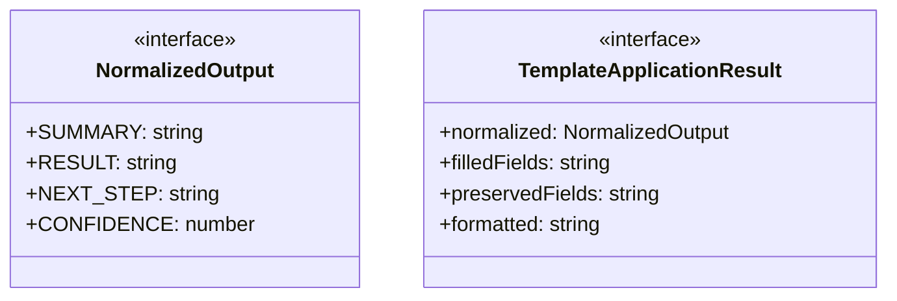
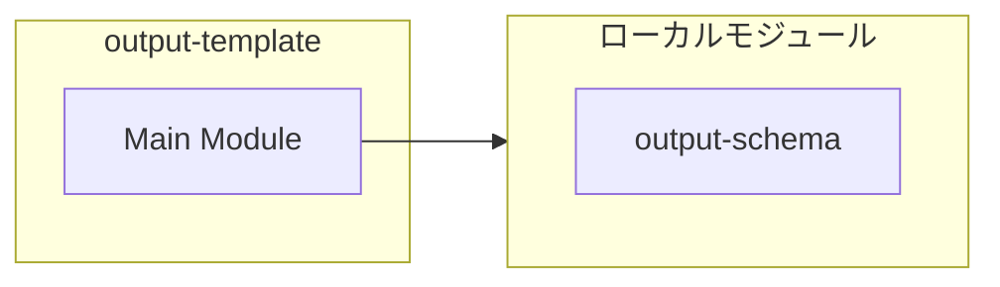
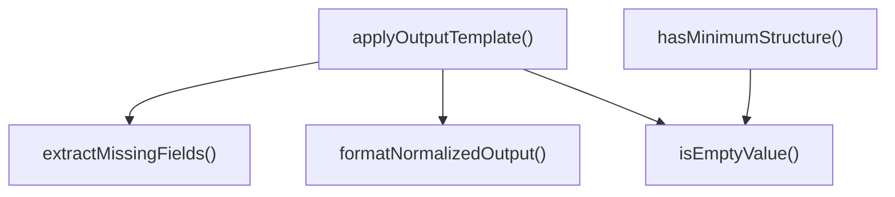
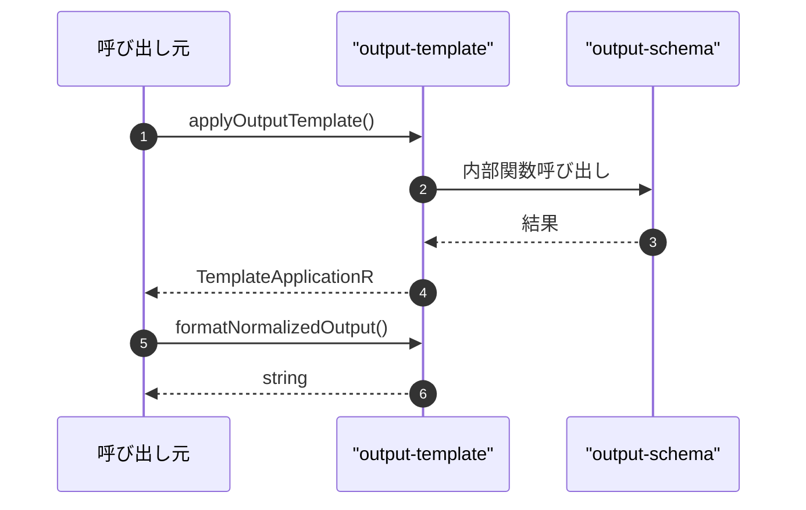

# output-template

## 概要

`output-template` モジュールのAPIリファレンス。

## インポート

```typescript
// from './output-schema.js': ParsedStructuredOutput, SchemaViolation, parseStructuredOutput
```

## エクスポート一覧

| 種別 | 名前 | 説明 |
|------|------|------|
| 関数 | `applyOutputTemplate` | 出力にテンプレートを適用し、デフォルト値で補完する |
| 関数 | `formatNormalizedOutput` | 正規化された出力を文字列形式に変換する |
| 関数 | `hasMinimumStructure` | 生の出力が最小限の構造を持っているかを確認する |
| インターフェース | `NormalizedOutput` | 正規化された出力構造 |
| インターフェース | `TemplateApplicationResult` | テンプレート適用結果 |

## 図解

### クラス図



### 依存関係図



### 関数フロー



### シーケンス図



## 関数

### isEmptyValue

```typescript
isEmptyValue(value: unknown): boolean
```

フィールドが実質的に空かどうかを判定する

**パラメータ**

| 名前 | 型 | 必須 |
|------|-----|------|
| value | `unknown` | はい |

**戻り値**: `boolean`

### extractMissingFields

```typescript
extractMissingFields(violations: SchemaViolation[]): Set<string>
```

違反から欠落フィールド名を抽出する

**パラメータ**

| 名前 | 型 | 必須 |
|------|-----|------|
| violations | `SchemaViolation[]` | はい |

**戻り値**: `Set<string>`

### applyOutputTemplate

```typescript
applyOutputTemplate(rawOutput: string, violations: SchemaViolation[]): TemplateApplicationResult
```

出力にテンプレートを適用し、デフォルト値で補完する

**パラメータ**

| 名前 | 型 | 必須 |
|------|-----|------|
| rawOutput | `string` | はい |
| violations | `SchemaViolation[]` | はい |

**戻り値**: `TemplateApplicationResult`

### formatNormalizedOutput

```typescript
formatNormalizedOutput(output: NormalizedOutput): string
```

正規化された出力を文字列形式に変換する

**パラメータ**

| 名前 | 型 | 必須 |
|------|-----|------|
| output | `NormalizedOutput` | はい |

**戻り値**: `string`

### hasMinimumStructure

```typescript
hasMinimumStructure(rawOutput: string): boolean
```

生の出力が最小限の構造を持っているかを確認する

**パラメータ**

| 名前 | 型 | 必須 |
|------|-----|------|
| rawOutput | `string` | はい |

**戻り値**: `boolean`

## インターフェース

### NormalizedOutput

```typescript
interface NormalizedOutput {
  SUMMARY: string;
  RESULT: string;
  NEXT_STEP: string;
  CONFIDENCE: number;
}
```

正規化された出力構造

### TemplateApplicationResult

```typescript
interface TemplateApplicationResult {
  normalized: NormalizedOutput;
  filledFields: string[];
  preservedFields: string[];
  formatted: string;
}
```

テンプレート適用結果

---
*自動生成: 2026-02-22T18:55:28.957Z*
