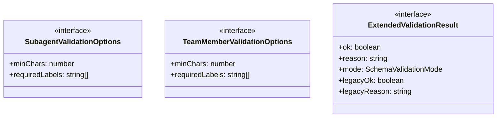
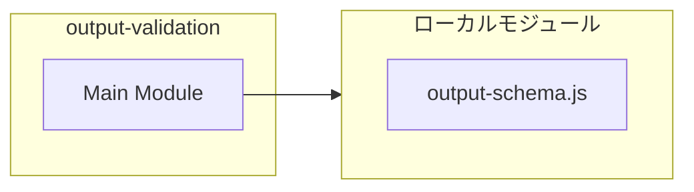
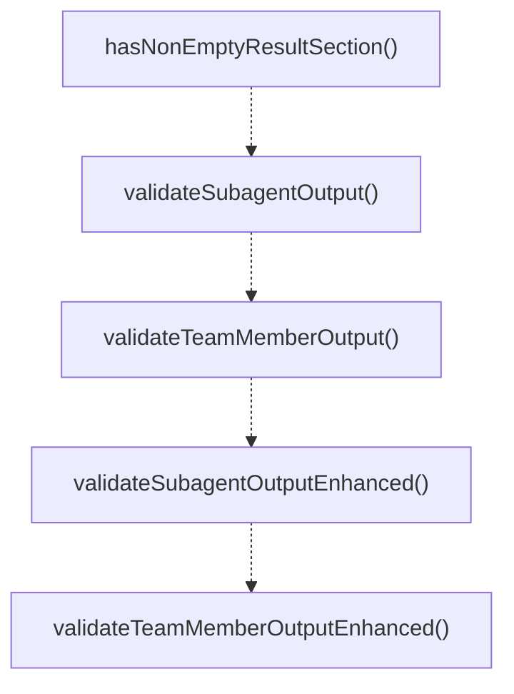

# output-validation

## 概要

`output-validation` モジュールのAPIリファレンス。

## インポート

```typescript
import { SchemaValidationMode, SchemaValidationResult, SchemaViolation... } from './output-schema.js';
```

## エクスポート一覧

| 種別 | 名前 | 説明 |
|------|------|------|
| 関数 | `hasNonEmptyResultSection` | Check if output has non-empty RESULT section. |
| 関数 | `validateSubagentOutput` | Validate subagent output format and content. |
| 関数 | `validateTeamMemberOutput` | Validate team member output format and content. |
| 関数 | `validateSubagentOutputEnhanced` | Validate subagent output with enhanced schema supp |
| 関数 | `validateTeamMemberOutputEnhanced` | Validate team member output with enhanced schema s |
| インターフェース | `SubagentValidationOptions` | Validation options for subagent output. |
| インターフェース | `TeamMemberValidationOptions` | Validation options for team member output. |
| インターフェース | `ExtendedValidationResult` | Extended validation result with schema information |

## 図解

### クラス図



### 依存関係図



### 関数フロー



### シーケンス図

```mermaid
sequenceDiagram
  autonumber
  participant Caller as 呼び出し元
  participant output_validation as output-validation
  participant output_schema_js as output-schema.js

  Caller->>output_validation: hasNonEmptyResultSection()
  output_validation->>output_schema_js: 内部関数呼び出し
  output_schema_js-->>output_validation: 結果
  output_validation-->>Caller: boolean

  Caller->>output_validation: validateSubagentOutput()
  output_validation-->>Caller: { ok: boolean; reason?: string }
```

## 関数

### hasNonEmptyResultSection

```typescript
hasNonEmptyResultSection(output: string): boolean
```

Check if output has non-empty RESULT section.

**パラメータ**

| 名前 | 型 | 必須 |
|------|-----|------|
| output | `string` | はい |

**戻り値**: `boolean`

### validateSubagentOutput

```typescript
validateSubagentOutput(output: string, options?: Partial<SubagentValidationOptions>): { ok: boolean; reason?: string }
```

Validate subagent output format and content.

**パラメータ**

| 名前 | 型 | 必須 |
|------|-----|------|
| output | `string` | はい |
| options | `Partial<SubagentValidationOptions>` | いいえ |

**戻り値**: `{ ok: boolean; reason?: string }`

### validateTeamMemberOutput

```typescript
validateTeamMemberOutput(output: string, options?: Partial<TeamMemberValidationOptions>): { ok: boolean; reason?: string }
```

Validate team member output format and content.
Team member output requires more labels and longer content than subagent.

**パラメータ**

| 名前 | 型 | 必須 |
|------|-----|------|
| output | `string` | はい |
| options | `Partial<TeamMemberValidationOptions>` | いいえ |

**戻り値**: `{ ok: boolean; reason?: string }`

### validateSubagentOutputEnhanced

```typescript
validateSubagentOutputEnhanced(output: string, options?: Partial<SubagentValidationOptions>): ExtendedValidationResult
```

Validate subagent output with enhanced schema support.
Respects PI_OUTPUT_SCHEMA_MODE feature flag.

**パラメータ**

| 名前 | 型 | 必須 |
|------|-----|------|
| output | `string` | はい |
| options | `Partial<SubagentValidationOptions>` | いいえ |

**戻り値**: `ExtendedValidationResult`

### validateTeamMemberOutputEnhanced

```typescript
validateTeamMemberOutputEnhanced(output: string, options?: Partial<TeamMemberValidationOptions>): ExtendedValidationResult
```

Validate team member output with enhanced schema support.
Respects PI_OUTPUT_SCHEMA_MODE feature flag.

**パラメータ**

| 名前 | 型 | 必須 |
|------|-----|------|
| output | `string` | はい |
| options | `Partial<TeamMemberValidationOptions>` | いいえ |

**戻り値**: `ExtendedValidationResult`

## インターフェース

### SubagentValidationOptions

```typescript
interface SubagentValidationOptions {
  minChars: number;
  requiredLabels: string[];
}
```

Validation options for subagent output.

### TeamMemberValidationOptions

```typescript
interface TeamMemberValidationOptions {
  minChars: number;
  requiredLabels: string[];
}
```

Validation options for team member output.

### ExtendedValidationResult

```typescript
interface ExtendedValidationResult {
  ok: boolean;
  reason?: string;
  mode: SchemaValidationMode;
  legacyOk: boolean;
  legacyReason?: string;
  schemaOk?: boolean;
  schemaReason?: string;
  schemaViolations?: SchemaViolation[];
  fallbackUsed: boolean;
}
```

Extended validation result with schema information.

---
*自動生成: 2026-02-17T22:16:16.696Z*
