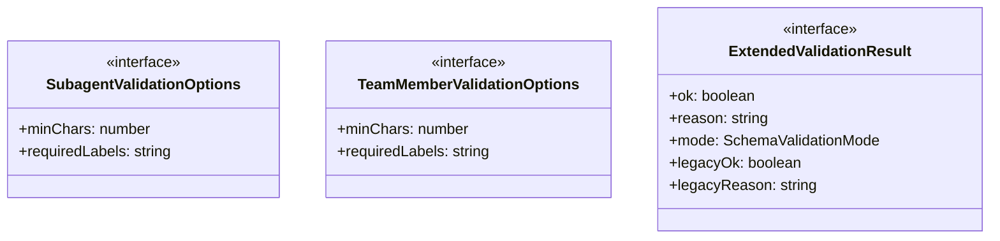
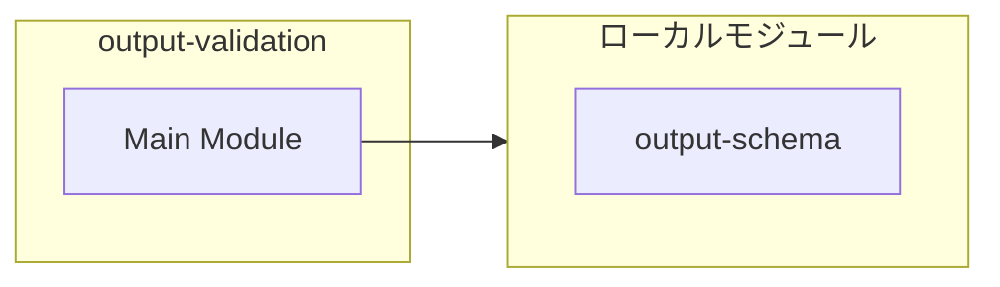
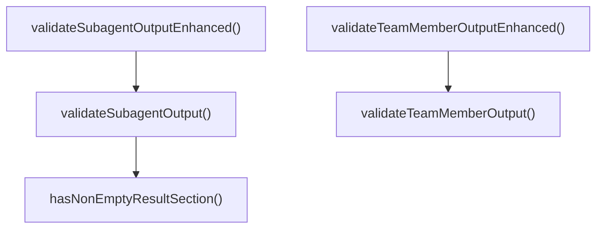
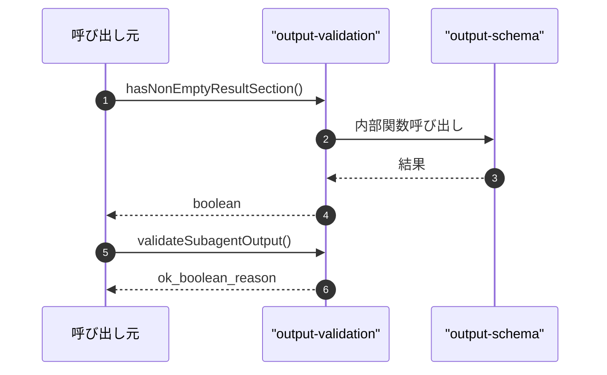

# output-validation

## 概要

`output-validation` モジュールのAPIリファレンス。

## インポート

```typescript
// from './output-schema.js': SchemaValidationMode, SchemaValidationResult, SchemaViolation, ...
```

## エクスポート一覧

| 種別 | 名前 | 説明 |
|------|------|------|
| 関数 | `hasNonEmptyResultSection` | 結果セクションが空でないか判定 |
| 関数 | `validateSubagentOutput` | サブエージェント出力を検証する |
| 関数 | `validateTeamMemberOutput` | チームメンバ出力の検証を行う |
| 関数 | `validateSubagentOutputEnhanced` | サブエージェント出力の拡張検証を行う |
| 関数 | `validateTeamMemberOutputEnhanced` | チームメンバ出力の拡張検証を行う |
| インターフェース | `SubagentValidationOptions` | サブエージェント検証オプション |
| インターフェース | `TeamMemberValidationOptions` | チームメンバー検証オプション |
| インターフェース | `ExtendedValidationResult` | スキーマ情報を含む拡張検証結果のインターフェース |

## 図解

### クラス図



### 依存関係図



### 関数フロー



### シーケンス図



## 関数

### hasNonEmptyResultSection

```typescript
hasNonEmptyResultSection(output: string): boolean
```

結果セクションが空でないか判定

**パラメータ**

| 名前 | 型 | 必須 |
|------|-----|------|
| output | `string` | はい |

**戻り値**: `boolean`

### validateSubagentOutput

```typescript
validateSubagentOutput(output: string, options?: Partial<SubagentValidationOptions>): { ok: boolean; reason?: string }
```

サブエージェント出力を検証する

**パラメータ**

| 名前 | 型 | 必須 |
|------|-----|------|
| output | `string` | はい |
| options | `Partial<SubagentValidationOptions>` | いいえ |

**戻り値**: `{ ok: boolean; reason?: string }`

### validateTeamMemberOutput

```typescript
validateTeamMemberOutput(output: string, options?: Partial<TeamMemberValidationOptions>): { ok: boolean; reason?: string }
```

チームメンバ出力の検証を行う

**パラメータ**

| 名前 | 型 | 必須 |
|------|-----|------|
| output | `string` | はい |
| options | `Partial<TeamMemberValidationOptions>` | いいえ |

**戻り値**: `{ ok: boolean; reason?: string }`

### validateSubagentOutputEnhanced

```typescript
validateSubagentOutputEnhanced(output: string, options?: Partial<SubagentValidationOptions>): ExtendedValidationResult
```

サブエージェント出力の拡張検証を行う

**パラメータ**

| 名前 | 型 | 必須 |
|------|-----|------|
| output | `string` | はい |
| options | `Partial<SubagentValidationOptions>` | いいえ |

**戻り値**: `ExtendedValidationResult`

### validateTeamMemberOutputEnhanced

```typescript
validateTeamMemberOutputEnhanced(output: string, options?: Partial<TeamMemberValidationOptions>): ExtendedValidationResult
```

チームメンバ出力の拡張検証を行う

**パラメータ**

| 名前 | 型 | 必須 |
|------|-----|------|
| output | `string` | はい |
| options | `Partial<TeamMemberValidationOptions>` | いいえ |

**戻り値**: `ExtendedValidationResult`

## インターフェース

### SubagentValidationOptions

```typescript
interface SubagentValidationOptions {
  minChars: number;
  requiredLabels: string[];
}
```

サブエージェント検証オプション

### TeamMemberValidationOptions

```typescript
interface TeamMemberValidationOptions {
  minChars: number;
  requiredLabels: string[];
}
```

チームメンバー検証オプション

### ExtendedValidationResult

```typescript
interface ExtendedValidationResult {
  ok: boolean;
  reason?: string;
  mode: SchemaValidationMode;
  legacyOk: boolean;
  legacyReason?: string;
  schemaOk?: boolean;
  schemaReason?: string;
  schemaViolations?: SchemaViolation[];
  fallbackUsed: boolean;
}
```

スキーマ情報を含む拡張検証結果のインターフェース

---
*自動生成: 2026-02-18T18:06:17.539Z*
