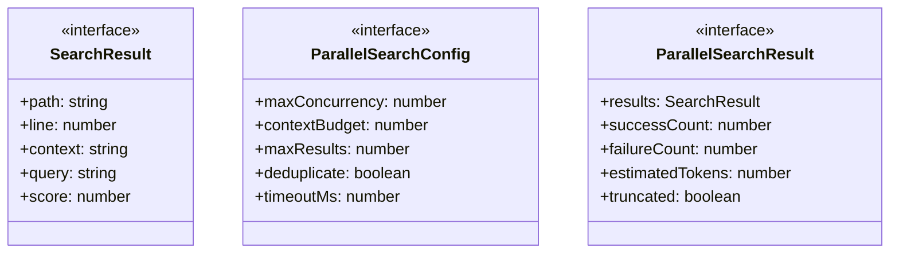
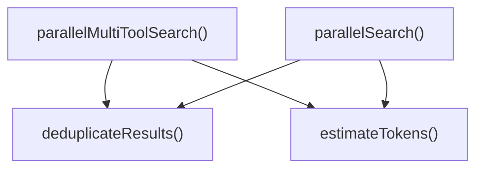
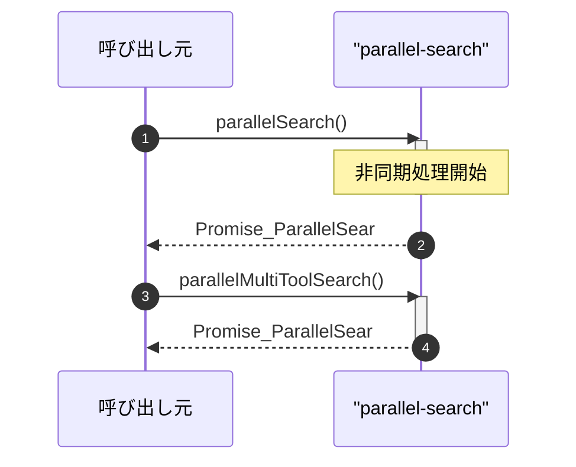

# parallel-search

## 概要

`parallel-search` モジュールのAPIリファレンス。

## エクスポート一覧

| 種別 | 名前 | 説明 |
|------|------|------|
| 関数 | `parallelSearch` | 複数の検索を並列実行 |
| 関数 | `parallelMultiToolSearch` | 複数の検索関数を並列実行 |
| インターフェース | `SearchResult` | 個別の検索結果 |
| インターフェース | `ParallelSearchConfig` | 並列検索の設定 |
| インターフェース | `ParallelSearchResult` | 並列検索の結果 |
| 型 | `SearchFunction` | 検索関数の型 |

## 図解

### クラス図



### 関数フロー



### シーケンス図



## 関数

### estimateTokens

```typescript
estimateTokens(results: SearchResult[]): number
```

結果のトークン数を推定

**パラメータ**

| 名前 | 型 | 必須 |
|------|-----|------|
| results | `SearchResult[]` | はい |

**戻り値**: `number`

### deduplicateResults

```typescript
deduplicateResults(results: SearchResult[]): SearchResult[]
```

結果を重複除去

**パラメータ**

| 名前 | 型 | 必須 |
|------|-----|------|
| results | `SearchResult[]` | はい |

**戻り値**: `SearchResult[]`

### parallelSearch

```typescript
async parallelSearch(queries: string[], searchFn: SearchFunction, config: ParallelSearchConfig): Promise<ParallelSearchResult>
```

複数の検索を並列実行

**パラメータ**

| 名前 | 型 | 必須 |
|------|-----|------|
| queries | `string[]` | はい |
| searchFn | `SearchFunction` | はい |
| config | `ParallelSearchConfig` | はい |

**戻り値**: `Promise<ParallelSearchResult>`

### searchWithTimeout

```typescript
async searchWithTimeout(query: string): Promise<SearchResult[]>
```

**パラメータ**

| 名前 | 型 | 必須 |
|------|-----|------|
| query | `string` | はい |

**戻り値**: `Promise<SearchResult[]>`

### parallelMultiToolSearch

```typescript
async parallelMultiToolSearch(searchFns: Array<{ fn: SearchFunction; query: string }>, config: ParallelSearchConfig): Promise<ParallelSearchResult>
```

複数の検索関数を並列実行

**パラメータ**

| 名前 | 型 | 必須 |
|------|-----|------|
| searchFns | `Array<{ fn: SearchFunction; query: string }>` | はい |
| config | `ParallelSearchConfig` | はい |

**戻り値**: `Promise<ParallelSearchResult>`

### searchWithTimeout

```typescript
async searchWithTimeout({
    fn,
    query,
  }: {
    fn: SearchFunction;
    query: string;
  }): Promise<SearchResult[]>
```

**パラメータ**

| 名前 | 型 | 必須 |
|------|-----|------|
| {
    fn,
    query,
  } | `object` | はい |
| &nbsp;&nbsp;↳ fn | `SearchFunction` | はい |
| &nbsp;&nbsp;↳ query | `string` | はい |

**戻り値**: `Promise<SearchResult[]>`

## インターフェース

### SearchResult

```typescript
interface SearchResult {
  path: string;
  line?: number;
  context?: string;
  query: string;
  score?: number;
}
```

個別の検索結果

### ParallelSearchConfig

```typescript
interface ParallelSearchConfig {
  maxConcurrency?: number;
  contextBudget?: number;
  maxResults?: number;
  deduplicate?: boolean;
  timeoutMs?: number;
}
```

並列検索の設定

### ParallelSearchResult

```typescript
interface ParallelSearchResult {
  results: SearchResult[];
  successCount: number;
  failureCount: number;
  estimatedTokens: number;
  truncated: boolean;
}
```

並列検索の結果

## 型定義

### SearchFunction

```typescript
type SearchFunction = (query: string) => Promise<SearchResult[]>
```

検索関数の型

---
*自動生成: 2026-02-24T17:08:02.736Z*
