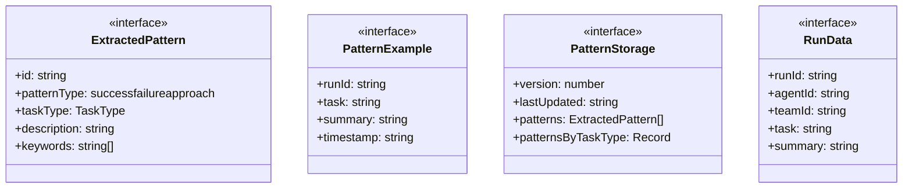
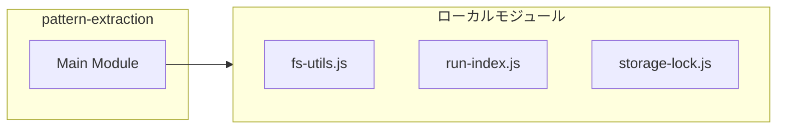
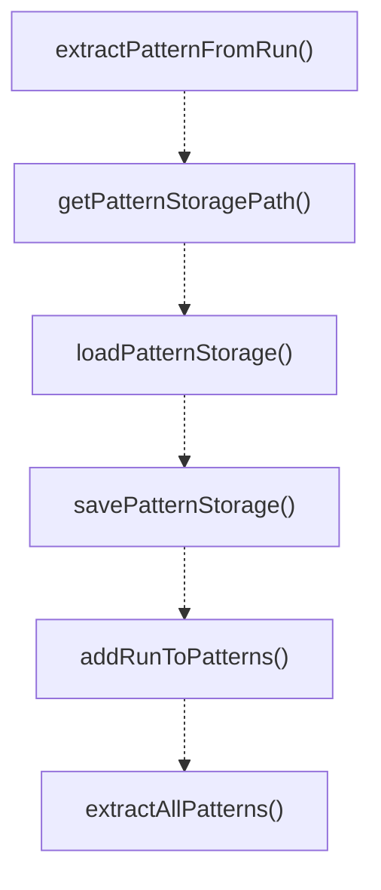
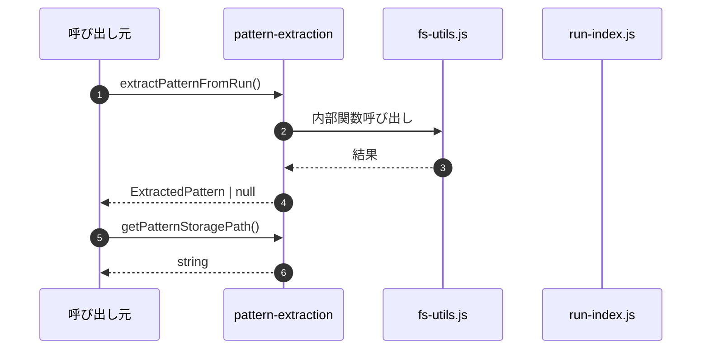

# pattern-extraction

## 概要

`pattern-extraction` モジュールのAPIリファレンス。

## インポート

```typescript
import { existsSync, readFileSync } from 'node:fs';
import { join } from 'node:path';
import { ensureDir } from './fs-utils.js';
import { extractKeywords, classifyTaskType, extractFiles... } from './run-index.js';
import { atomicWriteTextFile } from './storage-lock.js';
```

## エクスポート一覧

| 種別 | 名前 | 説明 |
|------|------|------|
| 関数 | `extractPatternFromRun` | Extract pattern from a single run. |
| 関数 | `getPatternStoragePath` | Get the path to the pattern storage file. |
| 関数 | `loadPatternStorage` | Load pattern storage from disk. |
| 関数 | `savePatternStorage` | Save pattern storage to disk. |
| 関数 | `addRunToPatterns` | Add a run to pattern storage. |
| 関数 | `extractAllPatterns` | Extract patterns from all runs in storage. |
| 関数 | `getPatternsForTaskType` | Get patterns for a specific task type. |
| 関数 | `getTopSuccessPatterns` | Get top success patterns. |
| 関数 | `getFailurePatternsToAvoid` | Get failure patterns to avoid. |
| 関数 | `findRelevantPatterns` | Find patterns relevant to a task description. |
| インターフェース | `ExtractedPattern` | Extracted pattern from run history. |
| インターフェース | `PatternExample` | Example of a pattern in action. |
| インターフェース | `PatternStorage` | Pattern storage structure. |
| インターフェース | `RunData` | Run data for pattern extraction. |

## 図解

### クラス図



### 依存関係図



### 関数フロー



### シーケンス図



## 関数

### generatePatternId

```typescript
generatePatternId(taskType: TaskType, keywords: string[]): string
```

Generate a unique pattern ID.

**パラメータ**

| 名前 | 型 | 必須 |
|------|-----|------|
| taskType | `TaskType` | はい |
| keywords | `string[]` | はい |

**戻り値**: `string`

### isSuccessPattern

```typescript
isSuccessPattern(summary: string): boolean
```

Detect if a run represents a success pattern.

**パラメータ**

| 名前 | 型 | 必須 |
|------|-----|------|
| summary | `string` | はい |

**戻り値**: `boolean`

### isErrorResolved

```typescript
isErrorResolved(summary: string): boolean
```

Check if "error" appears in a resolved context (e.g., "fixed error", "resolved error").

**パラメータ**

| 名前 | 型 | 必須 |
|------|-----|------|
| summary | `string` | はい |

**戻り値**: `boolean`

### isFailurePattern

```typescript
isFailurePattern(summary: string, status: string): boolean
```

Detect if a run represents a failure pattern.
Improved logic to avoid false positives from resolved errors.

**パラメータ**

| 名前 | 型 | 必須 |
|------|-----|------|
| summary | `string` | はい |
| status | `string` | はい |

**戻り値**: `boolean`

### extractPatternFromRun

```typescript
extractPatternFromRun(run: RunData): ExtractedPattern | null
```

Extract pattern from a single run.

**パラメータ**

| 名前 | 型 | 必須 |
|------|-----|------|
| run | `RunData` | はい |

**戻り値**: `ExtractedPattern | null`

### mergePatterns

```typescript
mergePatterns(existing: ExtractedPattern, newPattern: ExtractedPattern): ExtractedPattern
```

Merge two patterns if they are similar.

**パラメータ**

| 名前 | 型 | 必須 |
|------|-----|------|
| existing | `ExtractedPattern` | はい |
| newPattern | `ExtractedPattern` | はい |

**戻り値**: `ExtractedPattern`

### arePatternsSimilar

```typescript
arePatternsSimilar(a: ExtractedPattern, b: ExtractedPattern): boolean
```

Check if two patterns are similar enough to merge.

**パラメータ**

| 名前 | 型 | 必須 |
|------|-----|------|
| a | `ExtractedPattern` | はい |
| b | `ExtractedPattern` | はい |

**戻り値**: `boolean`

### getPatternStoragePath

```typescript
getPatternStoragePath(cwd: string): string
```

Get the path to the pattern storage file.

**パラメータ**

| 名前 | 型 | 必須 |
|------|-----|------|
| cwd | `string` | はい |

**戻り値**: `string`

### loadPatternStorage

```typescript
loadPatternStorage(cwd: string): PatternStorage
```

Load pattern storage from disk.

**パラメータ**

| 名前 | 型 | 必須 |
|------|-----|------|
| cwd | `string` | はい |

**戻り値**: `PatternStorage`

### savePatternStorage

```typescript
savePatternStorage(cwd: string, storage: PatternStorage): void
```

Save pattern storage to disk.

**パラメータ**

| 名前 | 型 | 必須 |
|------|-----|------|
| cwd | `string` | はい |
| storage | `PatternStorage` | はい |

**戻り値**: `void`

### addRunToPatterns

```typescript
addRunToPatterns(cwd: string, run: RunData): void
```

Add a run to pattern storage.
Extracts pattern and merges with existing if similar.

**パラメータ**

| 名前 | 型 | 必須 |
|------|-----|------|
| cwd | `string` | はい |
| run | `RunData` | はい |

**戻り値**: `void`

### extractAllPatterns

```typescript
extractAllPatterns(cwd: string): PatternStorage
```

Extract patterns from all runs in storage.

**パラメータ**

| 名前 | 型 | 必須 |
|------|-----|------|
| cwd | `string` | はい |

**戻り値**: `PatternStorage`

### getPatternsForTaskType

```typescript
getPatternsForTaskType(cwd: string, taskType: TaskType, patternType?: "success" | "failure" | "approach"): ExtractedPattern[]
```

Get patterns for a specific task type.

**パラメータ**

| 名前 | 型 | 必須 |
|------|-----|------|
| cwd | `string` | はい |
| taskType | `TaskType` | はい |
| patternType | `"success" | "failure" | "approach"` | いいえ |

**戻り値**: `ExtractedPattern[]`

### getTopSuccessPatterns

```typescript
getTopSuccessPatterns(cwd: string, limit: number): ExtractedPattern[]
```

Get top success patterns.

**パラメータ**

| 名前 | 型 | 必須 |
|------|-----|------|
| cwd | `string` | はい |
| limit | `number` | はい |

**戻り値**: `ExtractedPattern[]`

### getFailurePatternsToAvoid

```typescript
getFailurePatternsToAvoid(cwd: string, taskType?: TaskType): ExtractedPattern[]
```

Get failure patterns to avoid.

**パラメータ**

| 名前 | 型 | 必須 |
|------|-----|------|
| cwd | `string` | はい |
| taskType | `TaskType` | いいえ |

**戻り値**: `ExtractedPattern[]`

### findRelevantPatterns

```typescript
findRelevantPatterns(cwd: string, taskDescription: string, limit: number): ExtractedPattern[]
```

Find patterns relevant to a task description.

**パラメータ**

| 名前 | 型 | 必須 |
|------|-----|------|
| cwd | `string` | はい |
| taskDescription | `string` | はい |
| limit | `number` | はい |

**戻り値**: `ExtractedPattern[]`

## インターフェース

### ExtractedPattern

```typescript
interface ExtractedPattern {
  id: string;
  patternType: "success" | "failure" | "approach";
  taskType: TaskType;
  description: string;
  keywords: string[];
  files: string[];
  agentOrTeam: string;
  frequency: number;
  lastSeen: string;
  confidence: number;
  examples: PatternExample[];
}
```

Extracted pattern from run history.

### PatternExample

```typescript
interface PatternExample {
  runId: string;
  task: string;
  summary: string;
  timestamp: string;
}
```

Example of a pattern in action.

### PatternStorage

```typescript
interface PatternStorage {
  version: number;
  lastUpdated: string;
  patterns: ExtractedPattern[];
  patternsByTaskType: Record<TaskType, string[]>;
}
```

Pattern storage structure.

### RunData

```typescript
interface RunData {
  runId: string;
  agentId?: string;
  teamId?: string;
  task: string;
  summary: string;
  status: "completed" | "failed";
  startedAt: string;
  finishedAt: string;
  error?: string;
}
```

Run data for pattern extraction.

---
*自動生成: 2026-02-17T21:54:59.813Z*
