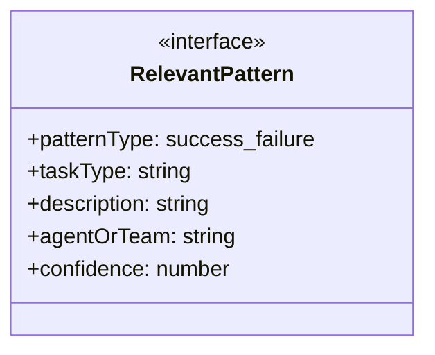
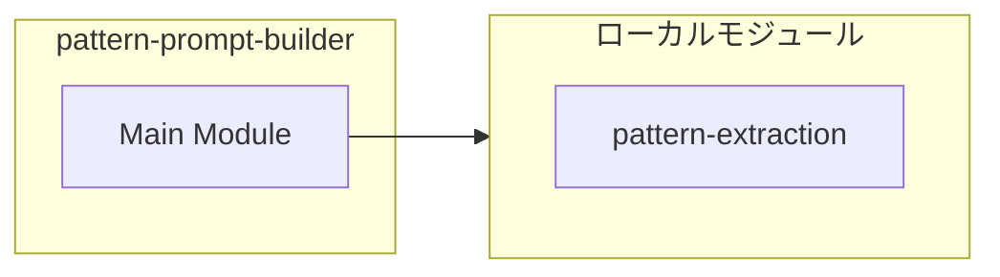
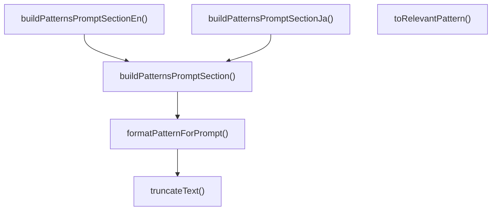
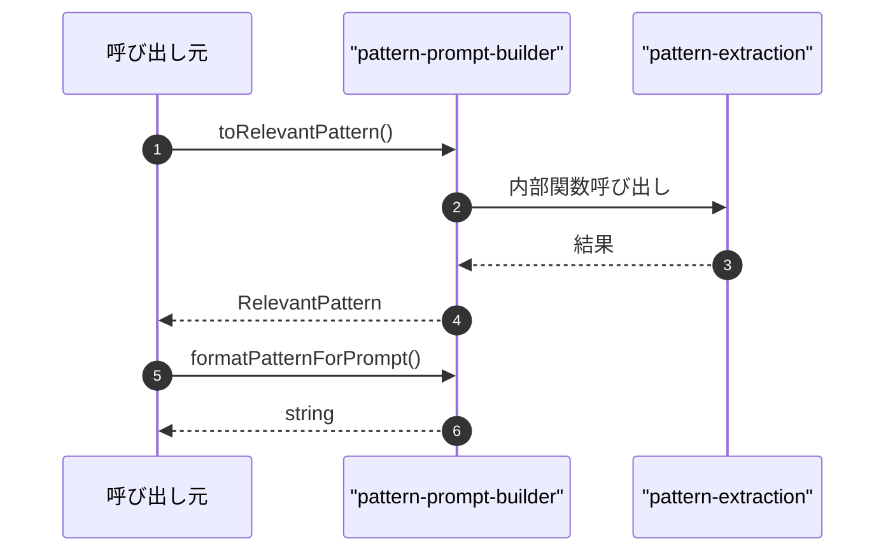

# pattern-prompt-builder

## 概要

`pattern-prompt-builder` モジュールのAPIリファレンス。

## インポート

```typescript
// from './pattern-extraction.js': ExtractedPattern
```

## エクスポート一覧

| 種別 | 名前 | 説明 |
|------|------|------|
| 関数 | `toRelevantPattern` | ExtractedPatternをRelevantPatternに変換 |
| 関数 | `formatPatternForPrompt` | 単一パターンをフォーマット |
| 関数 | `buildPatternsPromptSection` | パターンセクションを構築 |
| 関数 | `buildPatternsPromptSectionJa` | 日本語でパターンセクションを構築 |
| 関数 | `buildPatternsPromptSectionEn` | 英語でパターンセクションを構築 |
| インターフェース | `RelevantPattern` | 簡略化されたパターン情報（プロンプト用） |
| 型 | `PromptLanguage` | プロンプト言語設定 |

## 図解

### クラス図



### 依存関係図



### 関数フロー



### シーケンス図



## 関数

### truncateText

```typescript
truncateText(text: string, maxLength: number): string
```

テキストを指定長で切り詰め

**パラメータ**

| 名前 | 型 | 必須 |
|------|-----|------|
| text | `string` | はい |
| maxLength | `number` | はい |

**戻り値**: `string`

### toRelevantPattern

```typescript
toRelevantPattern(pattern: ExtractedPattern): RelevantPattern
```

ExtractedPatternをRelevantPatternに変換

**パラメータ**

| 名前 | 型 | 必須 |
|------|-----|------|
| pattern | `ExtractedPattern` | はい |

**戻り値**: `RelevantPattern`

### formatPatternForPrompt

```typescript
formatPatternForPrompt(pattern: RelevantPattern, language: PromptLanguage): string
```

単一パターンをフォーマット

**パラメータ**

| 名前 | 型 | 必須 |
|------|-----|------|
| pattern | `RelevantPattern` | はい |
| language | `PromptLanguage` | はい |

**戻り値**: `string`

### buildPatternsPromptSection

```typescript
buildPatternsPromptSection(patterns: RelevantPattern[] | undefined, language: PromptLanguage): string
```

パターンセクションを構築

**パラメータ**

| 名前 | 型 | 必須 |
|------|-----|------|
| patterns | `RelevantPattern[] | undefined` | はい |
| language | `PromptLanguage` | はい |

**戻り値**: `string`

### buildPatternsPromptSectionJa

```typescript
buildPatternsPromptSectionJa(patterns: RelevantPattern[] | undefined): string
```

日本語でパターンセクションを構築

**パラメータ**

| 名前 | 型 | 必須 |
|------|-----|------|
| patterns | `RelevantPattern[] | undefined` | はい |

**戻り値**: `string`

### buildPatternsPromptSectionEn

```typescript
buildPatternsPromptSectionEn(patterns: RelevantPattern[] | undefined): string
```

英語でパターンセクションを構築

**パラメータ**

| 名前 | 型 | 必須 |
|------|-----|------|
| patterns | `RelevantPattern[] | undefined` | はい |

**戻り値**: `string`

## インターフェース

### RelevantPattern

```typescript
interface RelevantPattern {
  patternType: "success" | "failure" | "approach";
  taskType: string;
  description: string;
  agentOrTeam: string;
  confidence: number;
  keywords: string[];
}
```

簡略化されたパターン情報（プロンプト用）

## 型定義

### PromptLanguage

```typescript
type PromptLanguage = "en" | "ja"
```

プロンプト言語設定

---
*自動生成: 2026-02-23T06:29:42.384Z*
