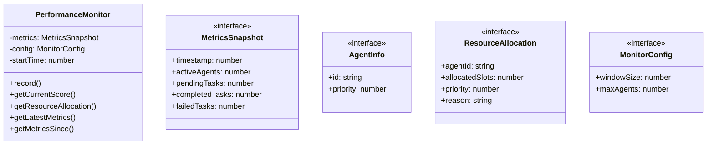

# performance-monitor

## 概要

`performance-monitor` モジュールのAPIリファレンス。

## エクスポート一覧

| 種別 | 名前 | 説明 |
|------|------|------|
| クラス | `PerformanceMonitor` | パフォーマンスモニター |
| インターフェース | `MetricsSnapshot` | メトリクススナップショット |
| インターフェース | `AgentInfo` | エージェント情報 |
| インターフェース | `ResourceAllocation` | リソース配分結果 |
| インターフェース | `MonitorConfig` | モニター設定 |

## 図解

### クラス図



## クラス

### PerformanceMonitor

パフォーマンスモニター
DynTaskMAS論文のAWMコンポーネントを実装

**プロパティ**

| 名前 | 型 | 可視性 |
|------|-----|--------|
| metrics | `MetricsSnapshot[]` | private |
| config | `MonitorConfig` | private |
| startTime | `number` | private |

**メソッド**

| 名前 | シグネチャ |
|------|------------|
| record | `record(snapshot): void` |
| getCurrentScore | `getCurrentScore(): number` |
| getResourceAllocation | `getResourceAllocation(agents, totalSlots): ResourceAllocation[]` |
| getLatestMetrics | `getLatestMetrics(): MetricsSnapshot | undefined` |
| getMetricsSince | `getMetricsSince(since): MetricsSnapshot[]` |
| getUptime | `getUptime(): number` |
| getSummary | `getSummary(): {
    totalCompleted: number;
    totalFailed: number;
    avgThroughput: number;
    avgLatency: number;
    avgUtilization: number;
    avgErrorRate: number;
    uptimeMs: number;
  }` |
| calculateThroughput | `calculateThroughput(): number` |
| calculateUtilization | `calculateUtilization(): number` |
| calculateErrorRate | `calculateErrorRate(): number` |
| clear | `clear(): void` |

## インターフェース

### MetricsSnapshot

```typescript
interface MetricsSnapshot {
  timestamp: number;
  activeAgents: number;
  pendingTasks: number;
  completedTasks: number;
  failedTasks: number;
  avgLatencyMs: number;
  throughput: number;
  resourceUtilization: number;
  errorRate: number;
}
```

メトリクススナップショット

### AgentInfo

```typescript
interface AgentInfo {
  id: string;
  priority: number;
}
```

エージェント情報

### ResourceAllocation

```typescript
interface ResourceAllocation {
  agentId: string;
  allocatedSlots: number;
  priority: number;
  reason: string;
}
```

リソース配分結果

### MonitorConfig

```typescript
interface MonitorConfig {
  windowSize: number;
  maxAgents: number;
}
```

モニター設定

---
*自動生成: 2026-02-24T17:08:02.740Z*
