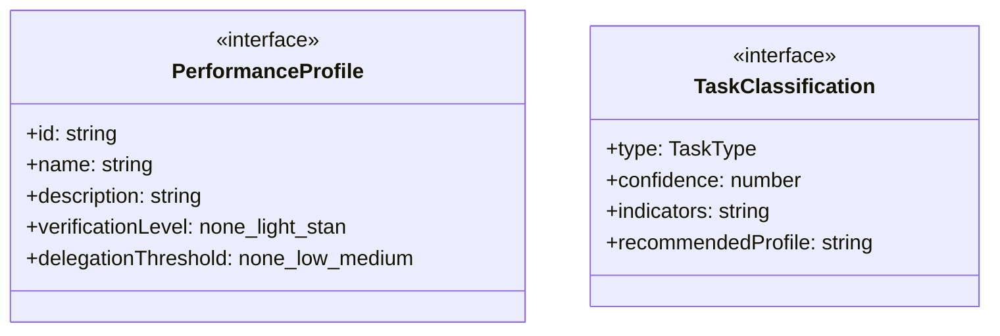
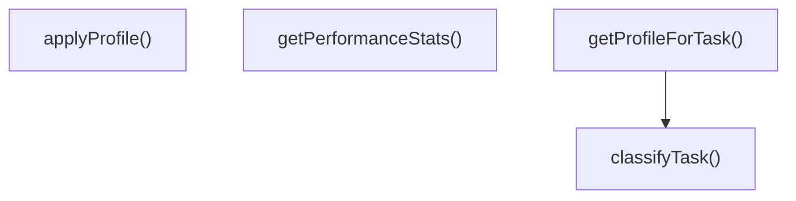

# performance-profiles

## 概要

`performance-profiles` モジュールのAPIリファレンス。

## エクスポート一覧

| 種別 | 名前 | 説明 |
|------|------|------|
| 関数 | `classifyTask` | タスクを分類する |
| 関数 | `getProfileForTask` | タスクに適したプロファイルを取得 |
| 関数 | `applyProfile` | プロファイルを適用して設定を調整 |
| 関数 | `getPerformanceStats` | 現在のパフォーマンス統計を取得 |
| インターフェース | `PerformanceProfile` | パフォーマンスプロファイル |
| インターフェース | `TaskClassification` | タスク分類結果 |
| 型 | `TaskType` | タスクタイプ |

## 図解

### クラス図



### 関数フロー



## 関数

### classifyTask

```typescript
classifyTask(task: string, context?: {
  fileCount?: number;
  estimatedSteps?: number;
  isHighRisk?: boolean;
}): TaskClassification
```

タスクを分類する

**パラメータ**

| 名前 | 型 | 必須 |
|------|-----|------|
| task | `string` | はい |
| context | `object` | いいえ |
| &nbsp;&nbsp;↳ fileCount | `number` | いいえ |
| &nbsp;&nbsp;↳ estimatedSteps | `number` | いいえ |
| &nbsp;&nbsp;↳ isHighRisk | `boolean` | いいえ |

**戻り値**: `TaskClassification`

### getProfileForTask

```typescript
getProfileForTask(task: string, context?: {
    fileCount?: number;
    estimatedSteps?: number;
    isHighRisk?: boolean;
    overrideProfile?: string;
  }): PerformanceProfile
```

タスクに適したプロファイルを取得

**パラメータ**

| 名前 | 型 | 必須 |
|------|-----|------|
| task | `string` | はい |
| context | `object` | いいえ |
| &nbsp;&nbsp;↳ fileCount | `number` | いいえ |
| &nbsp;&nbsp;↳ estimatedSteps | `number` | いいえ |
| &nbsp;&nbsp;↳ isHighRisk | `boolean` | いいえ |
| &nbsp;&nbsp;↳ overrideProfile | `string` | いいえ |

**戻り値**: `PerformanceProfile`

### applyProfile

```typescript
applyProfile(profile: PerformanceProfile, baseConfig: T): T & { profile: PerformanceProfile }
```

プロファイルを適用して設定を調整

**パラメータ**

| 名前 | 型 | 必須 |
|------|-----|------|
| profile | `PerformanceProfile` | はい |
| baseConfig | `T` | はい |

**戻り値**: `T & { profile: PerformanceProfile }`

### getPerformanceStats

```typescript
getPerformanceStats(): {
  profileUsage: Record<string, number>;
  averageTaskDuration: number;
  cacheHitRate: number;
}
```

現在のパフォーマンス統計を取得

**戻り値**: `{
  profileUsage: Record<string, number>;
  averageTaskDuration: number;
  cacheHitRate: number;
}`

## インターフェース

### PerformanceProfile

```typescript
interface PerformanceProfile {
  id: string;
  name: string;
  description: string;
  verificationLevel: 'none' | 'light' | 'standard' | 'strict';
  delegationThreshold: 'none' | 'low' | 'medium' | 'high' | 'always';
  metacognitiveDepth: 0 | 1 | 2 | 3 | 4 | 5;
  philosophicalReflection: boolean;
  aporiaHandling: boolean;
  maxIterations: number;
  timeoutMultiplier: number;
  priorityRules: string[];
}
```

パフォーマンスプロファイル

### TaskClassification

```typescript
interface TaskClassification {
  type: TaskType;
  confidence: number;
  indicators: string[];
  recommendedProfile: string;
}
```

タスク分類結果

## 型定義

### TaskType

```typescript
type TaskType = | 'trivial'        // 自明な修正（タイポ等）
  | 'simple'         // 単純タスク（1-2ステップ）
  | 'moderate'       // 中程度タスク（複数ステップ）
  | 'complex'        // 複雑タスク（設計判断必要）
  | 'critical'       // 重要タスク（削除・本番・セキュリティ）
  | 'exploratory'    // 探索的タスク（研究・分析）
  | 'creative'
```

タスクタイプ

---
*自動生成: 2026-02-22T18:55:28.965Z*
