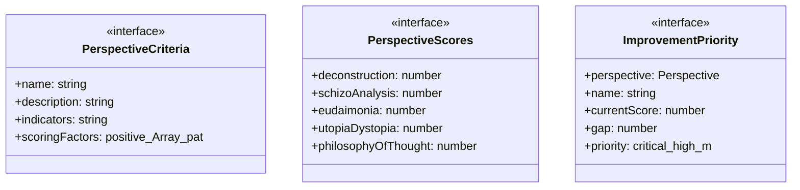
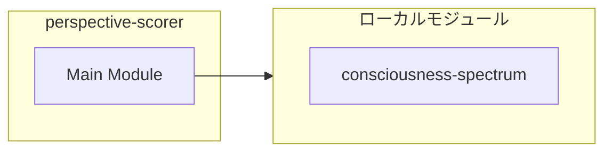
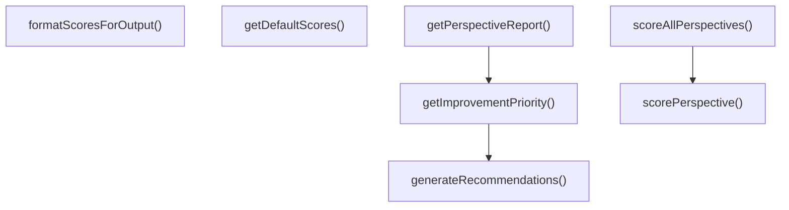
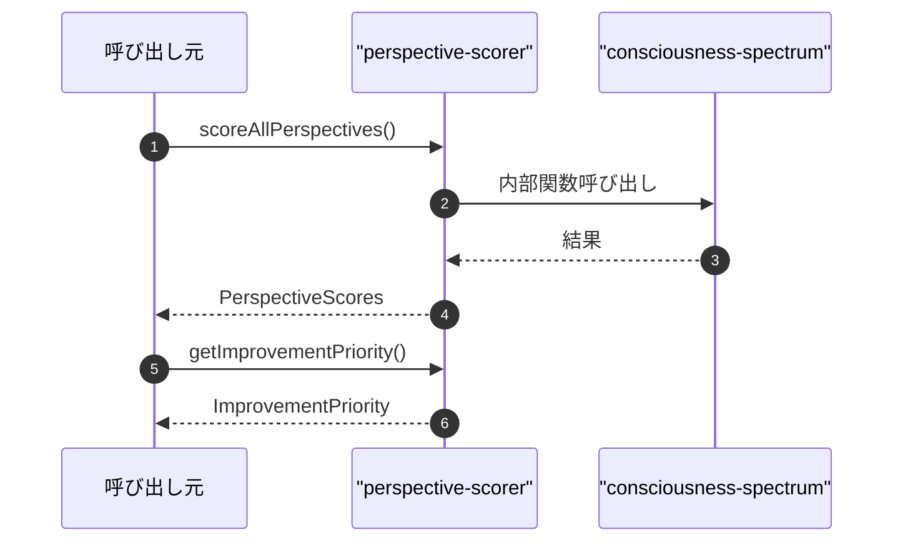

# perspective-scorer

## 概要

`perspective-scorer` モジュールのAPIリファレンス。

## インポート

```typescript
// from './consciousness-spectrum.js': ConsciousnessState, evaluateConsciousnessLevel, getConsciousnessReport, ...
```

## エクスポート一覧

| 種別 | 名前 | 説明 |
|------|------|------|
| 関数 | `scoreAllPerspectives` | 全視座のスコアを算出 |
| 関数 | `getImprovementPriority` | 改善の優先順位を算出 |
| 関数 | `getPerspectiveReport` | 視座レポートを生成 |
| 関数 | `formatScoresForOutput` | 出力フォーマット用のスコア文字列を生成 |
| 関数 | `getDefaultScores` | デフォルトのスコア（評価なしの場合） |
| インターフェース | `PerspectiveCriteria` | 各視座の評価基準 |
| インターフェース | `PerspectiveScores` | 視座別スコア |
| インターフェース | `ImprovementPriority` | 改善の優先順位 |
| 型 | `Perspective` | 7つの哲学的視座 |

## 図解

### クラス図



### 依存関係図



### 関数フロー



### シーケンス図



## 関数

### scoreAllPerspectives

```typescript
scoreAllPerspectives(output: string, context: {
    consciousnessContext?: {
      hasMetaCognitiveMarkers?: boolean;
      hasSelfReference?: boolean;
      hasTemporalContinuity?: boolean;
      hasValueExpression?: boolean;
      previousOutputs?: string[];
      taskType?: string;
    };
  }): PerspectiveScores
```

全視座のスコアを算出

**パラメータ**

| 名前 | 型 | 必須 |
|------|-----|------|
| output | `string` | はい |
| context | `object` | はい |
| &nbsp;&nbsp;↳ consciousnessContext | `{      hasMetaCognitiveMarkers?: boolean;      hasSelfReference?: boolean;      hasTemporalContinuity?: boolean;      hasValueExpression?: boolean;      previousOutputs?: string[];      taskType?: string;    }` | いいえ |

**戻り値**: `PerspectiveScores`

### scorePerspective

```typescript
scorePerspective(output: string, criteria: PerspectiveCriteria): number
```

単一視座のスコアを計算

**パラメータ**

| 名前 | 型 | 必須 |
|------|-----|------|
| output | `string` | はい |
| criteria | `PerspectiveCriteria` | はい |

**戻り値**: `number`

### getImprovementPriority

```typescript
getImprovementPriority(scores: PerspectiveScores): ImprovementPriority[]
```

改善の優先順位を算出

**パラメータ**

| 名前 | 型 | 必須 |
|------|-----|------|
| scores | `PerspectiveScores` | はい |

**戻り値**: `ImprovementPriority[]`

### generateRecommendations

```typescript
generateRecommendations(perspective: Perspective, score: number): string[]
```

視座別の推奨事項を生成

**パラメータ**

| 名前 | 型 | 必須 |
|------|-----|------|
| perspective | `Perspective` | はい |
| score | `number` | はい |

**戻り値**: `string[]`

### getPerspectiveReport

```typescript
getPerspectiveReport(scores: PerspectiveScores): string
```

視座レポートを生成

**パラメータ**

| 名前 | 型 | 必須 |
|------|-----|------|
| scores | `PerspectiveScores` | はい |

**戻り値**: `string`

### formatScoresForOutput

```typescript
formatScoresForOutput(scores: PerspectiveScores): string
```

出力フォーマット用のスコア文字列を生成

**パラメータ**

| 名前 | 型 | 必須 |
|------|-----|------|
| scores | `PerspectiveScores` | はい |

**戻り値**: `string`

### getDefaultScores

```typescript
getDefaultScores(): PerspectiveScores
```

デフォルトのスコア（評価なしの場合）

**戻り値**: `PerspectiveScores`

## インターフェース

### PerspectiveCriteria

```typescript
interface PerspectiveCriteria {
  name: string;
  description: string;
  indicators: string[];
  scoringFactors: {
    positive: Array<{ pattern: RegExp; points: number; description: string }>;
    negative: Array<{ pattern: RegExp; points: number; description: string }>;
  };
}
```

各視座の評価基準

### PerspectiveScores

```typescript
interface PerspectiveScores {
  deconstruction: number;
  schizoAnalysis: number;
  eudaimonia: number;
  utopiaDystopia: number;
  philosophyOfThought: number;
  taxonomyOfThought: number;
  logic: number;
  total: number;
  average: number;
  timestamp: string;
  consciousnessLevel?: ConsciousnessState;
}
```

視座別スコア

### ImprovementPriority

```typescript
interface ImprovementPriority {
  perspective: Perspective;
  name: string;
  currentScore: number;
  gap: number;
  priority: 'critical' | 'high' | 'medium' | 'low';
  recommendations: string[];
}
```

改善の優先順位

## 型定義

### Perspective

```typescript
type Perspective = | 'deconstruction'      // 脱構築
  | 'schizoAnalysis'      // スキゾ分析
  | 'eudaimonia'          // 幸福論
  | 'utopiaDystopia'      // ユートピア/ディストピア
  | 'philosophyOfThought' // 思考哲学
  | 'taxonomyOfThought'   // 思考分類学
  | 'logic'
```

7つの哲学的視座

---
*自動生成: 2026-02-22T19:27:00.687Z*
