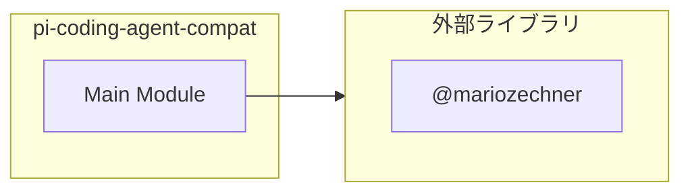

# pi-coding-agent-compat

## 概要

`pi-coding-agent-compat` モジュールのAPIリファレンス。

## インポート

```typescript
// from '@mariozechner/pi-agent-core': AgentToolResult
```

## エクスポート一覧

| 種別 | 名前 | 説明 |
|------|------|------|

## 図解

### クラス図

```mermaid
classDiagram
  class ExtensionUIContext {
    <<interface>>
  }
  class ContextUsage {
    <<interface>>
    +usageTokens: number
    +trailingTokens: number
  }
  class RunSubagentOptions {
    <<interface>>
    +subagentId: string
    +task: string
    +extraContext: string
    +timeoutMs: number
  }
  class ExecuteToolOptions {
    <<interface>>
    +toolName: string
    +params: Record_string_unknow
    +timeoutMs: number
  }
  class ExtensionAPI {
    <<interface>>
    +context: ExtensionContext
  }
  class SessionStartEvent {
    <<interface>>
    +sessionId: string
  }
  class BashToolResultEvent {
    <<interface>>
    +error: string
    +result: unknown
  }
  class ReadToolResultEvent {
    <<interface>>
    +error: string
    +result: unknown
  }
  class EditToolResultEvent {
    <<interface>>
    +error: string
    +result: unknown
  }
  class WriteToolResultEvent {
    <<interface>>
    +error: string
    +result: unknown
  }
  class GrepToolResultEvent {
    <<interface>>
    +error: string
    +result: unknown
  }
  class FindToolResultEvent {
    <<interface>>
    +error: string
    +result: unknown
  }
  class LsToolResultEvent {
    <<interface>>
    +error: string
    +result: unknown
  }
  class CustomToolResultEvent {
    <<interface>>
    +error: string
    +result: unknown
  }
```



### 依存関係図



## インターフェース

### ExtensionUIContext

```typescript
interface ExtensionUIContext {
  notify(message, type);
  getTitle();
}
```

### ContextUsage

```typescript
interface ContextUsage {
  usageTokens?: number;
  trailingTokens?: number;
}
```

### RunSubagentOptions

```typescript
interface RunSubagentOptions {
  subagentId: string;
  task: string;
  extraContext?: string;
  timeoutMs?: number;
}
```

サブエージェント実行オプション

### ExecuteToolOptions

```typescript
interface ExecuteToolOptions {
  toolName: string;
  params: Record<string, unknown>;
  timeoutMs?: number;
}
```

ツール実行オプション

### ExtensionAPI

```typescript
interface ExtensionAPI {
  context: import("@mariozechner/pi-coding-agent").ExtensionContext;
  on(event, handler);
  runSubagent(options);
  executeTool(options);
}
```

### SessionStartEvent

```typescript
interface SessionStartEvent {
  sessionId?: string;
}
```

### BashToolResultEvent

```typescript
interface BashToolResultEvent {
  error?: string;
  result?: unknown;
}
```

### ReadToolResultEvent

```typescript
interface ReadToolResultEvent {
  error?: string;
  result?: unknown;
}
```

### EditToolResultEvent

```typescript
interface EditToolResultEvent {
  error?: string;
  result?: unknown;
}
```

### WriteToolResultEvent

```typescript
interface WriteToolResultEvent {
  error?: string;
  result?: unknown;
}
```

### GrepToolResultEvent

```typescript
interface GrepToolResultEvent {
  error?: string;
  result?: unknown;
}
```

### FindToolResultEvent

```typescript
interface FindToolResultEvent {
  error?: string;
  result?: unknown;
}
```

### LsToolResultEvent

```typescript
interface LsToolResultEvent {
  error?: string;
  result?: unknown;
}
```

### CustomToolResultEvent

```typescript
interface CustomToolResultEvent {
  error?: string;
  result?: unknown;
}
```

---
*自動生成: 2026-02-24T17:08:02.743Z*
