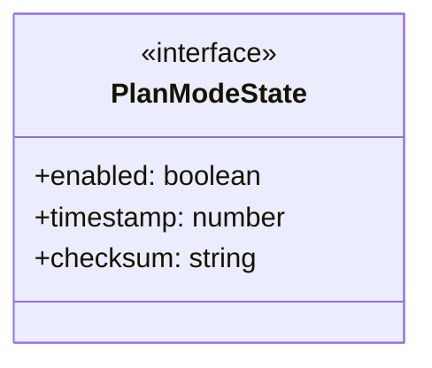
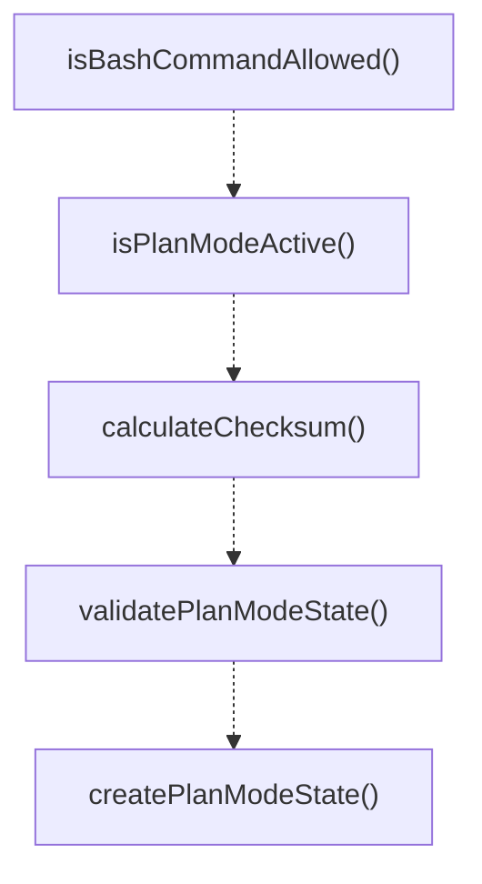
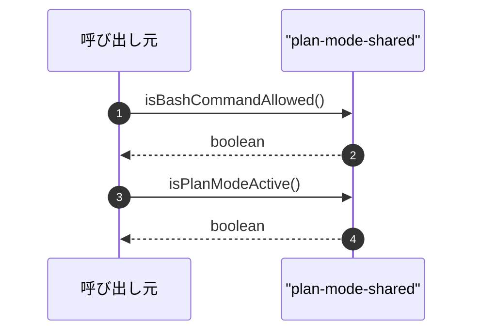

# plan-mode-shared

## 概要

`plan-mode-shared` モジュールのAPIリファレンス。

## インポート

```typescript
import { createHash } from 'node:crypto';
import { existsSync, readFileSync } from 'node:fs';
import { join } from 'node:path';
```

## エクスポート一覧

| 種別 | 名前 | 説明 |
|------|------|------|
| 関数 | `isBashCommandAllowed` | Check if a bash command is allowed in plan mode. |
| 関数 | `isPlanModeActive` | Check if plan mode is active. |
| 関数 | `calculateChecksum` | Calculate checksum for plan mode state validation. |
| 関数 | `validatePlanModeState` | Validate plan mode state checksum. |
| 関数 | `createPlanModeState` | Create a new plan mode state with checksum. |
| インターフェース | `PlanModeState` | - |

## 図解

### クラス図



### 関数フロー



### シーケンス図



## 関数

### isBashCommandAllowed

```typescript
isBashCommandAllowed(command: string): boolean
```

Check if a bash command is allowed in plan mode.

This function implements a multi-layered check to prevent write operations:
1. Check for output redirections (> >> 2> &>)
2. Check for pipelines with write commands
3. Check for subshells and command substitution
4. Check for explicit shell invocation (bash -c, sh -c)
5. Check first word against write command list
6. Verify first word is in read-only allowlist

**パラメータ**

| 名前 | 型 | 必須 |
|------|-----|------|
| command | `string` | はい |

**戻り値**: `boolean`

### isPlanModeActive

```typescript
isPlanModeActive(): boolean
```

Check if plan mode is active.

Requires both:
1) PI_PLAN_MODE="1" environment flag
2) A valid persisted state file with enabled=true

**戻り値**: `boolean`

### calculateChecksum

```typescript
calculateChecksum(state: Omit<PlanModeState, 'checksum'>): string
```

Calculate checksum for plan mode state validation.

**パラメータ**

| 名前 | 型 | 必須 |
|------|-----|------|
| state | `Omit<PlanModeState, 'checksum'>` | はい |

**戻り値**: `string`

### validatePlanModeState

```typescript
validatePlanModeState(state: PlanModeState): boolean
```

Validate plan mode state checksum.

**パラメータ**

| 名前 | 型 | 必須 |
|------|-----|------|
| state | `PlanModeState` | はい |

**戻り値**: `boolean`

### createPlanModeState

```typescript
createPlanModeState(enabled: boolean): PlanModeState
```

Create a new plan mode state with checksum.

**パラメータ**

| 名前 | 型 | 必須 |
|------|-----|------|
| enabled | `boolean` | はい |

**戻り値**: `PlanModeState`

## インターフェース

### PlanModeState

```typescript
interface PlanModeState {
  enabled: boolean;
  timestamp: number;
  checksum: string;
}
```

---
*自動生成: 2026-02-18T00:15:35.740Z*
