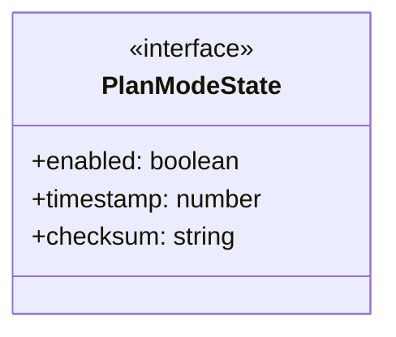
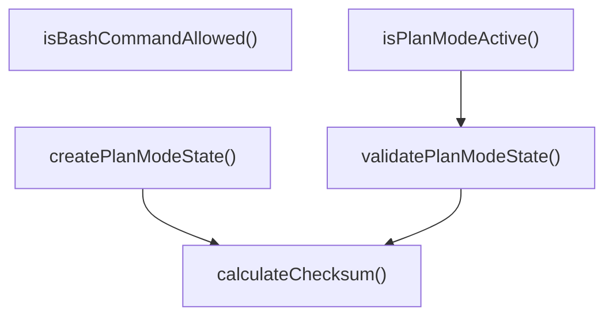
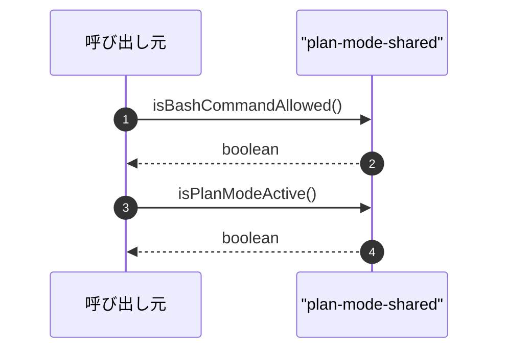

# plan-mode-shared

## 概要

`plan-mode-shared` モジュールのAPIリファレンス。

## インポート

```typescript
// from 'node:crypto': createHash
// from 'node:fs': existsSync, readFileSync
// from 'node:path': join
```

## エクスポート一覧

| 種別 | 名前 | 説明 |
|------|------|------|
| 関数 | `isBashCommandAllowed` | Bashコマンドが許可されているか判定する |
| 関数 | `isPlanModeActive` | プランモードが有効か判定する |
| 関数 | `calculateChecksum` | プランモード状態のチェックサムを計算する |
| 関数 | `validatePlanModeState` | 状態チェックサム検証 |
| 関数 | `createPlanModeState` | プランモードの状態を検証 |
| インターフェース | `PlanModeState` | プランモードの状態を表すインターフェース |

## 図解

### クラス図



### 関数フロー



### シーケンス図



## 関数

### isBashCommandAllowed

```typescript
isBashCommandAllowed(command: string): boolean
```

Bashコマンドが許可されているか判定する

**パラメータ**

| 名前 | 型 | 必須 |
|------|-----|------|
| command | `string` | はい |

**戻り値**: `boolean`

### isPlanModeActive

```typescript
isPlanModeActive(): boolean
```

プランモードが有効か判定する

**戻り値**: `boolean`

### calculateChecksum

```typescript
calculateChecksum(state: Omit<PlanModeState, 'checksum'>): string
```

プランモード状態のチェックサムを計算する

**パラメータ**

| 名前 | 型 | 必須 |
|------|-----|------|
| state | `Omit<PlanModeState, 'checksum'>` | はい |

**戻り値**: `string`

### validatePlanModeState

```typescript
validatePlanModeState(state: PlanModeState): boolean
```

状態チェックサム検証

**パラメータ**

| 名前 | 型 | 必須 |
|------|-----|------|
| state | `PlanModeState` | はい |

**戻り値**: `boolean`

### createPlanModeState

```typescript
createPlanModeState(enabled: boolean): PlanModeState
```

プランモードの状態を検証

**パラメータ**

| 名前 | 型 | 必須 |
|------|-----|------|
| enabled | `boolean` | はい |

**戻り値**: `PlanModeState`

## インターフェース

### PlanModeState

```typescript
interface PlanModeState {
  enabled: boolean;
  timestamp: number;
  checksum: string;
}
```

プランモードの状態を表すインターフェース

---
*自動生成: 2026-02-23T06:29:42.388Z*
