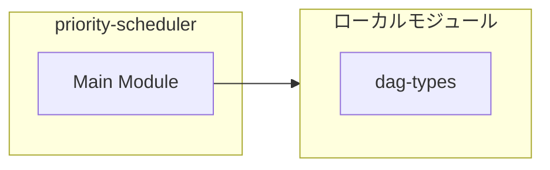
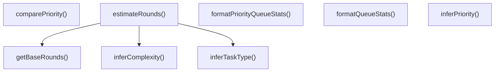
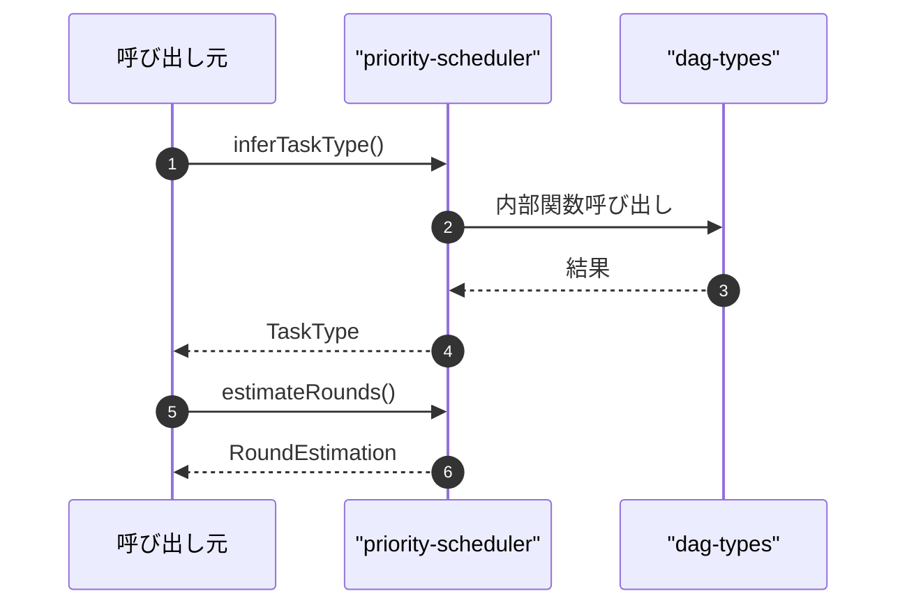

# priority-scheduler

## 概要

`priority-scheduler` モジュールのAPIリファレンス。

## インポート

```typescript
// from './dag-types.js': TaskNode
```

## エクスポート一覧

| 種別 | 名前 | 説明 |
|------|------|------|
| 関数 | `inferTaskType` | ツール名からタスク種別を推論 |
| 関数 | `estimateRounds` | ラウンド数を推定 |
| 関数 | `inferPriority` | ツール名とオプションから優先度を推論 |
| 関数 | `comparePriority` | 優先度を比較 |
| 関数 | `formatPriorityQueueStats` | キュー統計をフォーマット（QueueStatsオブジェクト用） |
| 関数 | `formatQueueStats` | キュー統計をフォーマット（PriorityTaskQueue用） |
| クラス | `PriorityScheduler` | 優先度ベースのタスクスケジューラ |
| クラス | `PriorityTaskQueue` | 優先度付きタスクキュー |
| インターフェース | `EstimationContext` | ラウンド推定コンテキスト |
| インターフェース | `RoundEstimation` | ラウンド推定結果 |
| インターフェース | `InferPriorityOptions` | 優先度推論オプション |
| インターフェース | `PriorityQueueEntry` | 優先度付きキューエントリ |
| インターフェース | `QueueStats` | キュー統計情報 |
| インターフェース | `SchedulerConfig` | スケジューラの設定 |
| インターフェース | `ScheduledTask` | スケジュールされたタスクの情報 |
| 型 | `TaskPriority` | 優先度レベル |
| 型 | `TaskType` | タスク種別 |
| 型 | `TaskComplexity` | タスク複雑度 |
| 型 | `PriorityTaskMetadata` | 優先度タスクメタデータ |

## 図解

### クラス図

```mermaid
classDiagram
  class PriorityScheduler {
    -config: SchedulerConfig
    -taskQueues: Map_string_TaskNode
    -lastScheduled: Map_string_number
    -waitingSince: Map_string_number
    +scheduleTasks()
    +markCompleted()
    -calculatePriorityScore()
    -separateStarvedTasks()
    +getQueueSize()
  }
  class PriorityTaskQueue {
    -queue: PriorityQueueEntry
    +enqueue()
    +dequeue()
    +peek()
    +size()
    +isEmptyMethod()
  }
  class EstimationContext {
    <<interface>>
    +toolName: string
    +taskDescription: string
    +agentCount: number
    +isRetry: boolean
    +hasUnknownFramework: boolean
  }
  class RoundEstimation {
    <<interface>>
    +taskType: TaskType
    +estimatedRounds: number
    +complexity: TaskComplexity
    +confidence: number
  }
  class InferPriorityOptions {
    <<interface>>
    +isInteractive: boolean
    +isBackground: boolean
    +isRetry: boolean
    +agentCount: number
  }
  class PriorityQueueEntry {
    <<interface>>
    +id: string
    +toolName: string
    +priority: TaskPriority
    +estimatedDurationMs: number
    +estimatedRounds: number
  }
  class QueueStats {
    <<interface>>
    +total: number
    +byPriority: Record_TaskPriority
    +avgWaitMs: number
    +maxWaitMs: number
    +starvingCount: number
  }
  class SchedulerConfig {
    <<interface>>
    +maxConcurrency: number
    +starvationPreventionInterval: number
  }
  class ScheduledTask {
    <<interface>>
    +task: TaskNode
    +weight: number
    +priority: number
    +waitingMs: number
  }
```



### 依存関係図



### 関数フロー



### シーケンス図



## 関数

### inferTaskType

```typescript
inferTaskType(toolName: string): TaskType
```

ツール名からタスク種別を推論

**パラメータ**

| 名前 | 型 | 必須 |
|------|-----|------|
| toolName | `string` | はい |

**戻り値**: `TaskType`

### getBaseRounds

```typescript
getBaseRounds(taskType: TaskType): number
```

タスク種別からベースラウンド数を取得

**パラメータ**

| 名前 | 型 | 必須 |
|------|-----|------|
| taskType | `TaskType` | はい |

**戻り値**: `number`

### inferComplexity

```typescript
inferComplexity(taskType: TaskType, context: EstimationContext): TaskComplexity
```

複雑度を推論

**パラメータ**

| 名前 | 型 | 必須 |
|------|-----|------|
| taskType | `TaskType` | はい |
| context | `EstimationContext` | はい |

**戻り値**: `TaskComplexity`

### estimateRounds

```typescript
estimateRounds(context: EstimationContext): RoundEstimation
```

ラウンド数を推定

**パラメータ**

| 名前 | 型 | 必須 |
|------|-----|------|
| context | `EstimationContext` | はい |

**戻り値**: `RoundEstimation`

### inferPriority

```typescript
inferPriority(toolName: string, options?: InferPriorityOptions): TaskPriority
```

ツール名とオプションから優先度を推論

**パラメータ**

| 名前 | 型 | 必須 |
|------|-----|------|
| toolName | `string` | はい |
| options | `InferPriorityOptions` | いいえ |

**戻り値**: `TaskPriority`

### comparePriority

```typescript
comparePriority(a: PriorityQueueEntry, b: PriorityQueueEntry): number
```

優先度を比較

**パラメータ**

| 名前 | 型 | 必須 |
|------|-----|------|
| a | `PriorityQueueEntry` | はい |
| b | `PriorityQueueEntry` | はい |

**戻り値**: `number`

### formatPriorityQueueStats

```typescript
formatPriorityQueueStats(stats: QueueStats): string
```

キュー統計をフォーマット（QueueStatsオブジェクト用）

**パラメータ**

| 名前 | 型 | 必須 |
|------|-----|------|
| stats | `QueueStats` | はい |

**戻り値**: `string`

### formatQueueStats

```typescript
formatQueueStats(queue: PriorityTaskQueue): string
```

キュー統計をフォーマット（PriorityTaskQueue用）

**パラメータ**

| 名前 | 型 | 必須 |
|------|-----|------|
| queue | `PriorityTaskQueue` | はい |

**戻り値**: `string`

## クラス

### PriorityScheduler

優先度ベースのタスクスケジューラ
DynTaskMAS論文のAPEEコンポーネントを実装

**プロパティ**

| 名前 | 型 | 可視性 |
|------|-----|--------|
| config | `SchedulerConfig` | private |
| taskQueues | `Map<string, TaskNode[]>` | private |
| lastScheduled | `Map<string, number>` | private |
| waitingSince | `Map<string, number>` | private |

**メソッド**

| 名前 | シグネチャ |
|------|------------|
| scheduleTasks | `scheduleTasks(readyTasks, weights): TaskNode[]` |
| markCompleted | `markCompleted(taskId): void` |
| calculatePriorityScore | `calculatePriorityScore(task, weight, waitingMs): number` |
| separateStarvedTasks | `separateStarvedTasks(tasks): [ScheduledTask[], ScheduledTask[]]` |
| getQueueSize | `getQueueSize(agentId): number` |
| enqueue | `enqueue(agentId, task): void` |
| updateConfig | `updateConfig(config): void` |
| getStats | `getStats(): {
    totalQueued: number;
    agentQueueSizes: Record<string, number>;
    avgWaitingMs: number;
  }` |

### PriorityTaskQueue

優先度付きタスクキュー

**プロパティ**

| 名前 | 型 | 可視性 |
|------|-----|--------|
| queue | `PriorityQueueEntry[]` | private |

**メソッド**

| 名前 | シグネチャ |
|------|------------|
| enqueue | `enqueue(metadata): PriorityQueueEntry` |
| dequeue | `dequeue(): PriorityQueueEntry | undefined` |
| peek | `peek(): PriorityQueueEntry | undefined` |
| size | `size(): number` |
| isEmptyMethod | `isEmptyMethod(): boolean` |
| toArray | `toArray(): PriorityQueueEntry[]` |
| getAll | `getAll(): PriorityQueueEntry[]` |
| remove | `remove(id): PriorityQueueEntry | undefined` |
| removeByPredicate | `removeByPredicate(predicate): number` |
| getByPriority | `getByPriority(priority): PriorityQueueEntry[]` |
| getStats | `getStats(): QueueStats` |
| promoteStarvingTasks | `promoteStarvingTasks(): number` |

## インターフェース

### EstimationContext

```typescript
interface EstimationContext {
  toolName: string;
  taskDescription?: string;
  agentCount?: number;
  isRetry?: boolean;
  hasUnknownFramework?: boolean;
}
```

ラウンド推定コンテキスト

### RoundEstimation

```typescript
interface RoundEstimation {
  taskType: TaskType;
  estimatedRounds: number;
  complexity: TaskComplexity;
  confidence: number;
}
```

ラウンド推定結果

### InferPriorityOptions

```typescript
interface InferPriorityOptions {
  isInteractive?: boolean;
  isBackground?: boolean;
  isRetry?: boolean;
  agentCount?: number;
}
```

優先度推論オプション

### PriorityQueueEntry

```typescript
interface PriorityQueueEntry {
  id: string;
  toolName: string;
  priority: TaskPriority;
  estimatedDurationMs?: number;
  estimatedRounds?: number;
  deadlineMs?: number;
  enqueuedAtMs: number;
  source?: string;
  virtualStartTime: number;
  virtualFinishTime: number;
  skipCount: number;
  lastConsideredMs?: number;
}
```

優先度付きキューエントリ

### QueueStats

```typescript
interface QueueStats {
  total: number;
  byPriority: Record<TaskPriority, number>;
  avgWaitMs: number;
  maxWaitMs: number;
  starvingCount: number;
}
```

キュー統計情報

### SchedulerConfig

```typescript
interface SchedulerConfig {
  maxConcurrency: number;
  starvationPreventionInterval: number;
}
```

スケジューラの設定

### ScheduledTask

```typescript
interface ScheduledTask {
  task: TaskNode;
  weight: number;
  priority: number;
  waitingMs: number;
}
```

スケジュールされたタスクの情報

## 型定義

### TaskPriority

```typescript
type TaskPriority = "critical" | "high" | "normal" | "low" | "background"
```

優先度レベル

### TaskType

```typescript
type TaskType = | "read"
  | "bash"
  | "edit"
  | "write"
  | "subagent_single"
  | "subagent_parallel"
  | "agent_team"
  | "question"
  | "unknown"
```

タスク種別

### TaskComplexity

```typescript
type TaskComplexity = | "trivial"
  | "simple"
  | "moderate"
  | "complex"
  | "exploratory"
```

タスク複雑度

### PriorityTaskMetadata

```typescript
type PriorityTaskMetadata = Omit<
  PriorityQueueEntry,
  "virtualStartTime" | "virtualFinishTime" | "skipCount" | "lastConsideredMs"
>
```

優先度タスクメタデータ

---
*自動生成: 2026-02-24T17:08:02.744Z*
