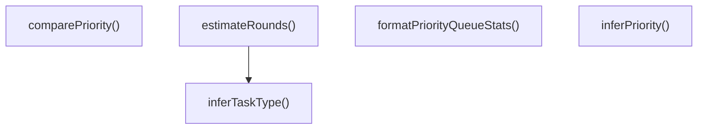

# priority-scheduler

## 概要

`priority-scheduler` モジュールのAPIリファレンス。

## エクスポート一覧

| 種別 | 名前 | 説明 |
|------|------|------|
| 関数 | `inferTaskType` | タスクタイプを推論 |
| 関数 | `estimateRounds` | 実行ラウンド数を見積もる |
| 関数 | `inferPriority` | タスク優先度を推論 |
| 関数 | `comparePriority` | 優先度を比較する |
| 関数 | `formatPriorityQueueStats` | 優先キューの統計情報をフォーマットする |
| クラス | `PriorityTaskQueue` | 優先度付きタスクキュー |
| インターフェース | `PriorityTaskMetadata` | タスクのメタデータを表すインターフェース |
| インターフェース | `PriorityQueueEntry` | 優先度付きキューエントリのインターフェース |
| インターフェース | `EstimationContext` | 推定コンテキストを表すインターフェース |
| インターフェース | `RoundEstimation` | ラウンド推定結果を表すインターフェース |
| 型 | `TaskPriority` | タスクの優先度を表す型 |
| 型 | `TaskType` | タスクの種類を表す型 |
| 型 | `TaskComplexity` | タスクの複雑さを表す型 |

## 図解

### クラス図


### 関数フロー



## 関数

### inferTaskType

```typescript
inferTaskType(toolName: string): TaskType
```

タスクタイプを推論

**パラメータ**

| 名前 | 型 | 必須 |
|------|-----|------|
| toolName | `string` | はい |

**戻り値**: `TaskType`

### estimateRounds

```typescript
estimateRounds(context: EstimationContext): RoundEstimation
```

実行ラウンド数を見積もる

**パラメータ**

| 名前 | 型 | 必須 |
|------|-----|------|
| context | `EstimationContext` | はい |

**戻り値**: `RoundEstimation`

### inferPriority

```typescript
inferPriority(toolName: string, context?: {
    isInteractive?: boolean;
    isRetry?: boolean;
    isBackground?: boolean;
    agentCount?: number;
  }): TaskPriority
```

タスク優先度を推論

**パラメータ**

| 名前 | 型 | 必須 |
|------|-----|------|
| toolName | `string` | はい |
| context | `object` | いいえ |
| &nbsp;&nbsp;↳ isInteractive | `boolean` | いいえ |
| &nbsp;&nbsp;↳ isRetry | `boolean` | いいえ |
| &nbsp;&nbsp;↳ isBackground | `boolean` | いいえ |
| &nbsp;&nbsp;↳ agentCount | `number` | いいえ |

**戻り値**: `TaskPriority`

### comparePriority

```typescript
comparePriority(a: PriorityQueueEntry, b: PriorityQueueEntry): number
```

優先度を比較する

**パラメータ**

| 名前 | 型 | 必須 |
|------|-----|------|
| a | `PriorityQueueEntry` | はい |
| b | `PriorityQueueEntry` | はい |

**戻り値**: `number`

### formatPriorityQueueStats

```typescript
formatPriorityQueueStats(stats: ReturnType<PriorityTaskQueue["getStats"]>): string
```

優先キューの統計情報をフォーマットする

**パラメータ**

| 名前 | 型 | 必須 |
|------|-----|------|
| stats | `ReturnType<PriorityTaskQueue["getStats"]>` | はい |

**戻り値**: `string`

## クラス

### PriorityTaskQueue

優先度付きタスクキュー

**プロパティ**

| 名前 | 型 | 可視性 |
|------|-----|--------|
| entries | `PriorityQueueEntry[]` | private |
| virtualTime | `number` | private |
| maxSkipCount | `number` | private |
| starvationThresholdMs | `number` | private |

**メソッド**

| 名前 | シグネチャ |
|------|------------|
| enqueue | `enqueue(metadata): PriorityQueueEntry` |
| dequeue | `dequeue(): PriorityQueueEntry | undefined` |
| peek | `peek(): PriorityQueueEntry | undefined` |
| remove | `remove(id): PriorityQueueEntry | undefined` |
| getAll | `getAll(): PriorityQueueEntry[]` |
| getByPriority | `getByPriority(priority): PriorityQueueEntry[]` |
| getStats | `getStats(): {
    total: number;
    byPriority: Record<TaskPriority, number>;
    avgWaitMs: number;
    maxWaitMs: number;
    starvingCount: number;
  }` |
| promoteStarvingTasks | `promoteStarvingTasks(): number` |
| sort | `sort(): void` |
| getQueueVirtualTime | `getQueueVirtualTime(): number` |

## インターフェース

### PriorityTaskMetadata

```typescript
interface PriorityTaskMetadata {
  id: string;
  toolName: string;
  priority: TaskPriority;
  estimatedDurationMs?: number;
  estimatedRounds?: number;
  deadlineMs?: number;
  enqueuedAtMs: number;
  source?: "user-interactive" | "background" | "scheduled" | "retry";
}
```

タスクのメタデータを表すインターフェース

### PriorityQueueEntry

```typescript
interface PriorityQueueEntry {
  virtualStartTime: number;
  virtualFinishTime: number;
  skipCount: number;
  lastConsideredMs?: number;
}
```

優先度付きキューエントリのインターフェース

### EstimationContext

```typescript
interface EstimationContext {
  toolName: string;
  taskDescription?: string;
  agentCount?: number;
  isRetry?: boolean;
  hasUnknownFramework?: boolean;
}
```

推定コンテキストを表すインターフェース

### RoundEstimation

```typescript
interface RoundEstimation {
  estimatedRounds: number;
  taskType: TaskType;
  complexity: TaskComplexity;
  confidence: number;
}
```

ラウンド推定結果を表すインターフェース

## 型定義

### TaskPriority

```typescript
type TaskPriority = "critical" | "high" | "normal" | "low" | "background"
```

タスクの優先度を表す型

### TaskType

```typescript
type TaskType = | "read"      // Information retrieval
  | "bash"      // Command execution
  | "edit"      // Single file modification
  | "write"     // File creation
  | "subagent_single"   // Single agent delegation
  | "subagent_parallel" // Parallel agent delegation
  | "agent_team"        // Team execution
  | "question"  // User interaction
  | "unknown"
```

タスクの種類を表す型

### TaskComplexity

```typescript
type TaskComplexity = "trivial" | "simple" | "moderate" | "complex" | "exploratory"
```

タスクの複雑さを表す型

---
*自動生成: 2026-02-18T15:54:41.502Z*
