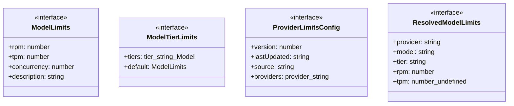
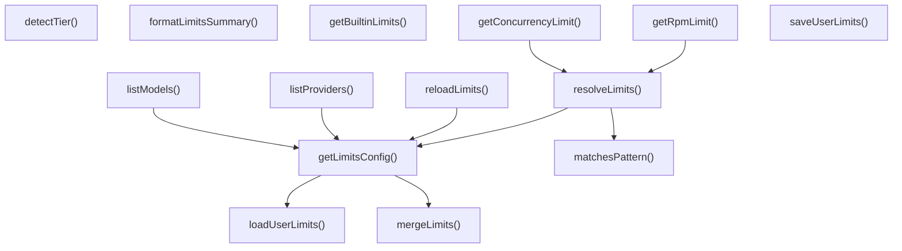
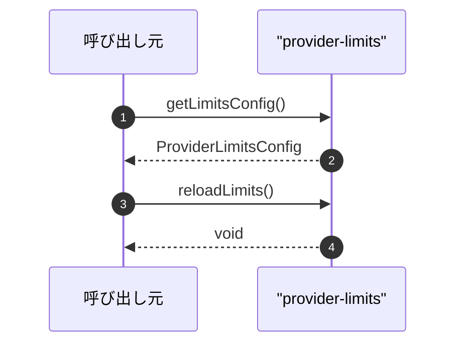

# provider-limits

## 概要

`provider-limits` モジュールのAPIリファレンス。

## インポート

```typescript
// from 'node:fs': readFileSync, existsSync, writeFileSync, ...
// from 'node:os': homedir
// from 'node:path': join
```

## エクスポート一覧

| 種別 | 名前 | 説明 |
|------|------|------|
| 関数 | `getLimitsConfig` | - |
| 関数 | `reloadLimits` | 制限設定を再読み込み |
| 関数 | `resolveLimits` | 指定したプロバイダ/モデル/ティアの制限を解決する |
| 関数 | `getConcurrencyLimit` | プロバイダーとモデルの並列処理数上限を取得 |
| 関数 | `getRpmLimit` | プロバイダー/モデルのRPM制限を取得 |
| 関数 | `listProviders` | - |
| 関数 | `listModels` | 利用可能モデル一覧取得 |
| 関数 | `saveUserLimits` | ユーザー制限設定保存 |
| 関数 | `getBuiltinLimits` | 組み込み制限設定取得 |
| 関数 | `detectTier` | プロバイダティア検出 |
| 関数 | `formatLimitsSummary` | 制限サマリを生成 |
| インターフェース | `ModelLimits` | - |
| インターフェース | `ModelTierLimits` | - |
| インターフェース | `ProviderLimitsConfig` | 制限設定形式 |
| インターフェース | `ResolvedModelLimits` | モデル制限定義 |

## 図解

### クラス図



### 関数フロー



### シーケンス図



## 関数

### matchesPattern

```typescript
matchesPattern(model: string, pattern: string): boolean
```

**パラメータ**

| 名前 | 型 | 必須 |
|------|-----|------|
| model | `string` | はい |
| pattern | `string` | はい |

**戻り値**: `boolean`

### loadUserLimits

```typescript
loadUserLimits(): ProviderLimitsConfig | null
```

**戻り値**: `ProviderLimitsConfig | null`

### mergeLimits

```typescript
mergeLimits(builtin: ProviderLimitsConfig, user: ProviderLimitsConfig | null): ProviderLimitsConfig
```

**パラメータ**

| 名前 | 型 | 必須 |
|------|-----|------|
| builtin | `ProviderLimitsConfig` | はい |
| user | `ProviderLimitsConfig | null` | はい |

**戻り値**: `ProviderLimitsConfig`

### getLimitsConfig

```typescript
getLimitsConfig(): ProviderLimitsConfig
```

**戻り値**: `ProviderLimitsConfig`

### reloadLimits

```typescript
reloadLimits(): void
```

制限設定を再読み込み

**戻り値**: `void`

### resolveLimits

```typescript
resolveLimits(provider: string, model: string, tier?: string): ResolvedModelLimits
```

指定したプロバイダ/モデル/ティアの制限を解決する

**パラメータ**

| 名前 | 型 | 必須 |
|------|-----|------|
| provider | `string` | はい |
| model | `string` | はい |
| tier | `string` | いいえ |

**戻り値**: `ResolvedModelLimits`

### getConcurrencyLimit

```typescript
getConcurrencyLimit(provider: string, model: string, tier?: string): number
```

プロバイダーとモデルの並列処理数上限を取得

**パラメータ**

| 名前 | 型 | 必須 |
|------|-----|------|
| provider | `string` | はい |
| model | `string` | はい |
| tier | `string` | いいえ |

**戻り値**: `number`

### getRpmLimit

```typescript
getRpmLimit(provider: string, model: string, tier?: string): number
```

プロバイダー/モデルのRPM制限を取得

**パラメータ**

| 名前 | 型 | 必須 |
|------|-----|------|
| provider | `string` | はい |
| model | `string` | はい |
| tier | `string` | いいえ |

**戻り値**: `number`

### listProviders

```typescript
listProviders(): string[]
```

**戻り値**: `string[]`

### listModels

```typescript
listModels(provider: string): string[]
```

利用可能モデル一覧取得

**パラメータ**

| 名前 | 型 | 必須 |
|------|-----|------|
| provider | `string` | はい |

**戻り値**: `string[]`

### saveUserLimits

```typescript
saveUserLimits(limits: ProviderLimitsConfig): void
```

ユーザー制限設定保存

**パラメータ**

| 名前 | 型 | 必須 |
|------|-----|------|
| limits | `ProviderLimitsConfig` | はい |

**戻り値**: `void`

### getBuiltinLimits

```typescript
getBuiltinLimits(): ProviderLimitsConfig
```

組み込み制限設定取得

**戻り値**: `ProviderLimitsConfig`

### detectTier

```typescript
detectTier(provider: string, _model: string): string | undefined
```

プロバイダティア検出

**パラメータ**

| 名前 | 型 | 必須 |
|------|-----|------|
| provider | `string` | はい |
| _model | `string` | はい |

**戻り値**: `string | undefined`

### formatLimitsSummary

```typescript
formatLimitsSummary(limits: ResolvedModelLimits): string
```

制限サマリを生成

**パラメータ**

| 名前 | 型 | 必須 |
|------|-----|------|
| limits | `ResolvedModelLimits` | はい |

**戻り値**: `string`

## インターフェース

### ModelLimits

```typescript
interface ModelLimits {
  rpm: number;
  tpm?: number;
  concurrency: number;
  description?: string;
}
```

### ModelTierLimits

```typescript
interface ModelTierLimits {
  tiers: {
    [tier: string]: ModelLimits;
  };
  default?: ModelLimits;
}
```

### ProviderLimitsConfig

```typescript
interface ProviderLimitsConfig {
  version: number;
  lastUpdated: string;
  source: string;
  providers: {
    [provider: string]: {
      displayName: string;
      documentation?: string;
      models: {
        [pattern: string]: ModelTierLimits;
      };
    };
  };
}
```

制限設定形式

### ResolvedModelLimits

```typescript
interface ResolvedModelLimits {
  provider: string;
  model: string;
  tier: string;
  rpm: number;
  tpm: number | undefined;
  concurrency: number;
  source: "preset" | "fallback" | "default";
}
```

モデル制限定義

---
*自動生成: 2026-02-23T06:29:42.390Z*
