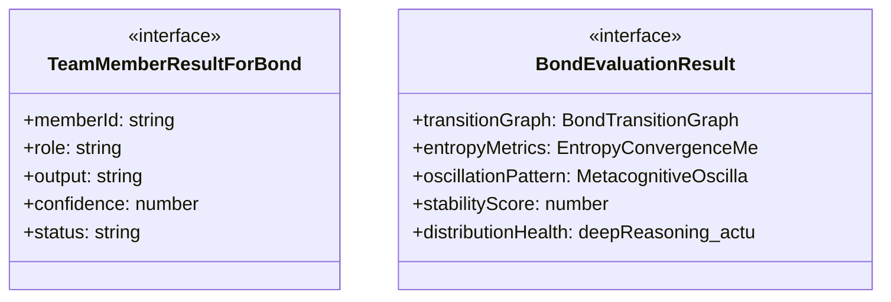
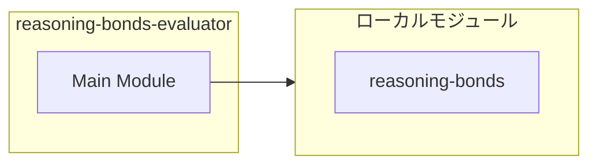
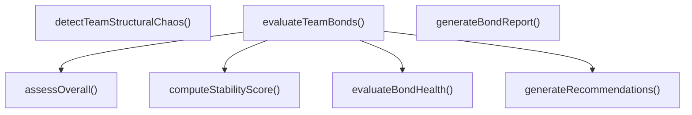
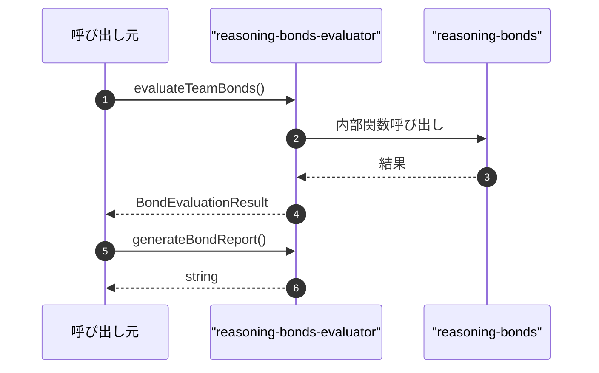

# reasoning-bonds-evaluator

## 概要

`reasoning-bonds-evaluator` モジュールのAPIリファレンス。

## インポート

```typescript
// from './reasoning-bonds.js': ReasoningBondType, BondTransitionGraph, EntropyConvergenceMetrics, ...
```

## エクスポート一覧

| 種別 | 名前 | 説明 |
|------|------|------|
| 関数 | `evaluateTeamBonds` | チーム実行結果のボンド評価を行う |
| 関数 | `generateBondReport` | ボンド評価レポートを生成 |
| 関数 | `detectTeamStructuralChaos` | 複数チーム実行の構造的カオスを検出 |
| インターフェース | `TeamMemberResultForBond` | チームメンバーの結果（評価用インターフェース） |
| インターフェース | `BondEvaluationResult` | ボンド評価結果 |

## 図解

### クラス図



### 依存関係図



### 関数フロー



### シーケンス図



## 関数

### evaluateTeamBonds

```typescript
evaluateTeamBonds(results: TeamMemberResultForBond[], previousGraph?: BondTransitionGraph): BondEvaluationResult
```

チーム実行結果のボンド評価を行う

**パラメータ**

| 名前 | 型 | 必須 |
|------|-----|------|
| results | `TeamMemberResultForBond[]` | はい |
| previousGraph | `BondTransitionGraph` | いいえ |

**戻り値**: `BondEvaluationResult`

### evaluateBondHealth

```typescript
evaluateBondHealth(actual: number, range: { min: number; max: number; optimal: number }): { actual: number; optimal: number; status: "ok" | "low" | "high" }
```

ボンド分布の健全性を評価

**パラメータ**

| 名前 | 型 | 必須 |
|------|-----|------|
| actual | `number` | はい |
| range | `object` | はい |
| &nbsp;&nbsp;↳ min | `number` | はい |
| &nbsp;&nbsp;↳ max | `number` | はい |
| &nbsp;&nbsp;↳ optimal | `number` | はい |

**戻り値**: `{ actual: number; optimal: number; status: "ok" | "low" | "high" }`

### computeStabilityScore

```typescript
computeStabilityScore(graph: BondTransitionGraph, entropyMetrics: EntropyConvergenceMetrics, distributionHealth: BondEvaluationResult["distributionHealth"], previousGraph?: BondTransitionGraph): number
```

構造安定性スコアを計算

**パラメータ**

| 名前 | 型 | 必須 |
|------|-----|------|
| graph | `BondTransitionGraph` | はい |
| entropyMetrics | `EntropyConvergenceMetrics` | はい |
| distributionHealth | `BondEvaluationResult["distributionHealth"]` | はい |
| previousGraph | `BondTransitionGraph` | いいえ |

**戻り値**: `number`

### assessOverall

```typescript
assessOverall(stabilityScore: number, entropyMetrics: EntropyConvergenceMetrics, distributionHealth: BondEvaluationResult["distributionHealth"]): "optimal" | "suboptimal" | "unstable" | "chaotic"
```

全体的な評価を行う

**パラメータ**

| 名前 | 型 | 必須 |
|------|-----|------|
| stabilityScore | `number` | はい |
| entropyMetrics | `EntropyConvergenceMetrics` | はい |
| distributionHealth | `BondEvaluationResult["distributionHealth"]` | はい |

**戻り値**: `"optimal" | "suboptimal" | "unstable" | "chaotic"`

### generateRecommendations

```typescript
generateRecommendations(distributionHealth: BondEvaluationResult["distributionHealth"], entropyMetrics: EntropyConvergenceMetrics, oscillationPattern: MetacognitiveOscillation, assessment: "optimal" | "suboptimal" | "unstable" | "chaotic"): string[]
```

推奨事項を生成

**パラメータ**

| 名前 | 型 | 必須 |
|------|-----|------|
| distributionHealth | `BondEvaluationResult["distributionHealth"]` | はい |
| entropyMetrics | `EntropyConvergenceMetrics` | はい |
| oscillationPattern | `MetacognitiveOscillation` | はい |
| assessment | `"optimal" | "suboptimal" | "unstable" | "chaotic"` | はい |

**戻り値**: `string[]`

### generateBondReport

```typescript
generateBondReport(evaluation: BondEvaluationResult): string
```

ボンド評価レポートを生成

**パラメータ**

| 名前 | 型 | 必須 |
|------|-----|------|
| evaluation | `BondEvaluationResult` | はい |

**戻り値**: `string`

### detectTeamStructuralChaos

```typescript
detectTeamStructuralChaos(evaluations: BondEvaluationResult[]): StructuralChaosDetection & { message: string }
```

複数チーム実行の構造的カオスを検出

**パラメータ**

| 名前 | 型 | 必須 |
|------|-----|------|
| evaluations | `BondEvaluationResult[]` | はい |

**戻り値**: `StructuralChaosDetection & { message: string }`

## インターフェース

### TeamMemberResultForBond

```typescript
interface TeamMemberResultForBond {
  memberId: string;
  role: string;
  output: string;
  confidence?: number;
  status: string;
}
```

チームメンバーの結果（評価用インターフェース）

### BondEvaluationResult

```typescript
interface BondEvaluationResult {
  transitionGraph: BondTransitionGraph;
  entropyMetrics: EntropyConvergenceMetrics;
  oscillationPattern: MetacognitiveOscillation;
  stabilityScore: number;
  distributionHealth: {
    deepReasoning: { actual: number; optimal: number; status: "ok" | "low" | "high" };
    selfReflection: { actual: number; optimal: number; status: "ok" | "low" | "high" };
    selfExploration: { actual: number; optimal: number; status: "ok" | "low" | "high" };
    normalOperation: { actual: number; optimal: number; status: "ok" | "low" | "high" };
  };
  overallAssessment: "optimal" | "suboptimal" | "unstable" | "chaotic";
  recommendations: string[];
}
```

ボンド評価結果

---
*自動生成: 2026-02-23T06:29:42.394Z*
