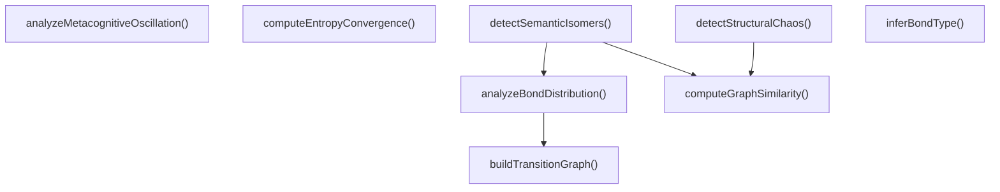

# reasoning-bonds

## 概要

`reasoning-bonds` モジュールのAPIリファレンス。

## エクスポート一覧

| 種別 | 名前 | 説明 |
|------|------|------|
| 関数 | `inferBondType` | 出力テキストからボンドタイプを推論 |
| 関数 | `buildTransitionGraph` | ボンド遷移グラフを構築 |
| 関数 | `computeGraphSimilarity` | 2つの遷移グラフ間の類似度を計算 |
| 関数 | `computeEntropyConvergence` | エントロピー収束メトリクスを計算 |
| 関数 | `detectStructuralChaos` | 構造的カオスを検出 |
| 関数 | `analyzeMetacognitiveOscillation` | メタ認知振動パターンを分析 |
| 関数 | `analyzeBondDistribution` | ボンド分布の分析 |
| 関数 | `detectSemanticIsomers` | Semantic Isomers（意味異性体）の検出 |
| インターフェース | `ReasoningBond` | 推論ボンド定義 |
| インターフェース | `BondTransition` | ボンド遷移 |
| インターフェース | `BondTransitionGraph` | 遷移確率グラフ |
| インターフェース | `EntropyConvergenceMetrics` | エントロピー収束メトリクス |
| インターフェース | `StructuralChaosDetection` | 構造的カオスの検出結果 |
| インターフェース | `MetacognitiveOscillation` | メタ認知振動パターン |
| 型 | `ReasoningBondType` | 推論ボンドの種類 |

## 図解

### クラス図

```mermaid
classDiagram
  class ReasoningBond {
    <<interface>>
    +type: ReasoningBondType
    +energy: number
    +distance: number
    +label: string
  }
  class BondTransition {
    <<interface>>
    +from: ReasoningBondType
    +to: ReasoningBondType
    +count: number
    +probability: number
  }
  class BondTransitionGraph {
    <<interface>>
    +transitions: Map_string_BondTrans
    +marginalDistribution: Map_ReasoningBondTyp
    +sampleCount: number
    +stabilityScore: number
  }
  class EntropyConvergenceMetrics {
    <<interface>>
    +initialEntropy: number
    +finalEntropy: number
    +convergenceRate: number
    +oscillationCount: number
    +oscillationAmplitude: number
  }
  class StructuralChaosDetection {
    <<interface>>
    +hasChaos: boolean
    +competingStructures: string
    +conflictScore: number
    +recommendation: unify_separate
  }
  class MetacognitiveOscillation {
    <<interface>>
    +highEntropyPhases: number
    +lowEntropyPhases: number
    +dominantBondInHighEntropy: ReasoningBondType
    +dominantBondInLowEntropy: ReasoningBondType
  }
```



### 関数フロー



## 関数

### inferBondType

```typescript
inferBondType(output: string): ReasoningBondType
```

出力テキストからボンドタイプを推論

**パラメータ**

| 名前 | 型 | 必須 |
|------|-----|------|
| output | `string` | はい |

**戻り値**: `ReasoningBondType`

### buildTransitionGraph

```typescript
buildTransitionGraph(bondSequence: ReasoningBondType[]): BondTransitionGraph
```

ボンド遷移グラフを構築

**パラメータ**

| 名前 | 型 | 必須 |
|------|-----|------|
| bondSequence | `ReasoningBondType[]` | はい |

**戻り値**: `BondTransitionGraph`

### computeGraphSimilarity

```typescript
computeGraphSimilarity(graph1: BondTransitionGraph, graph2: BondTransitionGraph): number
```

2つの遷移グラフ間の類似度を計算
論文ではPearson相関を使用

**パラメータ**

| 名前 | 型 | 必須 |
|------|-----|------|
| graph1 | `BondTransitionGraph` | はい |
| graph2 | `BondTransitionGraph` | はい |

**戻り値**: `number`

### computeEntropyConvergence

```typescript
computeEntropyConvergence(entropySeries: number[]): EntropyConvergenceMetrics
```

エントロピー収束メトリクスを計算

**パラメータ**

| 名前 | 型 | 必須 |
|------|-----|------|
| entropySeries | `number[]` | はい |

**戻り値**: `EntropyConvergenceMetrics`

### detectStructuralChaos

```typescript
detectStructuralChaos(graphs: BondTransitionGraph[], threshold: number): StructuralChaosDetection
```

構造的カオスを検出
論文では、異なる安定構造を混合するとパフォーマンスが低下することを示している

**パラメータ**

| 名前 | 型 | 必須 |
|------|-----|------|
| graphs | `BondTransitionGraph[]` | はい |
| threshold | `number` | はい |

**戻り値**: `StructuralChaosDetection`

### analyzeMetacognitiveOscillation

```typescript
analyzeMetacognitiveOscillation(bondSequence: ReasoningBondType[], entropySeries: number[]): MetacognitiveOscillation
```

メタ認知振動パターンを分析

**パラメータ**

| 名前 | 型 | 必須 |
|------|-----|------|
| bondSequence | `ReasoningBondType[]` | はい |
| entropySeries | `number[]` | はい |

**戻り値**: `MetacognitiveOscillation`

### analyzeBondDistribution

```typescript
analyzeBondDistribution(outputs: string[]): {
  graph: BondTransitionGraph;
  bondCounts: Map<ReasoningBondType, number>;
  dominantBond: ReasoningBondType;
}
```

ボンド分布の分析

**パラメータ**

| 名前 | 型 | 必須 |
|------|-----|------|
| outputs | `string[]` | はい |

**戻り値**: `{
  graph: BondTransitionGraph;
  bondCounts: Map<ReasoningBondType, number>;
  dominantBond: ReasoningBondType;
}`

### detectSemanticIsomers

```typescript
detectSemanticIsomers(outputs1: string[], outputs2: string[]): {
  isIsomer: boolean;
  structuralSimilarity: number;
  distributionSimilarity: number;
}
```

Semantic Isomers（意味異性体）の検出
同じタスクに対して異なる推論構造を持つ軌跡を特定

**パラメータ**

| 名前 | 型 | 必須 |
|------|-----|------|
| outputs1 | `string[]` | はい |
| outputs2 | `string[]` | はい |

**戻り値**: `{
  isIsomer: boolean;
  structuralSimilarity: number;
  distributionSimilarity: number;
}`

## インターフェース

### ReasoningBond

```typescript
interface ReasoningBond {
  type: ReasoningBondType;
  energy: number;
  distance: number;
  label: string;
}
```

推論ボンド定義

### BondTransition

```typescript
interface BondTransition {
  from: ReasoningBondType;
  to: ReasoningBondType;
  count: number;
  probability: number;
}
```

ボンド遷移

### BondTransitionGraph

```typescript
interface BondTransitionGraph {
  transitions: Map<string, BondTransition>;
  marginalDistribution: Map<ReasoningBondType, number>;
  sampleCount: number;
  stabilityScore: number;
}
```

遷移確率グラフ

### EntropyConvergenceMetrics

```typescript
interface EntropyConvergenceMetrics {
  initialEntropy: number;
  finalEntropy: number;
  convergenceRate: number;
  oscillationCount: number;
  oscillationAmplitude: number;
  isConverging: boolean;
}
```

エントロピー収束メトリクス

### StructuralChaosDetection

```typescript
interface StructuralChaosDetection {
  hasChaos: boolean;
  competingStructures: string[];
  conflictScore: number;
  recommendation: "unify" | "separate" | "investigate";
}
```

構造的カオスの検出結果

### MetacognitiveOscillation

```typescript
interface MetacognitiveOscillation {
  highEntropyPhases: number[];
  lowEntropyPhases: number[];
  dominantBondInHighEntropy: ReasoningBondType;
  dominantBondInLowEntropy: ReasoningBondType;
}
```

メタ認知振動パターン

## 型定義

### ReasoningBondType

```typescript
type ReasoningBondType = | "deep-reasoning"    // 共有結合的: 論理の骨格、密な局所クラスター
  | "self-reflection"   // 水素結合的: 過去ステップへのフィードバック、安定化
  | "self-exploration"  // ファンデルワールス力的: 遠距離クラスタ間の弱い橋渡し
  | "normal-operation"
```

推論ボンドの種類
論文の分子構造モデルに基づく

---
*自動生成: 2026-02-22T19:27:00.695Z*
