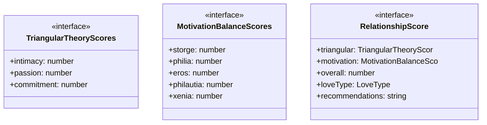
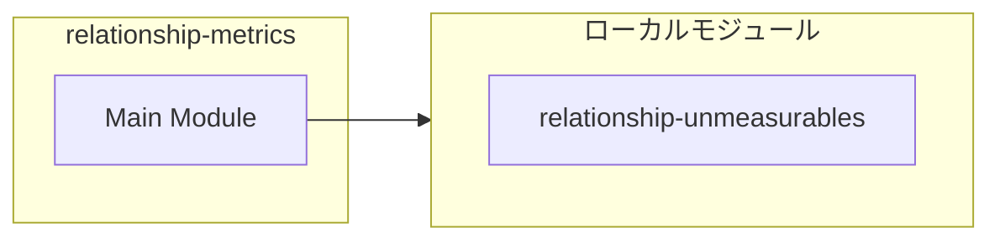
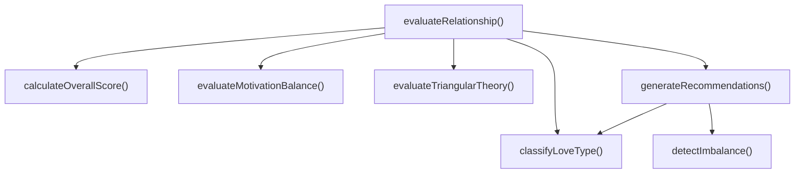
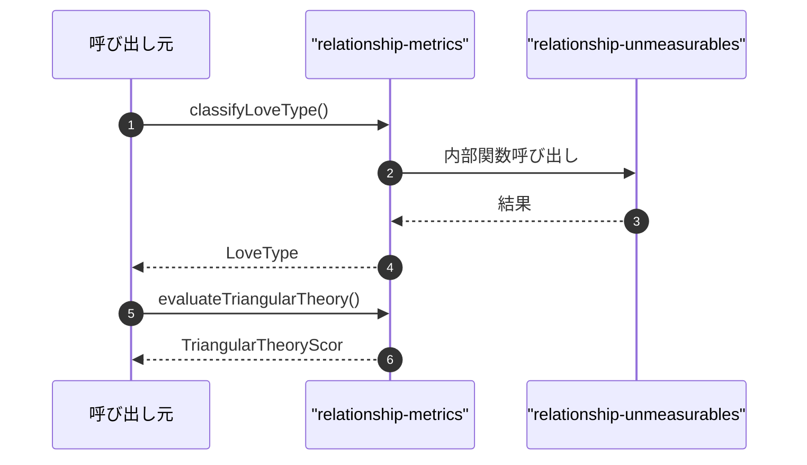

# relationship-metrics

## 概要

`relationship-metrics` モジュールのAPIリファレンス。

## インポート

```typescript
// from './relationship-unmeasurables.js': createMeasurabilityWarning, MeasurabilityWarning
```

## エクスポート一覧

| 種別 | 名前 | 説明 |
|------|------|------|
| 関数 | `classifyLoveType` | 三角理論に基づいて愛の形態を分類 |
| 関数 | `evaluateTriangularTheory` | 三角理論スコアを評価 |
| 関数 | `evaluateMotivationBalance` | 動機付けバランスを評価 |
| 関数 | `detectImbalance` | 動機付けバランスの偏りを検出 |
| 関数 | `calculateOverallScore` | 総合関係性スコアを計算 |
| 関数 | `generateRecommendations` | 改善推奨事項を生成 |
| 関数 | `evaluateRelationship` | 包括的な関係性評価を実行 |
| インターフェース | `TriangularTheoryScores` | 三角理論の3要素 |
| インターフェース | `MotivationBalanceScores` | 動機付けの6形態スコア |
| インターフェース | `RelationshipScore` | 関係性評価結果 |
| 型 | `LoveType` | 三角理論に基づく8つの愛の形態 |

## 図解

### クラス図



### 依存関係図



### 関数フロー



### シーケンス図



## 関数

### classifyLoveType

```typescript
classifyLoveType(scores: TriangularTheoryScores): LoveType
```

三角理論に基づいて愛の形態を分類

**パラメータ**

| 名前 | 型 | 必須 |
|------|-----|------|
| scores | `TriangularTheoryScores` | はい |

**戻り値**: `LoveType`

### evaluateTriangularTheory

```typescript
evaluateTriangularTheory(context: number, creativity: number, consistency: number): TriangularTheoryScores
```

三角理論スコアを評価

**パラメータ**

| 名前 | 型 | 必須 |
|------|-----|------|
| context | `number` | はい |
| creativity | `number` | はい |
| consistency | `number` | はい |

**戻り値**: `TriangularTheoryScores`

### evaluateMotivationBalance

```typescript
evaluateMotivationBalance(scores: Partial<MotivationBalanceScores>): MotivationBalanceScores
```

動機付けバランスを評価

**パラメータ**

| 名前 | 型 | 必須 |
|------|-----|------|
| scores | `Partial<MotivationBalanceScores>` | はい |

**戻り値**: `MotivationBalanceScores`

### detectImbalance

```typescript
detectImbalance(balance: MotivationBalanceScores, threshold: any): Array<{ type: keyof MotivationBalanceScores; score: number; warning: string }>
```

動機付けバランスの偏りを検出

**パラメータ**

| 名前 | 型 | 必須 |
|------|-----|------|
| balance | `MotivationBalanceScores` | はい |
| threshold | `any` | はい |

**戻り値**: `Array<{ type: keyof MotivationBalanceScores; score: number; warning: string }>`

### calculateOverallScore

```typescript
calculateOverallScore(triangular: TriangularTheoryScores, motivation: MotivationBalanceScores, weights: any): number
```

総合関係性スコアを計算

**パラメータ**

| 名前 | 型 | 必須 |
|------|-----|------|
| triangular | `TriangularTheoryScores` | はい |
| motivation | `MotivationBalanceScores` | はい |
| weights | `any` | はい |

**戻り値**: `number`

### generateRecommendations

```typescript
generateRecommendations(triangular: TriangularTheoryScores, motivation: MotivationBalanceScores): string[]
```

改善推奨事項を生成

**パラメータ**

| 名前 | 型 | 必須 |
|------|-----|------|
| triangular | `TriangularTheoryScores` | はい |
| motivation | `MotivationBalanceScores` | はい |

**戻り値**: `string[]`

### evaluateRelationship

```typescript
evaluateRelationship(input: {
	context?: number;
	creativity?: number;
	consistency?: number;
	motivation?: Partial<MotivationBalanceScores>;
}): RelationshipScore
```

包括的な関係性評価を実行

**パラメータ**

| 名前 | 型 | 必須 |
|------|-----|------|
| input | `object` | はい |
| &nbsp;&nbsp;↳ context | `number` | いいえ |
| &nbsp;&nbsp;↳ creativity | `number` | いいえ |
| &nbsp;&nbsp;↳ consistency | `number` | いいえ |
| &nbsp;&nbsp;↳ motivation | `Partial<MotivationBalanceScores>` | いいえ |

**戻り値**: `RelationshipScore`

## インターフェース

### TriangularTheoryScores

```typescript
interface TriangularTheoryScores {
  intimacy: number;
  passion: number;
  commitment: number;
}
```

三角理論の3要素

### MotivationBalanceScores

```typescript
interface MotivationBalanceScores {
  storge: number;
  philia: number;
  eros: number;
  philautia: number;
  xenia: number;
  agape: number;
}
```

動機付けの6形態スコア

### RelationshipScore

```typescript
interface RelationshipScore {
  triangular: TriangularTheoryScores;
  motivation: MotivationBalanceScores;
  overall: number;
  loveType: LoveType;
  recommendations: string[];
  measurabilityWarnings?: MeasurabilityWarning[];
}
```

関係性評価結果

## 型定義

### LoveType

```typescript
type LoveType = | "non-love"
	| "liking"
	| "infatuation"
	| "empty-love"
	| "romantic"
	| "companionate"
	| "fatuous"
	| "consummate"
```

三角理論に基づく8つの愛の形態

---
*自動生成: 2026-02-24T17:08:02.750Z*
