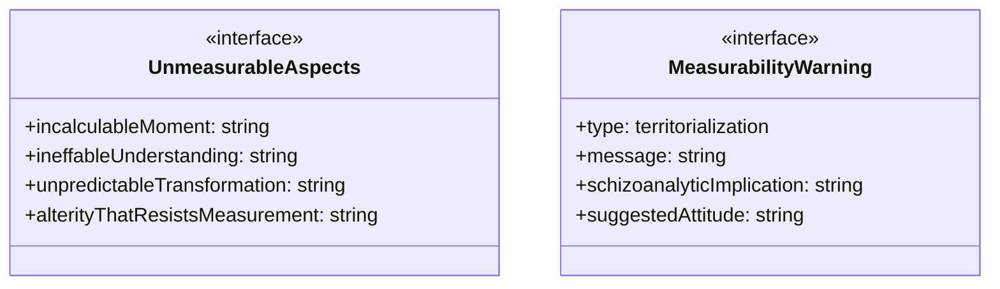

# relationship-unmeasurables

## 概要

`relationship-unmeasurables` モジュールのAPIリファレンス。

## エクスポート一覧

| 種別 | 名前 | 説明 |
|------|------|------|
| 関数 | `createMeasurabilityWarning` | 測定可能性の警告を生成 |
| インターフェース | `UnmeasurableAspects` | 測定不可能な関係性の側面 |
| インターフェース | `MeasurabilityWarning` | 測定可能性の警告 |

## 図解

### クラス図



## 関数

### createMeasurabilityWarning

```typescript
createMeasurabilityWarning(score: number): MeasurabilityWarning[]
```

測定可能性の警告を生成

**パラメータ**

| 名前 | 型 | 必須 |
|------|-----|------|
| score | `number` | はい |

**戻り値**: `MeasurabilityWarning[]`

## インターフェース

### UnmeasurableAspects

```typescript
interface UnmeasurableAspects {
  incalculableMoment: string;
  ineffableUnderstanding: string;
  unpredictableTransformation: string;
  alterityThatResistsMeasurement: string;
}
```

測定不可能な関係性の側面

スキゾ分析の視点から：「欲望」は欠如ではなく生産である。
測定可能な指標は、欲望を「管理可能な形式」に回収する。
しかし、真に生産的な欲望は、測定不可能な領域から生まれる。

### MeasurabilityWarning

```typescript
interface MeasurabilityWarning {
  type: | "territorialization"
		| "self-surveillance"
		| "reduction_of_complexity"
		| "commodification_of_desire";
  message: string;
  schizoanalyticImplication: string;
  suggestedAttitude: string;
}
```

測定可能性の警告

「私の関係性スコアは高い」という自己満足が、
実際には「内なるファシズム」（自己監視の強化）を生産している可能性を警告する。

---
*自動生成: 2026-02-22T19:27:00.696Z*
