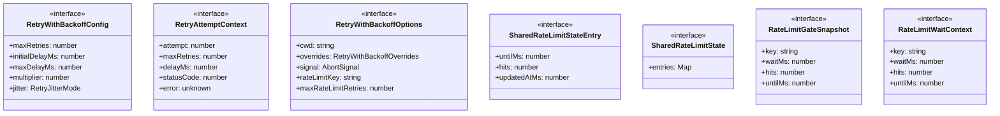
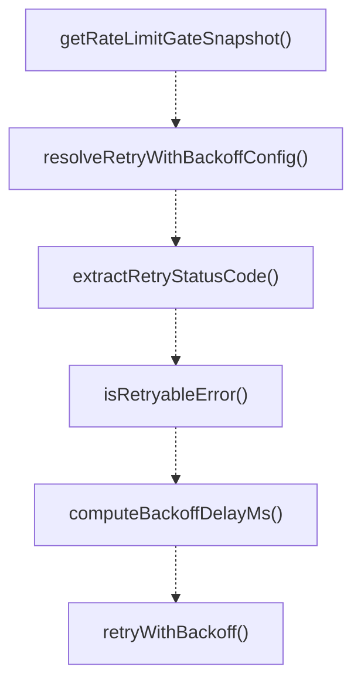
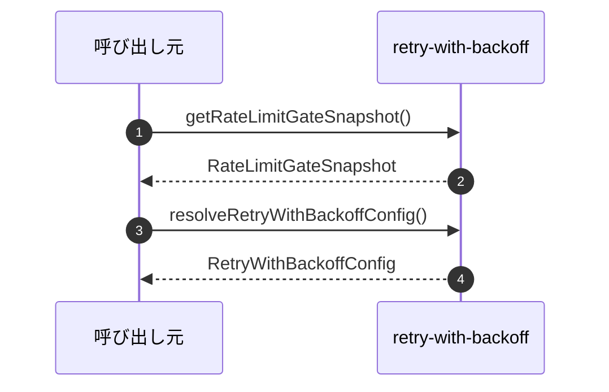

# retry-with-backoff

## 概要

`retry-with-backoff` モジュールのAPIリファレンス。

## インポート

```typescript
import { existsSync, readFileSync } from 'node:fs';
import { join } from 'node:path';
```

## エクスポート一覧

| 種別 | 名前 | 説明 |
|------|------|------|
| 関数 | `getRateLimitGateSnapshot` | - |
| 関数 | `resolveRetryWithBackoffConfig` | - |
| 関数 | `extractRetryStatusCode` | - |
| 関数 | `isRetryableError` | - |
| 関数 | `computeBackoffDelayMs` | - |
| 関数 | `retryWithBackoff` | - |
| インターフェース | `RetryWithBackoffConfig` | - |
| インターフェース | `RetryAttemptContext` | - |
| インターフェース | `RateLimitGateSnapshot` | - |
| インターフェース | `RateLimitWaitContext` | - |
| 型 | `RetryJitterMode` | - |
| 型 | `RetryWithBackoffOverrides` | - |

## 図解

### クラス図



### 関数フロー



### シーケンス図



## 関数

### toFiniteNumber

```typescript
toFiniteNumber(value: unknown): number | undefined
```

**パラメータ**

| 名前 | 型 | 必須 |
|------|-----|------|
| value | `unknown` | はい |

**戻り値**: `number | undefined`

### clampInteger

```typescript
clampInteger(value: number, min: number, max: number): number
```

**パラメータ**

| 名前 | 型 | 必須 |
|------|-----|------|
| value | `number` | はい |
| min | `number` | はい |
| max | `number` | はい |

**戻り値**: `number`

### clampFloat

```typescript
clampFloat(value: number, min: number, max: number): number
```

**パラメータ**

| 名前 | 型 | 必須 |
|------|-----|------|
| value | `number` | はい |
| min | `number` | はい |
| max | `number` | はい |

**戻り値**: `number`

### normalizeJitter

```typescript
normalizeJitter(value: unknown): RetryJitterMode | undefined
```

**パラメータ**

| 名前 | 型 | 必須 |
|------|-----|------|
| value | `unknown` | はい |

**戻り値**: `RetryJitterMode | undefined`

### sanitizeOverrides

```typescript
sanitizeOverrides(overrides: RetryWithBackoffOverrides | undefined): RetryWithBackoffOverrides
```

**パラメータ**

| 名前 | 型 | 必須 |
|------|-----|------|
| overrides | `RetryWithBackoffOverrides | undefined` | はい |

**戻り値**: `RetryWithBackoffOverrides`

### readConfigOverrides

```typescript
readConfigOverrides(cwd: string | undefined): RetryWithBackoffOverrides
```

**パラメータ**

| 名前 | 型 | 必須 |
|------|-----|------|
| cwd | `string | undefined` | はい |

**戻り値**: `RetryWithBackoffOverrides`

### normalizeRateLimitKey

```typescript
normalizeRateLimitKey(input: string | undefined): string
```

**パラメータ**

| 名前 | 型 | 必須 |
|------|-----|------|
| input | `string | undefined` | はい |

**戻り値**: `string`

### createRateLimitKeyScope

```typescript
createRateLimitKeyScope(rateLimitKey: string | undefined): string[]
```

**パラメータ**

| 名前 | 型 | 必須 |
|------|-----|------|
| rateLimitKey | `string | undefined` | はい |

**戻り値**: `string[]`

### selectLongestRateLimitGate

```typescript
selectLongestRateLimitGate(gates: RateLimitGateSnapshot[]): RateLimitGateSnapshot
```

**パラメータ**

| 名前 | 型 | 必須 |
|------|-----|------|
| gates | `RateLimitGateSnapshot[]` | はい |

**戻り値**: `RateLimitGateSnapshot`

### getSharedRateLimitState

```typescript
getSharedRateLimitState(): SharedRateLimitState
```

**戻り値**: `SharedRateLimitState`

### pruneRateLimitState

```typescript
pruneRateLimitState(nowMs: any): void
```

**パラメータ**

| 名前 | 型 | 必須 |
|------|-----|------|
| nowMs | `any` | はい |

**戻り値**: `void`

### getRateLimitGateSnapshot

```typescript
getRateLimitGateSnapshot(key: string | undefined): RateLimitGateSnapshot
```

**パラメータ**

| 名前 | 型 | 必須 |
|------|-----|------|
| key | `string | undefined` | はい |

**戻り値**: `RateLimitGateSnapshot`

### registerRateLimitGateHit

```typescript
registerRateLimitGateHit(key: string | undefined, retryDelayMs: number): RateLimitGateSnapshot
```

**パラメータ**

| 名前 | 型 | 必須 |
|------|-----|------|
| key | `string | undefined` | はい |
| retryDelayMs | `number` | はい |

**戻り値**: `RateLimitGateSnapshot`

### registerRateLimitGateSuccess

```typescript
registerRateLimitGateSuccess(key: string | undefined): void
```

**パラメータ**

| 名前 | 型 | 必須 |
|------|-----|------|
| key | `string | undefined` | はい |

**戻り値**: `void`

### resolveRetryWithBackoffConfig

```typescript
resolveRetryWithBackoffConfig(cwd?: string, overrides?: RetryWithBackoffOverrides): RetryWithBackoffConfig
```

**パラメータ**

| 名前 | 型 | 必須 |
|------|-----|------|
| cwd | `string` | いいえ |
| overrides | `RetryWithBackoffOverrides` | いいえ |

**戻り値**: `RetryWithBackoffConfig`

### extractRetryStatusCode

```typescript
extractRetryStatusCode(error: unknown): number | undefined
```

**パラメータ**

| 名前 | 型 | 必須 |
|------|-----|------|
| error | `unknown` | はい |

**戻り値**: `number | undefined`

### isRetryableError

```typescript
isRetryableError(error: unknown, statusCode?: number): boolean
```

**パラメータ**

| 名前 | 型 | 必須 |
|------|-----|------|
| error | `unknown` | はい |
| statusCode | `number` | いいえ |

**戻り値**: `boolean`

### applyJitter

```typescript
applyJitter(delayMs: number, jitter: RetryJitterMode): number
```

**パラメータ**

| 名前 | 型 | 必須 |
|------|-----|------|
| delayMs | `number` | はい |
| jitter | `RetryJitterMode` | はい |

**戻り値**: `number`

### computeBackoffDelayMs

```typescript
computeBackoffDelayMs(attempt: number, config: RetryWithBackoffConfig): number
```

**パラメータ**

| 名前 | 型 | 必須 |
|------|-----|------|
| attempt | `number` | はい |
| config | `RetryWithBackoffConfig` | はい |

**戻り値**: `number`

### createAbortError

```typescript
createAbortError(): Error
```

**戻り値**: `Error`

### createRateLimitFastFailError

```typescript
createRateLimitFastFailError(message: string): Error
```

**パラメータ**

| 名前 | 型 | 必須 |
|------|-----|------|
| message | `string` | はい |

**戻り値**: `Error`

### toOptionalNonNegativeInt

```typescript
toOptionalNonNegativeInt(value: unknown, fallback: number, max: any): number
```

**パラメータ**

| 名前 | 型 | 必須 |
|------|-----|------|
| value | `unknown` | はい |
| fallback | `number` | はい |
| max | `any` | はい |

**戻り値**: `number`

### toOptionalPositiveInt

```typescript
toOptionalPositiveInt(value: unknown, fallback: number): number
```

**パラメータ**

| 名前 | 型 | 必須 |
|------|-----|------|
| value | `unknown` | はい |
| fallback | `number` | はい |

**戻り値**: `number`

### sleepWithAbort

```typescript
sleepWithAbort(delayMs: number, signal?: AbortSignal): Promise<void>
```

**パラメータ**

| 名前 | 型 | 必須 |
|------|-----|------|
| delayMs | `number` | はい |
| signal | `AbortSignal` | いいえ |

**戻り値**: `Promise<void>`

### onAbort

```typescript
onAbort(): void
```

**戻り値**: `void`

### cleanup

```typescript
cleanup(): void
```

**戻り値**: `void`

### retryWithBackoff

```typescript
async retryWithBackoff(operation: () => Promise<T>, options: RetryWithBackoffOptions): Promise<T>
```

**パラメータ**

| 名前 | 型 | 必須 |
|------|-----|------|
| operation | `() => Promise<T>` | はい |
| options | `RetryWithBackoffOptions` | はい |

**戻り値**: `Promise<T>`

## インターフェース

### RetryWithBackoffConfig

```typescript
interface RetryWithBackoffConfig {
  maxRetries: number;
  initialDelayMs: number;
  maxDelayMs: number;
  multiplier: number;
  jitter: RetryJitterMode;
}
```

### RetryAttemptContext

```typescript
interface RetryAttemptContext {
  attempt: number;
  maxRetries: number;
  delayMs: number;
  statusCode?: number;
  error: unknown;
}
```

### RetryWithBackoffOptions

```typescript
interface RetryWithBackoffOptions {
  cwd?: string;
  overrides?: RetryWithBackoffOverrides;
  signal?: AbortSignal;
  rateLimitKey?: string;
  maxRateLimitRetries?: number;
  maxRateLimitWaitMs?: number;
  onRateLimitWait?: (context: RateLimitWaitContext) => void;
  onRetry?: (context: RetryAttemptContext) => void;
  shouldRetry?: (error: unknown, statusCode?: number) => boolean;
}
```

### SharedRateLimitStateEntry

```typescript
interface SharedRateLimitStateEntry {
  untilMs: number;
  hits: number;
  updatedAtMs: number;
}
```

### SharedRateLimitState

```typescript
interface SharedRateLimitState {
  entries: Map<string, SharedRateLimitStateEntry>;
}
```

### RateLimitGateSnapshot

```typescript
interface RateLimitGateSnapshot {
  key: string;
  waitMs: number;
  hits: number;
  untilMs: number;
}
```

### RateLimitWaitContext

```typescript
interface RateLimitWaitContext {
  key: string;
  waitMs: number;
  hits: number;
  untilMs: number;
}
```

## 型定義

### RetryJitterMode

```typescript
type RetryJitterMode = "full" | "partial" | "none"
```

### RetryWithBackoffOverrides

```typescript
type RetryWithBackoffOverrides = Partial<RetryWithBackoffConfig>
```

---
*自動生成: 2026-02-17T22:16:16.708Z*
